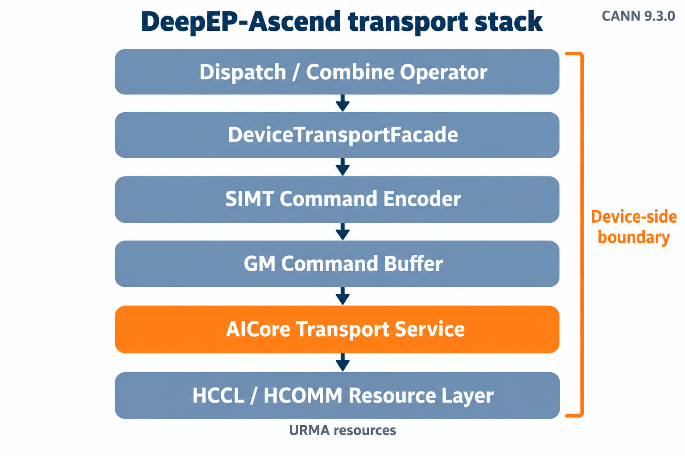
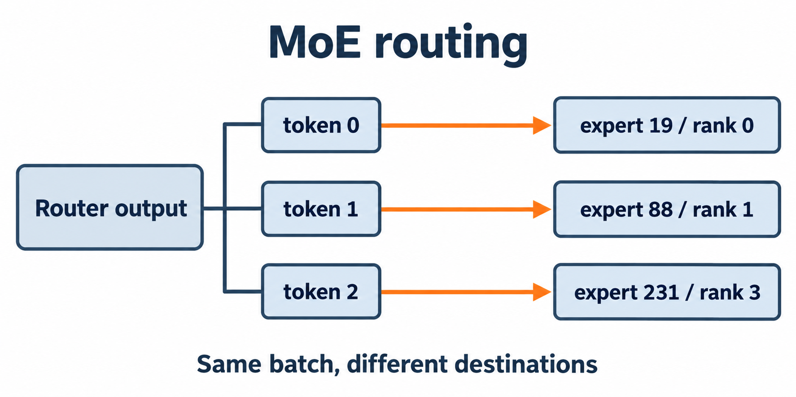
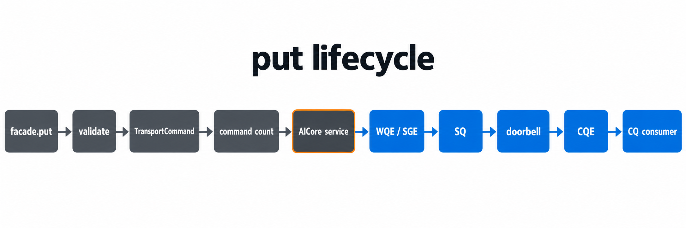
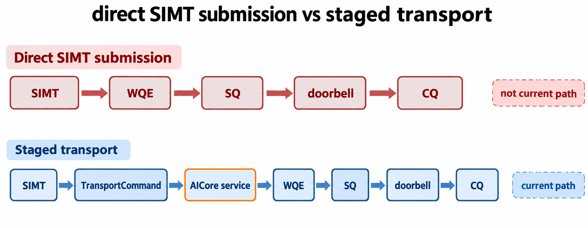
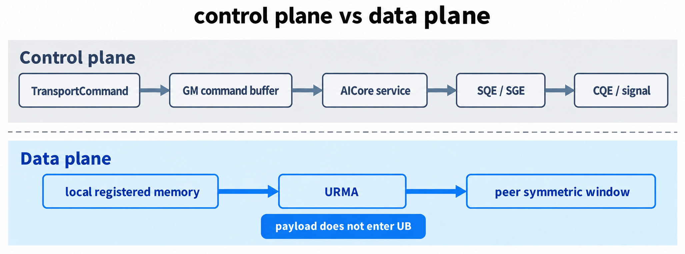
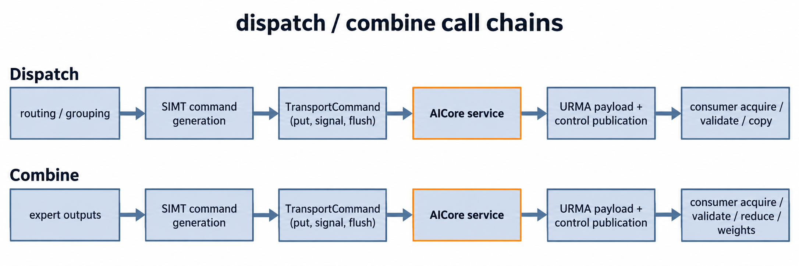
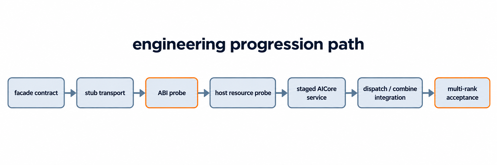
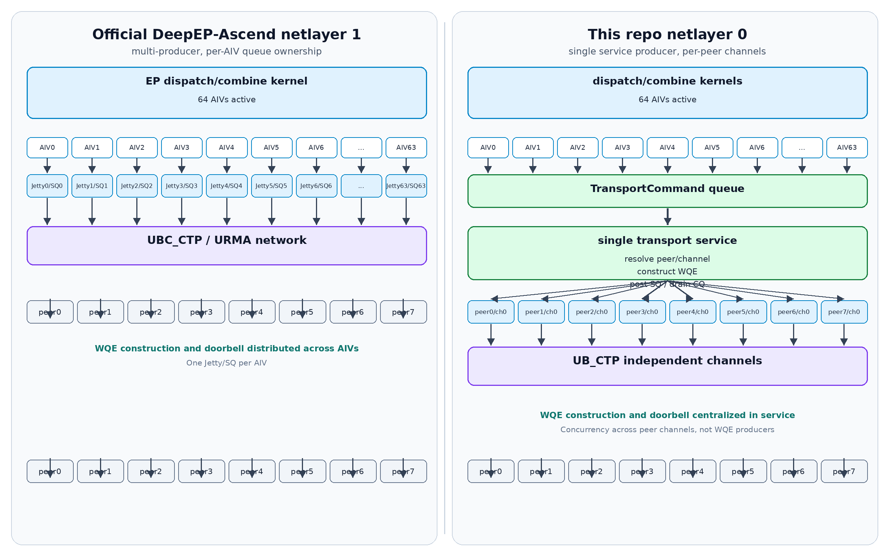

# DeepEP-Ascend：SIMT 生成，AICore 提交的 URMA 通信路径

日期：2026-10-08
状态：公众号正文草稿 v0.2
配套大纲：`docs/ascend-articles/epv2-ascend-simt-urma-article-draft-outline-zh.md`

## 一分钟版

如果只读一段，可以读这段：

MoE dispatch 和 combine 的通信由 router 结果决定。每个 token 可能去不同 expert、不同 rank，payload 长度和目标 offset 也不同。DeepEP-Ascend 把“路由结果怎么变成通信命令”放在 Device 侧：SIMT 在算子里生成 `put`、`signal`、`flush` 这类命令，AICore service 再把命令翻译成 URMA 队列操作。

这不是 SIMT 直接敲 doorbell。当前 CANN 9.3.0 下，SQ/CQ 和 doorbell 操作属于 AICore 执行域，所以实现采用 staged transport：SIMT 负责动态通信意图，AICore service 负责批量提交和完成处理。payload 仍走 symmetric window 和 URMA，不先进 UB。

本文解释这条路径的边界和工程取舍。文末给出一组与官方 DeepEP-Ascend 报告口径近似对齐的性能记录；两边实现和通信 layer 不同，所以它是可追溯的参考数据，不是“全面更快”的结论。

如果你读过《昇腾950 AIV 直驱URMA 实践》，可以把本文当成互补路径：那篇讲 AIV 在调用点直接构造并提交 WQE；这篇讲 DeepEP 在 MoE 动态路由下，由 SIMT 生成通信命令，再交给 AICore service 统一提交。两者都在 Device 侧，但调度模型不同。

## 阅读说明

本文面向正在做 MoE、分布式通信或 Ascend 后端适配的工程师，介绍 DeepEP-Ascend 的设备侧通信执行层：SIMT 在算子内部生成通信命令，AICore service 在服务边界构造 URMA WQE 并驱动 SQ/CQ。

阅读前建议先了解三个概念：

- Host / Device 执行模型：Host 负责 Python/C++ 控制流、资源初始化和 kernel launch，Device 上的 AICore/AIV 执行算子；
- 专家并行（Expert Parallelism，EP）：不同 expert 分布在不同 rank 上，token 需要在 rank 之间流动；
- 对称窗口（symmetric window）：各 rank 按同一规则注册一段可远端访问的内存，发送端可以用“本端地址减本端 base 得到的 offset”定位远端地址。

需要先划清一个边界：本文讲的不是官方 SHMEM 或 AIV 直驱 URMA 路径，而是 DeepEP-Ascend 当前采用的 **SIMT-fronted staged transport**。SIMT 不直接敲 SQ/CQ doorbell，它生成固定格式的通信命令；AICore service 在 VF 返回后统一解释命令、构造 WQE、发布 SQE 并处理完成队列。这个区别会贯穿全文。

本文也不讨论三件事：

1. 不比较 DeepEP 与 HCCL/NCCL 在所有 collective 上的性能；
2. 不把 staged transport 说成官方直驱路径的替代品；
3. 不把实现方案不同的近似对齐数据写成严格 A/B 结论。

> 一句话概括：SIMT 负责“我要发给谁、写到哪、发多少”；AICore service 负责“怎么把一批通信意图高效提交给 URMA 队列”。



图 1：DeepEP-Ascend transport stack。六层都在 Device 侧边界内；AICore transport service 是批量提交和完成处理的服务边界，底层继续复用 HCCL/HCOMM 拥有的 URMA 资源。

## 1. 要解决的问题

Router 输出 top-k 结果的那一瞬间，MoE 通信的问题才真正开始。

对每个 token 来说，这份数据要去哪个 expert、落在哪个 rank、写到对端 window 的哪个 offset、带多少 payload，都要等路由结果出来才知道。假设 256 个 expert 均匀分布在 4 个 rank 上，同一个 batch 里，token 0 可能去 rank 0 的 expert 19，token 1 去 rank 1 的 expert 88，token 2 去 rank 3 的 expert 231。它看起来是 all-to-all，但每次通信矩阵的形状和重量都不同。

这种通信有三个特点。它是动态的，路由结果每一步都会变，通信计划无法在运行前完全展开；它是稀疏的，一个 rank 通常只和部分 peer 有真实数据交互；它也是不均衡的，热门 expert 集中在少数 rank 时，尾部 rank 会决定整个操作的完成时间。

如果把这段控制逻辑放回 Host，路径会变长。Device 先算出路由元数据，同步回 Host；Host 根据元数据发通信，再等通信结束；最后 Device 继续做后处理。每一轮都有 launch、同步和状态搬运。路由信息本来就在 Device 上产生，这样来回搬运，换来的主要是延迟和更多出错面。

DeepEP-Ascend 的做法是把“路由结果到通信意图”的转换留在 Device 侧。SIMT producer 在算子内部读路由结果，完成 peer 选择、rank 翻译、offset 计算和边界判断，然后生成 `put`、`put_value`、`remote_add`、`flush` 这类固定格式命令。AICore service 随后把这批命令翻译成 URMA 队列操作。



图 2：MoE routing。同一个 batch 里，三个 token 分别被 router 指到不同 expert 和 rank。通信目标不是静态 broadcast 计划，而是每个 token 的路由结果。

这个设计和“AIV 直驱 URMA”不同。后者让 AIV 在调用点内直接构造并提交 WQE；本文的 staged transport 则是 SIMT 先写命令，AICore service 统一提交。两者都在 Device 侧，但数据面调度模型不同。staged transport 的收益不在“少一层就一定更快”，而在把 DeepEP 需要的动态路由控制、完成协议和错误处理放在一个可控的执行边界上。

## 2. 术语定义

| 术语 | 含义 | 本文中的作用 |
| --- | --- | --- |
| Host | CPU 侧控制程序 | 初始化 communicator、注册内存、启动 kernel |
| Device | NPU 侧执行环境 | 执行算子、生成和提交通信 |
| AICore / AIV | 昇腾 AI Core 与 Vector 执行路径 | 承接数据并行搬运、SIMT producer 和 AICore service |
| SIMT | 单指令多线程执行模式 | 靠近 token 路由元数据，生成通信命令 |
| TransportCommand | DeepEP 自定义的固定格式命令 | 在 SIMT 和 AICore service 之间传递通信意图 |
| GM | Global Memory | 存放 command buffer、payload 和控制状态 |
| UB / UB_MEM | Unified Buffer 及相关快速存储 | service 阶段组织 SQE、SGE 和临时 descriptor |
| HCCL / HCOMM | 昇腾通信库及其内部通信实现 | 提供 communicator、链路、内存注册和队列资源 |
| Team | 通信参与者集合 | 描述 world、scale-up、scale-out 等逻辑域 |
| Window | 对称可远端访问内存 | 提供 offset 到远端地址的映射 |
| Channel | Team 内的通信 lane | 绑定 SQ/CQ、token 和链路上下文 |
| URMA | Unified Remote Memory Access | 将远端读写表示为硬件可执行操作 |
| WQE / CQE | 工作队列项 / 完成队列项 | 描述一次远端操作及其完成状态 |
| SQ / CQ | 提交队列 / 完成队列 | 承载 WQE 提交与 CQE 完成 |
| doorbell | 通知硬件队列有新工作的机制 | 由 AICore service 用 `st_dev` 写入 |

## 3. 总体架构：从 operator 到 URMA

架构图上有六层，但它们不是六个并列的模块。跟着一次 `put` 走一遍，每一层的职责会清楚很多。

起点在 dispatch 或 combine 算子内。算子只表达业务语义：这个 token 要送到哪个 peer，写到哪个 offset，写多少字节。它不关心 SQE 字段，也不知道 HCOMM 内部对象长什么样。

往下是 `DeviceTransportFacade`。它把语义收敛成 `put`、`put_value`、`remote_add`、`signal`、`flush` 这组通信原语。对算子来说，这是设备侧通信的入口；对 transport 来说，这是稳定的调用面。

SIMT command encoder 接手后，把 facade 参数翻译成固定大小、trivially-copyable 的 `TransportCommand`。命令写入 backend 拥有的 GM command buffer，随后发布 count。到这里，SIMT producer 的工作完成了，VF 可以返回。

AICore transport service 在服务边界消费这批命令：校验参数，解析 team、window 和 channel，构造 WQE/SGE，写 SQ，用 `st_dev` ring doorbell，再处理 CQ 完成。最后一层是 HCCL/HCOMM 资源层，它继续拥有连接建立、内存注册、token、队列分配和 teardown。



图 3：put lifecycle。前半段是 facade、校验、命令编码和 count 发布；越过 AICore service 后进入 WQE/SGE、SQ、doorbell 和 CQ 完成处理。图里保留的是主干，省略了 resource resolution、cache publication、CQ 校验等实现细节。

这六层合起来，责任边界是清楚的：算子不理解队列，SIMT 不碰 doorbell，AICore service 不理解 MoE 路由，CANN 继续管理连接和注册资源。出问题时，定位也沿着这条链走：先看命令是否正确生成，再看资源解析是否正确，最后看队列提交和完成处理。

## 4. 为什么是 staged transport

这里最容易讲错。既然 SIMT 已经在算子里，为什么不让它直接写 SQ、敲 doorbell、轮询 CQ？

答案不是设计偏好，而是当前 CANN 9.3.0 的执行域边界。DeepEP 的通信 producer 是 `__simt_vf__`，而 URMA SQ/CQ 提交所需的 `st_dev` / `ld_dev` 属于 AICore 执行域，不能从 SIMT VF 安全调用。`__stg` 虽然能在 SIMT 中编译，但它和 `st_dev` 的设备语义不同，不能当 doorbell 用。CANN 的 HCOMM、PTO URMA 和 MoE 通信参考实现也都使用 `st_dev` 处理 SQ/CQ doorbell，没有参考实现支持用普通 GM store 替代。

所以 DeepEP-Ascend 选择了 staged transport：

```text
SIMT producer
  -> 追加 TransportCommand 到 GM command queue
  -> VF 返回
  -> AICore service 逐条解释命令
  -> 构造 URMA WQE / SQ / CQ 操作
  -> 提交、drain、发布完成
```

这条路径的代价很清楚：多了一层命令编码、一次 GM 命令发布和一次 service 解析。换来的边界也很清楚：

- SIMT 能在离路由元数据最近的位置生成通信意图；
- WQE 构造、队列提交、doorbell 和 CQ 处理集中在 AICore service；
- `flush`、`barrier`、generation、错误诊断可以按 DeepEP 的协议实现；
- 未来如果换成更直接的 SIMT 提交路径，替换边界也在这里。

换句话说，这不是“绕一层”的妥协，而是把不能安全跨越的执行域差异，收敛成一个可以被测试和替换的接口。

### 4.1 命令 ABI：两层之间的合同

`TransportCommand` 是 128 字节、64 字节对齐的 POD：

```cpp
enum class TransportCommandOpcode : std::uint32_t {
    kNone,
    kPut,
    kPutValue64,
    kRemoteAdd64,
    kSignal,
    kFlush,
    kBarrier,
};

struct alignas(64) TransportCommand {
    TransportCommandOpcode opcode;
    TransportTeam team;
    CooperationScope scope;
    MemorySegment segment;
    RemoteActionKind action_kind;

    int32_t peer;
    uint32_t channel;
    DeviceOptions options;
    uint32_t value_bytes;
    uint32_t signal_index;
    int32_t world_peer;

    DeviceAddress source;
    DeviceAddress destination;
    uint64_t bytes;
    uint64_t value;
    uint64_t symmetric_offset;
    uint64_t timeout_cycles;
    uint64_t reserved1[6];
};
```

它刻意不包含 HCOMM 内部类型，也不包含 SQE 字段。SIMT 只写“语义”：目标 team、目标 peer、channel、源地址、目标 offset、字节数和可选动作。service 再把这些语义翻译成队列操作。可以把 `TransportCommand` 理解成两层之间的合同：SIMT 不承诺怎么提交 WQE，service 也不需要理解 MoE 路由。

这种 ABI 带来两个工程收益：

1. **边界稳定**：CANN 内部类结构变化不会直接穿透到 DeepEP 算子；
2. **可测试**：host probe 可以检查结构尺寸、对齐、字段 offset 和 trivially-copyable 属性，不匹配就失败。

不要把它理解成“SIMT 全部替代 AICore”。两者是分工：SIMT 处理动态分支，AICore service 处理批量提交吞吐。

| 工作类型 | 更适合的执行路径 |
| --- | --- |
| 规则、大块、同构的数据搬运 | SIMD/AICore |
| 动态 peer 选择和分支 | SIMT |
| 每个 token 目标不同 | SIMT |
| 批量组织 SQE、doorbell、CQ 轮询 | AICore service |
| 端到端通信与路由融合 | SIMT 生成 + AICore 提交 |



图 4：direct SIMT submission vs staged transport。上面的直接提交路径在当前 CANN 执行域下不可用；当前实现是下面的 staged transport，由 AICore service 承接 WQE、SQ、doorbell 和 CQ。

## 5. 控制面与数据面

看架构图时，很容易得出一个结论：既然 UB_MEM 参与通信，是不是 token payload 也要先进 UB，再由 service 转发出去？

不是。DeepEP-Ascend 把控制面和数据面分开了。

UB_MEM 服务的是通信控制面：聚合固定格式命令，组织 SQE、SGE 和临时 descriptor，保存 service 阶段快速访问的状态，并配合 `st_dev` / `ld_dev` 完成 SQ/CQ 和 doorbell 操作。真正的 payload 不走这条路，它从本地注册内存出发，通过 URMA 写入 peer 的 symmetric window。



图 5：control plane vs data plane。上半部分是命令和队列组织的控制路径；下半部分是 payload 的数据路径。本地注册内存里的 token payload 不先进 UB，而是由 URMA 直接写入 peer 的 symmetric window。

两边分开后，远端地址的生成规则也变得简单：

```text
offset = local_operand - local_window_base
remote_address = peer_window_base + offset
```

发送端不需要知道远端物理地址，只需要维护本端 operand 在 symmetric window 里的 offset。service 会读取 peer window 表，把 offset 转成合法 URMA 目标地址，并校验边界。跨 rank 保持一致的是 offset 规则，不是每张卡的物理地址表。

这样，控制面的动态性由 SIMT 承接，数据面的大块搬运交给 URMA。一个处理“每个 token 去哪里”，一个处理“这块数据怎么高效搬过去”。

## 6. 资源模型：Team、Window、Channel

DeepEP-Ascend 用三层资源模型组织通信：

```text
communicator
    -> team：参与者集合、rank 和拓扑域
        -> window：各 rank 对称布局的可远端访问内存
            -> channel：Team 内的并行通信 lane
                -> SQ/CQ、doorbell 和底层通信队列
```

**Team** 定义通信域。DeepEP 的 facade 中有 `world`、`scale_up`、`scale_out` 三个逻辑 team，算子可以按拓扑选择通信域，而不需要理解 HCCS、PCIe 或 RoCE 的具体差异。

**Window** 提供远端寻址基础。所有 rank 按同一规则注册对称内存后，发送端只需要 offset，不需要在 kernel 里维护每张卡的远端物理地址表。

**Channel** 提供并行执行资源。一个 peer 可以有多个 channel，每个 channel 绑定自己的队列和 token。service 会按 team 的 channel table 和 per-member channel counts 解析具体队列。

把三者放在一次远端写里看会更直观。假设 command 里写的是 team = `scale_up`、peer = 3、symmetric offset = 4096、channel = 1、bytes = 8192：

```text
team = scale_up
    -> 确定 rank graph 和 channel table

peer = 3, channel = 1
    -> 找到 peer 3 的 channel 1
    -> 得到对应的 SQ/CQ、token 和链路上下文

symmetric offset = 4096, bytes = 8192
    -> remote_address = peer 3 window base + 4096
    -> 校验 [4096, 12288) 不越界

结果：
    -> 构造 WQE/SGE
    -> 写入该 channel 的 SQ
    -> ring doorbell
    -> 等待对应 CQE
```

对上层来说，仍然只是一个语义调用：向 peer 3 写 8192 字节。Team、Window、Channel 把拓扑、远端地址和并发资源整理成三张设备可见的表，service 在边界内完成这些解析。

上层算子最终只描述一件事：“向哪个 peer 写哪段数据”。team 翻译、window 解析、channel 索引、token 校验和队列生命周期都留在 transport 层。Jetty 如果在底层实现中出现，也属于 endpoint/队列实现细节，不会被提升为 operator facade 的一级接口。

## 7. dispatch / combine 如何接入

`DeviceTransportFacade` 屏蔽了这些细节：

- HCCL communicator 的复用和校验；
- team / window / channel 的创建与销毁；
- world rank 与 team-local peer 的翻译；
- symmetric window 地址解析；
- channel table 索引和有效性检查；
- signal、generation、flush 和 barrier 语义；
- CANN device-visible ABI 的结构体布局。

对 dispatch 来说，producer 侧根据路由结果分组 token，生成 record 和远端 payload 命令。真正发布控制信息时，顺序很重要：先通过 `flush` 保证 payload 对接收端可见，再发布 count、generation 和 signal。consumer 侧等待所有 source ready 后，先 validate record，再统计 expert 数量、分配输出并 copy。如果顺序反过来，consumer 可能读到 count，却还没读到完整 payload。

对 combine 来说，producer 侧把各 expert 输出写回目标 rank。本 rank 目标可以直接落位，远端 rank 仍通过 staging 和 put 发送。consumer 侧 acquire 并 validate contributor slot 后，再按 source token reduce、加权重和完成输出。这里的关键同样是完成语义：每个 contributor slot 只有在数据和元数据都可见之后才被视为有效。

这两个流程看起来不同，但通信结构是同一套：路由或 contributor 信息决定目标，SIMT 生成命令，AICore service 提交，接收端在明确的 acquire/validate 边界后才消费。



图 6：dispatch / combine call chains。两条链的前半段不同：dispatch 从 routing / grouping 进入，combine 从 expert outputs 进入；但都经过 SIMT command generation、TransportCommand 和 AICore service，接收端再在 acquire/validate 边界后执行 copy 或 reduce/weights。

capability bit 在这里起关键作用。代码里存在某个接口，不等于生产可用；编译通过也不等于端到端语义正确。DeepEP-Ascend 只有在对应的多 rank 语义测试通过后，才开启对应 capability。这是防止“看起来支持，实际边界不清”的机制。

## 8. 工程落地路径

这条路径要接到底层通信栈，最大的风险不是写不出代码，而是把不可靠假设埋进接口。所以 DeepEP-Ascend 没有从零重写通信栈，而是按风险边界逐层验证。

第一层风险是进程组和资源生命周期。实现直接复用已有 HCCL communicator，进程启动后校验 rank 和 world size，不额外建立一套进程组。连接建立、内存注册和队列资源继续由 CANN 管理。

第二层风险是 device-visible ABI。CANN 内部类不能直接暴露给算子，因此只定义必要的 POD 布局：SQE、SGE、CQE、team、window、channel。ABI probe 检查尺寸、对齐和字段 offset，不匹配就失败，不做 best-effort 继续。

第三层风险是 facade 语义。先在 stub transport 上验证 `put`、`signal`、`flush` 等调用，再切换到真实 HCCL/HCOMM 资源。这样接口错误不会和硬件队列问题混在一起。

第四层风险是扩展方式。新增通信操作主要扩展 command opcode 和 service handler，而不是重写资源生命周期。CUDA/NCCL 路径保持独立，Ascend 后端的抽象不反向污染原有实现。



图 7：engineering progression path。ABI probe 和 multi-rank acceptance 是两个关键验证关口，前者挡住 ABI 假设，后者验证多 rank 端到端语义。

这套方法的重点不是“代码行数少”，而是依赖边界清楚、可测试、可替换。CANN 9.3.0 的 communication-domain 路径负责 rank graph、内存注册、AIV channel 和远端 MR 查询，DeepEP 在 host transport 层把这些资源整理成设备可见的 Team / Window / Channel 表，再让 device facade 保持稳定。

## 9. 与官方实现近似对齐的性能记录

性能比较前必须先说明基线。官方 DeepEP-Ascend 的公开 EP8 数据使用 netlayer 1：EP kernel 内 64 个 AIV 直接拥有 Jetty/SQ，每个 AIV 构造 WQE、推进自己的队列并 ring doorbell，数据面经 UBC_CTP/URMA 访问 SuperPoD 外部 Clos 网络。本仓库当前可用的 NPU8P 环境选择 netlayer 0：dispatch/combine kernel 只生成 TransportCommand，由单个 AICore transport service 解析 peer/channel、构造 WQE、提交 SQ 并 drain CQ，数据面使用每 peer 独立的 UB_CTP channel 和机内直连拓扑。



图 8：官方 netlayer 1 与本仓库 netlayer 0 的所有权模型。左边是多 producer：每个 AIV 拥有独立 Jetty/SQ；右边是单 service producer：多 AIV 只追加命令，WQE 构造和 doorbell 集中在 transport service。

这不是“同一个 kernel 换一个 layer 参数”。两条路径的物理通路、地址发现协议、队列所有权和并发位置都不同：

| 维度 | 官方 netlayer 1 | 本仓库 netlayer 0 |
| --- | --- | --- |
| 拓扑 | SuperPoD 外部 Clos | 单机 8 NPU 直连 |
| 地址发现 | peer UB_MEM channel | HcclChannelGetRemoteMems |
| 发送协议 | UBC_CTP Jetty/URMA | UB_CTP independent channel |
| 队列所有权 | 每个 AIV 一个 Jetty/SQ | 单 transport service |
| EP kernel 职责 | 直接构造并提交 WQE | 只生成 TransportCommand |
| 并发位置 | 多 WQE producer | 多 peer/channel，单 producer |

因此，下面只能做报告口径的近似对齐，不能把它解释成同硬件通路上的 netlayer 0/1 严格 A/B。更严格的 layer 对比需要独立 AB 基准，并且要控制 payload、WQE 大小、rank 数和 producer 数。

### 9.1 官方报告口径

官方 README 对 EP8 带宽的说明是：timings include issue and drain but exclude final epilogues。对应实现不是完整 API 端到端计时，而是 tests/ep/test_ep.py 的 profiler 采样：

1. 通信 kernel 使用 dispatch_impl / combine_impl 的采样时长；
2. 最终 copy/reduce epilogue 被拆到独立 kernel，不进入 URMA 带宽；
3. dur_ns 来自 Torch-NPU/FFTS profiler，50 个采样求平均；
4. 字节公式使用 per-rank 收到的逻辑 URMA 字节，而不是完整 API 逻辑字节或物理链路字节。

本仓库为了靠近这个边界，没有使用完整 API 的 NPU Event 端到端时间，而是使用 stage profile 中的 service_submit + cq_wait，对应 stage_service_issue_drain。这个 proxy 覆盖 transport service 的提交和完成等待，外层 producer 和最终 epilogue 不计入。

### 9.2 workload 与环境

| 条件 | 值 |
| --- | --- |
| case | ep-fp8-align128-bias0-hcopy0-prev0-async1-alloc0 |
| world size | 8 |
| tokens per rank | 16384 |
| hidden | 7168 |
| top-k | 6 |
| experts | 256 |
| seed | 0 |
| warmups / iterations | 10 / 50 |
| hardware | Ascend 950DT, devices 0-7 |
| CANN / HCOMM | 9.3.0 |
| launch | 64 AIVs on both sides |
| stage profile | service_submit + cq_wait |

Dispatch 使用 FP8 payload 加 scale 字节，并启用 expanded dispatch、zero padding 和 row-major scale factors。Combine 使用 BF16 hidden payload，并按官方公式排除 top-k 权重。

### 9.3 结果

| 操作 | 官方参考 GB/s | 本仓库近似口径 GB/s | 相对官方 |
| --- | ---: | ---: | ---: |
| Dispatch（expanded dispatch） | 374 | 274.49 | 0.73x |
| Combine（reduced combine） | 346 | 285.82 | 0.83x |

这组数字说明当前实现已经能达到官方公开参考值的三分之二以上，但它不能推出两个结论：一是“netlayer 0 达到 netlayer 1 的 73%/83%”，因为通信硬件通路不同；二是“staged transport 一定慢 17%–27%”，因为当前 proxy 的 kernel 边界、barrier 位置和 stage 计数仍与官方采样不完全一致。

已知差异主要有四点。第一，当前实现没有官方 set_barrier_in_prologue，外部 barrier 不能移动到通信 kernel prologue。第二，当前实现没有 defer_epilogue，最终 copy/reduce epilogue 不能按官方方式拆成独立 kernel。第三，stage profile 只有一次聚合观察，不提供 50 个迭代样本；时间用 envelope cycle 和 device seconds 校准，是近似 timer。第四，官方数据来自 Ascend 950DT、CANN 9.2.0 和特定 PoC HDK，本仓库数据来自 NPU8P、CANN 9.3.0；按对比策略，包版本差异不作为实现差异解释，但环境不同仍然限制了外推。

发布这组数据时，更稳妥的表述是：在 workload、launch AIV 数、字节公式和“issue + drain、排除最终 epilogue”的时间边界都尽量对齐后，本仓库 staged transport 的 service 提交与完成路径达到官方公开参考值的 0.73x 和 0.83x。它是一个可复现的 checkpoint，不是终局性能结论。

## 10. 当前边界与后续演进

当前实现的主要验证边界：

- **硬件与软件**：Ascend 950DT，单机 8 NPU，CANN/HCOMM 9.3.0；
- **执行模型**：SIMT-fronted staged transport，不是 SIMT 直接 doorbell；
- **生产能力**：以端到端验证和 capability bit 为准，不能只看代码存在；
- **跨机能力**：物理 RoCE scale-out 仍需单独验证，不能由逻辑多主机结果外推。

后续演进方向：

1. **SIMT command batching**：减少每条命令的固定发布开销；
2. **多 channel 调度**：按 payload 字节和 peer 分布自适应选择 channel 数；
3. **通信计算重叠**：把 release、acquire 和计算阶段进一步流水化；
4. **device-side completion**：完善 request 状态机和细粒度完成等待；
5. **跨机 URMA / RoCE**：扩展 topology、注册和完成模型；
6. **多 service worker**：提高命令消费和队列提交并发；
7. **评估官方 SIMT Hcomm 路径**：在单 lane、单 channel 的最小 probe 上做 A/B，再评估 producer 改造。

官方 asc-comm 已经提供了 SIMT 直接提交 Hcomm 的能力，历史阻塞点正在消失。但它要求一个 channel 由单个 lane 驱动，而 DeepEP 当前 producer 是多 block、多 lane 形态，不能简单替换。合理的路线是先做最小 probe，再评估是否为每个 channel 设计唯一提交 lane。

## 11. 小结

DeepEP-Ascend 这条通信路径的核心不是“用一条新指令替代旧通信库”，而是把 MoE 动态路由的通信控制放回 Device 侧：

- SIMT 在算子内部根据路由结果生成通信命令；
- AICore service 在明确边界上构造 URMA WQE 并驱动 SQ/CQ；
- symmetric window 承载 payload 数据面，UB_MEM 服务控制面；
- Team / Window / Channel 统一组织通信资源；
- dispatch / combine 通过同一个 facade 接入，不直接感知 HCOMM/URMA 细节。

这套设计当前的价值是可控和可验证：动态路由控制靠近数据产生位置，硬件提交集中在 service 边界，完成协议和错误处理有明确归属。它的性能收益需要按 workload 条件验证，而不是用一句“更快”概括。

当前与官方实现的近似对齐记录见第 9 节。后续我们会继续补三件事：多 channel 的功能和性能 A/B、通信计算重叠的 pipeline 边界，以及跨机 RoCE 路径。

## 参考入口

- `csrc/backends/ascend/transport/device_transport_facade.hpp`
- `csrc/backends/ascend/transport/device_transport_commands.hpp`
- `csrc/backends/ascend/transport/aicore_transport_service.hpp`
- `csrc/backends/ascend/transport/cann_transport.cpp`
- `docs/ascend-design/epv2-ascend-simt-urma-transport.md`
- `docs/ascend-reference/deep-ep-ascend-communication-implementation-review-zh.md`
- `docs/ascend-reference/asc-comm-official-simt-comparison-zh.md`
- docs/ascend-diagnosis/netlayer0-vs-netlayer1-analysis-zh.md
- docs/ascend-diagnosis/netlayer0-adaptation-diagnosis-zh.md
