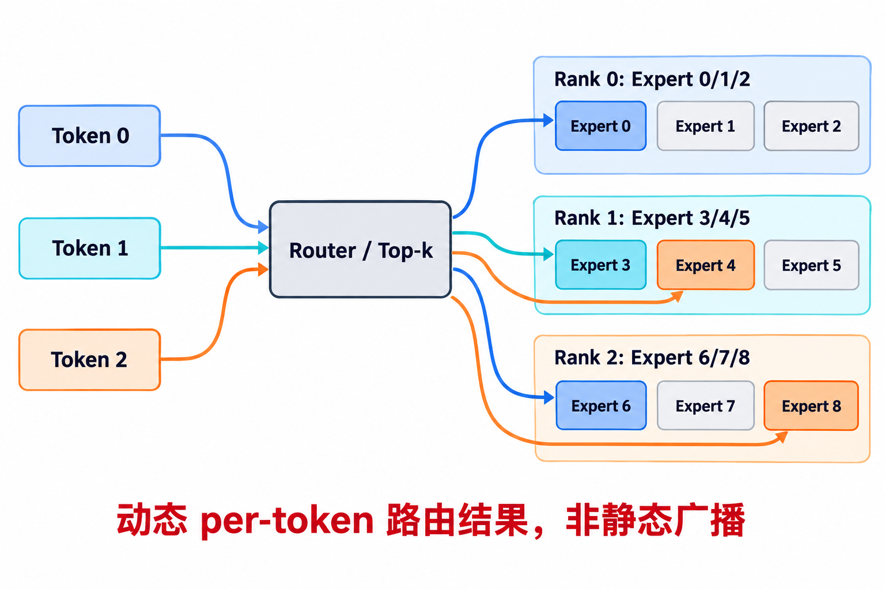
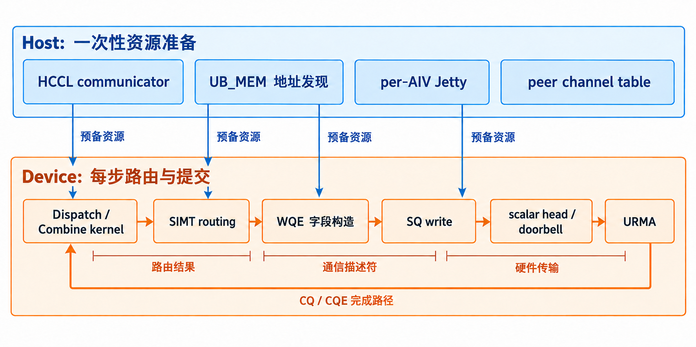
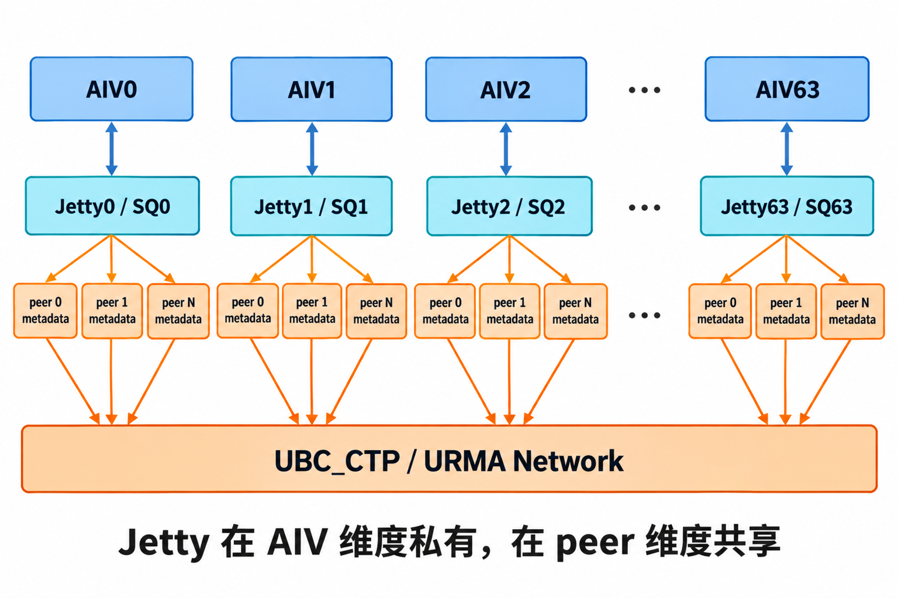
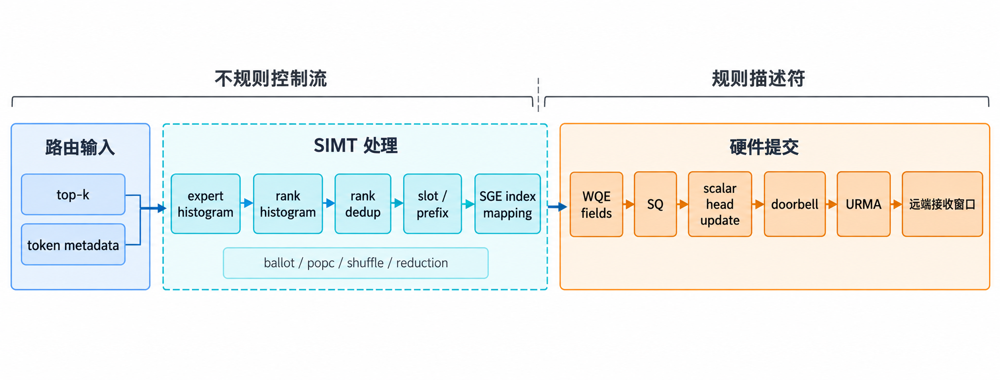
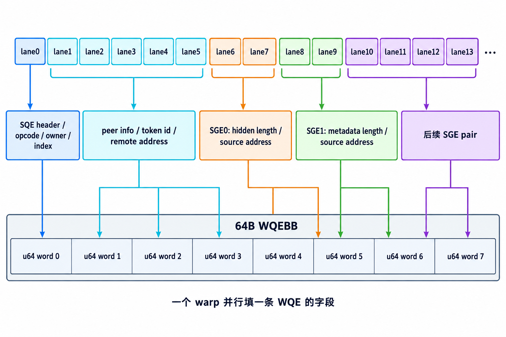
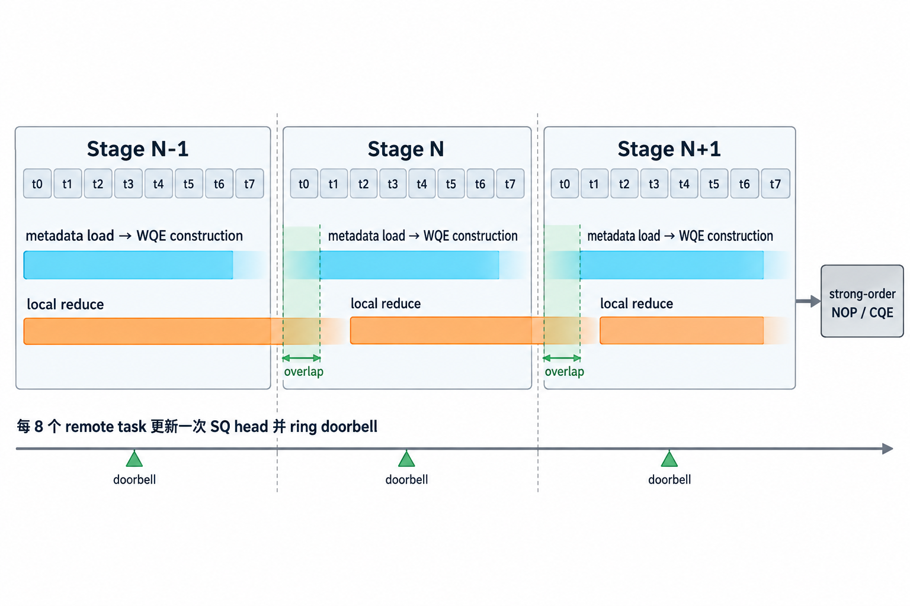

# DeepEP-Ascend：SIMT 为什么适合通信？

日期：2026-10-10
状态：公众号正文草稿 v0.3
配套大纲：docs/ascend-articles/official-deepep-ascend-simt-communication-article-outline-zh.md

## 一分钟版

MoE 通信的难点，不在“搬数据”，而在“知道搬给谁”。

Router 输出 top-k 后，每个 token 的目标 expert、目标 rank、接收 slot 和 payload 长度都不同。DeepEP-Ascend 把这层转换留在 Device 侧：SIMT worker 并行完成 top-k 扫描、rank 去重、槽位分配和 WQE 字段构造；每个 AIV 拥有独立 Jetty/SQ；WQE 里的 SGE 直接指向本地 payload，URMA 负责写入远端窗口。

要注意，这不是“每个 lane 各自 ring doorbell”。SIMT 负责并行构造 WQE；WQE 写入 SQ 后，由该 AIV 的 scalar 侧更新 head 并发布 doorbell。

一句话：SIMT 把不规则的路由结果编译成规则描述符，URMA 按描述符把 payload 搬到远端。

## 阅读说明

本文面向做 MoE、分布式通信或 Ascend 后端的工程师，介绍 DeepEP-Ascend 的设备侧通信路径。只需要先记住三个概念：

- Host / Device 执行模型：Host 负责 Python/C++ 控制流、资源初始化和 kernel launch，Device 上的 AICore/AIV 执行算子；
- 专家并行（Expert Parallelism，EP）：expert 分布在不同 rank 上，token 需要跨 rank 流动；
- 一次远端写入（one-sided write）：发送端描述“把本地这段数据写到 peer 的某个地址”，接收端不需要同时调用匹配的 receive。

本文以 GitHub 仓库为准。GitCode 上的 ASC-COMM 报告描述更高层 API，两者不是同一层实现，后文单独说明。

## 1. 问题：路由每一步都在变

Router 输出 top-k 之后，通信才进入最难的一段。

假设 256 个 expert 分布在 8 个 rank 上，每个 token 选 6 个 expert。token 0 可能去 rank 1 的 expert 19，也可能同时去 rank 5 的 expert 180；token 1 又是另一组目标。发给谁、每个 rank 收多少、每个 token 写到哪个 slot，都无法在运行前固定。

这类通信有三个特点：

- 动态：路由每一步都变；
- 稀疏：不是每个 peer 都有等量数据；
- 不均衡：热门 expert 所在 rank 可能成为尾部。

如果把这段逻辑放回 Host，路径会变长：Device 算出路由，同步回 Host；Host 生成通信计划；Device 再继续后处理。路由信息本来就在 Device 上，来回搬运换来的主要是同步和 launch 开销。

DeepEP-Ascend 的选择是：让 SIMT 直接读路由结果，生成 slot 和 WQE 字段；让每个 AIV 拥有自己的 Jetty/SQ，多个 AIV 并行准备通信描述符。

## 2. 先对齐几个词

| 术语 | 含义 | 本文中的作用 |
| --- | --- | --- |
| Host | CPU 侧控制程序 | 创建通信资源 |
| Device | NPU 侧执行环境 | 执行 Dispatch / Combine |
| AICore / AIV | Ascend AI Core 与 Vector 执行路径 | 每个 AIV 是一个通信 producer 分片 |
| SIMT | 单指令多线程执行模式 | 并行处理 top-k、去重、slot 和 WQE 字段 |
| top-k | Router 为 token 选择的 expert 集合 | 决定目标 rank 和 slot |
| Jetty | HCOMM/URMA endpoint 与队列资源 | 每个 AIV 一个，服务多个 peer |
| SQ / CQ | 提交队列 / 完成队列 | 承载 WQE 提交与 CQE 完成 |
| WQE / SQE | 工作队列项 / 提交队列项 | 描述一次远端操作 |
| SGE | Scatter-Gather Element | 描述本地 payload 的地址和长度 |
| URMA | Unified Remote Memory Access | 执行远端写入 |
| doorbell | 通知硬件有新 WQE 的机制 | 由 AIV 的 scalar 侧发布 |
| CQE | 完成队列项 | 记录 WQE 完成 |

## 3. 总体路径：Host 建资源，Device 拼描述符

实现的边界并不复杂。

Host 做一次性准备：复用 HCCL communicator，选择 netlayer 1 的 SuperPoD 外部 Clos 通路，发现远端地址，为每个 AIV 创建 Jetty，并把 channel 表交给 Device。

Device 做每步路由和提交：SIMT worker 读取 top-k 和 metadata，完成 histogram、去重、prefix 和 slot 分配；把 WQE 写入本 AIV 的 SQ；scalar 更新 head 并 ring doorbell；URMA 根据 SGE 和远端地址写 payload。

图的核心是边界：SIMT 处理动态路由，scalar 发布提交边界，URMA 执行硬件传输。

## 4. 关键设计：每个 AIV 一个 Jetty

容易忽略但影响并发模型的一步，是 acquire_jetties。

它不是“每个 peer 一个 Jetty”，而是“每个 AIV 一个 Jetty”。一个 Jetty 可以服务多个 peer，但不同 AIV 不共享 Jetty。于是 AIV0 有 Jetty0/SQ0，AIV1 有 Jetty1/SQ1，直到 AIV63 有 Jetty63/SQ63。

这里的重点是队列所有权。多个 AIV 同时写同一个 SQ，就要处理 slot 预留、head 推进、owner bit 和 doorbell 顺序。每 AIV 一个 Jetty 绕开了这层竞争。

Host 还要求所有 peer 使用同一个 local UBC_CTP endpoint。Device 因此可以按 AIV index 选 Jetty，按 peer index 选远端 metadata。

## 5. Dispatch：从 top-k 到 WQE

Dispatch 做的事情可以概括为：把 token 路由变成远端写入描述符。

### 5.1 每个 AIV 负责一段连续 token

DeepEP-Ascend Dispatch 把连续的 token range 分给 AIV，每个 AIV 内部启动 512 个 SIMT thread。这样本地 copy 和 metadata 预取更友好，通信也分布在多个 Jetty/SQ 上。

### 5.2 SIMT 处理最不规则的几步

SIMT worker 读取 top-k 后，先做三件事：

1. 统计 expert histogram，知道每个 expert 要接收多少 token；
2. 统计 rank histogram，知道每个 peer 要接收多少 token；
3. 对同一个 token 的重复目标 rank 去重。如果一个 token 命中同一 rank 上的多个 expert，只向该 rank 发送一份 payload，接收端再按 expert 展开。

这些步骤落在 SIMT 擅长的范围。top-k slot 可以映射到 lane；ballot、popc、shuffle、warp reduction 分别回答“是否重复”“重复位置在哪”“前缀和是多少”。这不是规则大块搬运，而是大量分支、比较和归约。

去重后，worker 为远端 entry 分配 SGE index，建立 sgep_to_entry 映射，再计算 SQE 区间和接收 slot。到这里，token 路由已经变成硬件布局。

### 5.3 WQE 字段按 lane 展开

WQE 不是由一个线程串行填出来的，而是按字段映射到 lane。

SQE header 使用前几个 lane；peer metadata 从 lane 1 开始；每个 SGE pair 使用 4 个 lane，描述 hidden 和 metadata 的长度与地址。每个 WQEBB 是 64B，对应 8 个 u64 word。SIMT worker 算出 sqe_word 后，用 asc_stcg 写到 SQ。

| lane | 字段 |
| --- | --- |
| 0 | SQE header / opcode / owner / index |
| 1–5 | peer info / token id / remote address |
| 6–7 | SGE 0：hidden length / source address |
| 8–9 | SGE 1：metadata length / source address |
| 10–13 | 后续 SGE pair |
| 其余 | padding / NOP |

WQE 是硬件描述符，但字段布局适合 lane 映射。SIMT 不需要理解通信硬件，只要把目标 rank、slot、源地址和长度填进对应 word。

### 5.4 Payload 不先进 UB

WQE 中的 SGE 直接指向本地 payload：

- hidden payload：指向输入 x；
- metadata payload：指向 metadata_send_buffer；
- FP8 场景还会携带 scale factors。

URMA 根据远端地址和 SGE 中的本地地址，直接写远端接收窗口。token 数据不先进 UB，也不经过 Host。

最后一个 SQE 设置 strong order、fence 和 CQE，覆盖前面的写入。SIMT 完成字段构造后，scalar 更新 SQ head 并 ring doorbell。benchmark 再用 barrier 等待 URMA traffic，得到包含 issue 和 drain 的时间。

## 6. Combine：通信提交嵌进任务流水

Combine 更能体现“通信不是孤立阶段”。

DeepEP-Ascend Combine 的 load_meta_issue_wqe 是 SIMT VF。每个 task 处理 8 个 token。SIMT 读取来源 rank、原始 token index 和 slot，为远端 token 构造 WQE：两个 SGE 分别描述 hidden payload 和可选 top-k weights。

WQE 字段同样按 lane 展开：lane 0 填 header，lane 1–5 填 peer metadata 和远端地址，lane 6–9 填 SGE。SIMT 用一次字段展开，把“输出回到哪个 rank 的哪个 slot”变成硬件可执行的写操作。

Combine 还做了批量 doorbell：每 8 个 remote task 更新一次 SQ head 并 ring doorbell，避免每 token 一次 doorbell 的固定开销。结尾追加 strong-order NOP 并请求 CQE，用于完成检查。

Combine 也不是“先算完再通信”。当前 stage 做 reduce 时，下一个 stage 可以继续 load metadata 并构造 WQE。

## 7. SIMT 的优势是什么

分工可以整理成下表：

| 工作类型 | 执行路径 | 原因 |
| --- | --- | --- |
| top-k 扫描 | SIMT | 每个 token 目标不同 |
| rank 去重 | SIMT warp primitive | ballot/popc/shuffle 对应这类比较和归约 |
| expert/rank histogram | SIMT | 分支多，需要归约 |
| slot/SGE 映射 | SIMT | 每个 token 一份不规则映射 |
| WQE 字段构造 | SIMT | 字段可按 lane 展开 |
| SQ head / doorbell | scalar | 需要明确的发布边界 |
| 大块 payload 搬运 | URMA / MTE | 硬件路径更高效 |

换句话说，SIMT 的价值在“编译”：把不规则路由变成硬件能消费的描述符。URMA 的价值在“执行”：按描述符完成远端写入。

MoE 通信之所以适合 SIMT，不是因为 SIMT 是更快的 memcpy，而是因为它擅长分支、去重、归约和字段展开。

## 8. 性能证据与边界

README 给出 Ascend 950DT、CANN 9.2.0 和特定 PoC HDK 下的公开数据：

| EP size | Dispatch GB/s | Combine GB/s |
| ---: | ---: | ---: |
| EP8 | 373–375 | 345–347 |
| EP16 | 348–352 | 338–341 |
| EP32 | 335–340 | 320–324 |
| EP64 | 323–327 | 294–298 |
| EP128 | 313–320 | 272–278 |

统计口径是：包含 issue 和 drain，排除最终 epilogue。实现上采样 dispatch_impl / combine_impl 的 dur_ns，50 次取平均；字节按 per-rank 逻辑 URMA 字节计算。

README 说明，Dispatch 在 EP32 以内达到物理 payload 带宽的约 90–95%；Combine 仍有本地 reduction 和 HBM/URMA contention。

这组数字不是说所有 MoE 通信都能达到同样带宽，而是说明：在这组环境和典型 workload 上，per-AIV Jetty + SIMT WQE construction + URMA payload 已经能把 issue/drain 推到接近物理 payload 带宽。

## 9. 延伸阅读：从 direct WQE 到两条工程路线

第一条路线，是把通信 API 继续往上抬。

这篇文章花了很多篇幅解释 SQE/WQE、SGE 和 doorbell。它们能说明机制，但对应用开发者来说偏底层。GitCode 的 ASC-COMM 报告展示了另一个层次：Hcomm 提供 WriteNbi、MakeBatchHandle、BatchCommit 和 Drain，应用只需要描述“写什么、写到哪里、何时提交和等待”。

这和 DeepEP-Ascend 源码不是同一层实现：仓库里直接操作 HcommUrmaSqeCtx / HcommUrmaSgeCtx；报告展示的是更高层 API 下应用如何组织 Dispatch/Combine。报告中的 API 名不能直接套到仓库源码上。两个视角互补：前者解释 WQE 怎么拼，后者解释这些细节如何被封装。

报告中有一个案例值得参考：Ascend 950DT、EP16、4096 tokens/rank、hidden 7168、top-k 6、384 experts。

| 操作 | 前处理 | URMA | 后处理 | 带宽 |
| --- | ---: | ---: | ---: | ---: |
| Dispatch BF16 | 58.021 μs | 649.602 μs | 298.877 μs | 508.467 GB/s |
| Dispatch FP8 | 71.031 μs | 318.665 μs | 239.513 μs | 518.258 GB/s |
| Combine BF16 | 37.861 μs | 769.748 μs | 151.046 μs | 429.103 GB/s |

这组数据把通信拆成前处理、URMA 和后处理。它说明 MoE 通信优化不只压缩 URMA 时间，也要控制路由、metadata、展开和聚合。

第二条路线，是在设备侧保留一个专职 transport service kernel。

DeepEP-Ascend 把 WQE 构造放回 producer，路径短：路由结果算完，通信描述符也基本就绪。前提是资源模型必须配合，例如每个 AIV 拥有自己的 Jetty/SQ，避免多个 producer 争用同一个队列。

另一种工程路线是让 producer 和队列所有权解耦：SIMT producer 只生成语义 command，例如 put、signal、flush；专职 transport service kernel 独占 channel/Jetty，把 command 解析成 WQE/SQE，并统一维护 head/tail、completion 和错误诊断状态。

service 分层不是对 direct WQE 的否定。它更容易封装资源所有权、completion 协议和诊断信息，也让不同 producer 复用同一套通信语义；代价是 command 编码、全局队列传递和额外调度开销。若沿这条路继续做，要回答的问题包括 command 粒度、channel 独占方式、completion 跨代语义，以及 producer 与 service 能否形成足够深的流水线。

## 10. 小结

DeepEP-Ascend 提供了一个可读性很高的 SIMT 通信样例：

1. 动态路由适合 SIMT：top-k、去重、histogram、slot 分配都是不规则分支和归约；
2. WQE 字段适合 lane 映射：header、peer metadata、SGE 地址和长度都可以并行构造；
3. per-AIV Jetty 让多 producer 自然成立：每个 AIV 推进自己的 SQ，避免共享队列所有权问题；
4. URMA 继续负责 payload：SIMT 不替代硬件传输，而是生成硬件能直接消费的描述符。

通信不只是搬 payload，还包括把不规则业务意图编译成硬件描述符。DeepEP-Ascend 证明，SIMT 擅长处理这件事。

## 参考入口

- 仓库：https://github.com/deepseek-ai/DeepEP-Ascend
- commit：3b25377d04b24fc6154698ded78a2bcb2c59afff
- 关键文件：csrc/kernels/comm/hccl.hpp；deep_ep/include/deep_ep/comm/handle.hpp；deep_ep/include/deep_ep/impls/ep/dispatch.hpp；deep_ep/include/deep_ep/impls/ep/combine.hpp；tests/ep/test_ep.py
- ASC-COMM 技术报告：https://gitcode.com/cann/cann-recipes-infer/blob/master/docs/models/deepseek_v4_1/deepseek_v4.1_asc_comm_tech_report.md
