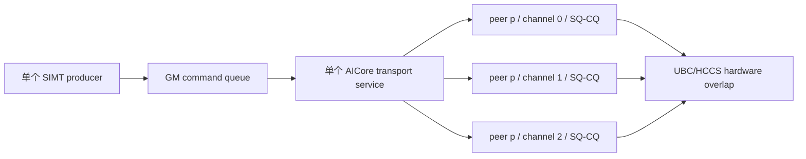
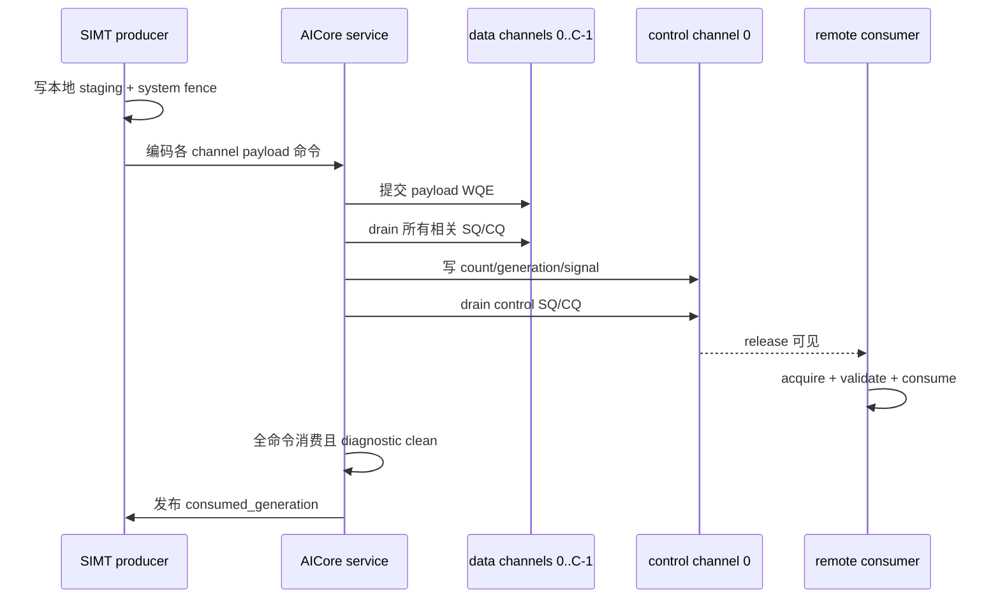

# EPv2 Ascend Normal Dispatch / Combine 多 Channel 设计规范

## 1. 状态与适用范围

**状态：** 基础实现已完成，NPU2 CANN 9.2 编译通过；NPU8P 功能、性能和参数选择待验证。

本文规定 Ascend EPv2 Normal Dispatch 和 Normal Combine 在单机多 NPU
scale-up 场景下使用多个独立传输 channel 的资源模型、数据切分、队列所有权、完成语义、
自适应策略、Profiling 和验收方法。

本文是设计与验收规范，不宣称多 channel 已被证明是 rank 长尾的根因或最终修复。rank
长尾的完整现象和排查记录见
[EPv2 Ascend Normal Dispatch / Combine Rank 长尾问题分析](epv2-ascend-rank-tail-analysis-zh.md)。

当前范围：

- Ascend 950、CANN 9.2.0；
- 单机 8 rank 的 Normal Dispatch 和 Normal Combine；
- `COMM_ENGINE_AIV`、`COMM_PROTOCOL_UBC_CTP`；
- 每个非本地 peer 创建 1--4 个 channel；
- 一个 SIMT 命令生产者和一个 AICore transport service；
- payload 多 channel，control/release 固定 channel 0；
- 保持 generation、SQ/CQ 和远端可见性的严格完成语义。

不在当前范围：

- scale-out RoCE 的多 QP 参数调优；
- 多个 AICore service 并发写同一个 SQ；
- 多个 SIMT producer 共享一个 command queue；
- 共享 Jetty 的逻辑多 channel；
- 用多 channel 代替 D0/C0 kernel-entry arrival skew 的根因定位；
- 在没有 NPU8P 数据前默认开启多 channel。

## 2. 调研结论

### 2.1 结论摘要

通信库应提供“每个 peer 多个独立 channel”的能力，但不应对所有消息固定使用多个
channel。对于 Normal Dispatch / Combine 的大块 All-to-All payload，多 channel 是符合
HCCL/HCOMM 资源模型的正常优化方向；对于小消息和 control，单 channel 更合适。

应区分以下三层：

| 层次 | 含义 | 本方案 |
| --- | --- | --- |
| channel | 面向一个 remote peer 的传输资源和队列上下文 | 每 peer 可有 1--4 个 |
| SQ/CQ/Jetty | 实际提交和完成队列 | 每个独立 channel 使用其自己的可解析队列上下文 |
| 共享 Jetty 的逻辑 channel | 多个逻辑 channel 复用一个 Jetty | 不使用；不能作为并发带宽方案 |

多 channel 的目标是提高足够大 payload 的队列并行度、减轻单 SQ 队头阻塞，并给通信库
和硬件更多调度空间。它不是 400 GB/s 带宽成立的前提：如果单 channel 已能饱和链路，增加
channel 可能没有收益，甚至会因 WQE、doorbell、CQ polling 和队列资源开销而退化。

### 2.2 CANN 9.2 直接证据

NPU2 节点安装的 CANN 9.2.0 头文件和实现给出以下证据：

1. `include/hccl/hccl_team.h` 中 `HcclTeamCreateChannelsDesc::channelCnt`
   明确允许用户指定 channel 数；`HcclTeamChannelsCreate` 根据该描述创建 team channel。
2. `include/hcomm/hcomm_channel.h` 的 `HcommChannelCreate` 接受 `channelNum`；RoCE
   描述中还包含 `queueNum` 和“每个 QP 最小数据量”的 `qpThreshold`。
3. 同一头文件的 `IS_SHARED_QUEUE` 模式明确规定：共享 Jetty 的不同 channel 不支持并发，
   必须由调用者按业务顺序串行调用。因此这种逻辑多 channel 不能用于本方案的并发分流。
4. HCCL All-to-AllV 实现
   `ins_temp_all_to_all_v_mesh_1D.h` 包含
   `ShouldUseMultiChannelForAlltoAll()`、`channelsPerRank_`、
   `sendCountsSplit_`、`recvCountsSplit_` 和 `RunSendRecvOnChannel()`。
   这直接说明 HCCL 自身会为一个 remote rank 使用多个 channel，并切分该 rank 的
   send/recv 数据。
5. CANN 9.2 还包含 All-to-All 的 `MultiJetty` 模板；AllGather 和 ReduceScatter 也存在
   `channelsPerRank` 或 `MultiJetty` 路径。多 channel 是通信库的正式资源/算法模型，
   不是 DeepEP 私有的规避方案。

公开的 HCCL 文档同样采用按数据量选择多 QP 的策略：每个 QP 数据不足阈值时自动减少
QP 数，数据小于阈值时使用单 QP。文档中的默认 512 KB 是 Atlas A2/A3 RDMA 的参考值，
不能直接作为 Ascend 950 UBC_CTP 的最终阈值，但其选择原则适用于本设计：

- [HCCL_MULTI_QP_THRESHOLD](https://www.hiascend.com/document/detail/zh/CANNCommunityEdition/850alpha002/hccl/hcclug/hcclug_000087.html)
- [cann-hccl README：All-to-All 与 Pairwise 算法说明](https://gitee.com/ascend/cann-hccl/blob/master/README.md)

## 3. 设计目标与非目标

### 3.1 设计目标

1. 一个 peer 的大 payload 可以切分到多个独立 channel。
2. 每个 record 只能属于一个 channel，禁止拆开 token/record 内部字节。
3. 不允许多个软件 owner 并发修改同一个 SQ producer 游标。
4. control publication 必须发生在相关 payload 的所有 channel 完成之后。
5. `consumed_generation` 必须代表该代所有命令和所有 SQ/CQ 已完成。
6. channel 数可配置、可回退，并最终根据每 peer 数据量自适应选择。
7. Profiling 必须能区分 producer 晚到、service 排队、SQ 提交和 CQ 完成。
8. 性能结论以 8 rank 最慢完成时间、P95 和逻辑带宽为准，而不是局部 stage 变短。

### 3.2 非目标

1. 不保证 2/4 channel 一定比 1 channel 快。
2. 不通过改变 peer 顺序掩盖最慢 producer。
3. 不把等待从 acquire 移到 release 后宣称长尾已解决。
4. 不允许以弱化 drain、远端可见性或 generation 语义换取表面性能。
5. 不在本阶段引入多个 AICore service worker；既有实验已显示 launch 和底层资源竞争会
   显著降低端到端性能。

## 4. 资源与队列模型

### 4.1 Host 创建

Host 使用统一的 `requested_channels` 创建 world team channel：

```text
HcclTeamCreateChannelsDesc
    engine     = COMM_ENGINE_AIV
    protocol   = COMM_PROTOCOL_UBC_CTP
    channelCnt = requested_channels
```

当前配置入口为 `DEEP_EP_ASCEND_CHANNELS=1..4`，默认值为 1。非法、空或超出范围的值
必须在初始化阶段失败，禁止静默截断。

上限 4 是 DeepEP 当前版本的受控实验上限，不代表 CANN 的硬件最大值。提高上限前必须
重新评估 command queue 容量、team 资源、SQ/CQ 深度、service scratch 和 NPU8P 稳定性。

### 4.2 Device 映射

CANN team ABI 暴露连续的 channel 表和每个 member 的 `channel_counts`。对 team 内 peer
`p` 和 channel `c`：

```text
flat_index(p, c) = sum(channel_counts[0 .. p-1]) + c
0 <= c < channel_counts[p]
```

解析后必须分别校验 channel protocol、SQ/CQ 数量和 SQ/CQ context 地址。任何一个 channel
无效都必须报告 transport diagnostic，不能悄悄回退到 channel 0 并继续发布 generation。

### 4.3 所有权



软件服务可以顺序构造和提交不同 channel 的 WQE，提交后的独立队列由硬件重叠推进。
这不要求多个 AICore 同时执行，也不允许多个 AICore 并发写同一 SQ。

## 5. Channel 数选择

### 5.1 三个 channel 数

实现和 Profiling 必须区分：

- `requested_channels`：用户配置的资源上限；
- `available_channels(peer)`：CANN team 实际为该 peer 提供的 channel 数；
- `active_channels(peer, generation)`：本代该 peer payload 实际使用的 channel 数。

当前基础实现令：

```text
active = min(available, requested, record_count, 4)
```

因此只跳过没有 record 的空 channel，尚未根据 payload 字节数过滤过小分片。

### 5.2 目标自适应策略

后续实现应引入每 channel 最小有效数据量 `min_bytes_per_channel`。对某个 peer：

```text
peer_bytes = record_count * record_bytes
resource_limit = min(requested_channels, available_channels, record_count)
byte_limit = max(1, floor(peer_bytes / min_bytes_per_channel))
active_channels = max(1, min(resource_limit, byte_limit))
```

`record_count == 0` 时不提交 payload WQE，`active_channels` 记为 0，但仍按协议处理该 peer
的零 count control。

`min_bytes_per_channel` 必须由 Ascend 950 NPU8P microbenchmark 和代表性 EP case 标定。
RDMA 文档中的 512 KB 只作为初始扫描点之一，不能直接写死。建议扫描：

```text
64 KB, 128 KB, 256 KB, 512 KB, 1 MB, 2 MB
```

选择阈值时同时考察 Dispatch 与 Combine；允许二者最终使用不同阈值，因为 record 大小、
producer 成本和后续消费方式不同。

## 6. Payload 切分规范

### 6.1 连续完整 record 切分

对 `N` 个 record 和 `C` 个 active channel：

```text
base = N / C
remainder = N % C
count[c] = base + (c < remainder ? 1 : 0)
offset[c] = c * base + min(c, remainder)
```

channel `c` 传输：

```text
source      + offset[c] * record_bytes
destination + offset[c] * record_bytes
count[c] * record_bytes
```

必须满足：

- 分片连续、互不重叠、无空洞；
- `sum(count[c]) == N`；
- 非空 channel 的 record 数差不超过 1；
- 不拆分单个 record；
- source 与 destination 使用同一个 record offset；
- 地址与字节数运算必须做溢出和 window 边界检查。

### 6.2 Normal Dispatch

Normal Dispatch 以完整 token record 为切分单位，`record_bytes = token_stride_bytes`。
同一个目标 rank 的 token 顺序在拼接所有 channel 分片后必须与单 channel 完全一致，不能
改变 control count、prefix、slot 或 expert routing 语义。

### 6.3 Normal Combine

Normal Combine 以完整 combine record 为切分单位，`record_bytes = combine_record_bytes`。
hidden、routing weight、record header 和可选 route metadata 必须留在同一个 record 内。
多 channel 只能改变传输资源，不能改变 contribution 顺序、master lane 或 reduction 语义。

### 6.4 Control channel

以下小消息固定使用 channel 0：

- peer count；
- generation；
- release signal；
- barrier/control 原子操作；
- terminal completion publication。

固定 control channel 的目的是维持单一、可审计的控制次序。它不意味着 payload 也必须走
channel 0。

## 7. 提交、可见性与完成语义

### 7.1 每代协议



必须保持以下顺序：

1. 本地 staging 写完成后执行 system fence；
2. 向各 active channel 提交 payload；
3. drain 本代涉及的所有 payload channel；
4. 在 channel 0 发布 count、generation 和 signal；
5. drain control channel；
6. consumer acquire 成功后才读取 payload；
7. command queue 全部消费、所有相关 SQ/CQ 无 outstanding 且 diagnostic clean 后，才允许
   发布 `consumed_generation`；
8. 下一代 `reset()` 必须拒绝 active、部分消费或尚未完成的非空 generation。

当前安全实现的 collective flush 和 terminal drain 会遍历每个 peer 的全部已分配 channel。
未来若只 drain active channel，必须为每代保存不可歧义的 active bitmap，且错误、零 count、
提前返回和 pipeline 路径都必须覆盖；在此之前禁止用推断替代全 channel drain。

### 7.2 禁止的完成优化

- 禁止只等待 channel 0 的 CQE 就推断其他独立 channel 已完成；
- 禁止依赖不同 SQ 之间未被 CANN 明确定义的完成顺序；
- 禁止所有 WQE 都设置 `cqe=0` 后把 `Drain` 返回当成硬件完成；
- 禁止在 payload drain 前发布 generation 或 signal；
- 禁止错误路径发布 `consumed_generation`；
- 禁止下一代 reset 覆盖仍有 outstanding 的 SQ/CQ 状态。

只有同一队列内顺序和 fence 得到明确保证时，才可以评估“仅最后一条 WQE 请求 CQE”的
优化；该优化不得跨独立 channel 推广。

## 8. Command Queue 与资源容量

每增加一个 payload channel，每个 peer 最坏情况至少增加一条 payload command。command
queue 容量必须随 `world_size` 和 `requested_channels` 增长，并在 host 初始化阶段做
`uint32_t` 溢出检查。

当前容量模型为：

```text
peers = world_size - 1
commands_per_peer = 6 + requested_channels
capacity = peers * commands_per_peer + 4
```

若后续增加分段 pipeline、每 channel 多 WQE、active bitmap publication 或独立 control
批次，必须同步更新容量公式和边界测试。禁止依赖代表性 case “刚好未溢出”。

## 9. Profiling 规范

多 channel Profiling 至少记录以下维度：

| 维度 | 必需指标 |
| --- | --- |
| rank | operation start/end、D0/C0 entry、release start、acquire end |
| peer | record 数、payload bytes、requested/available/active channels |
| channel | bytes、WQE 数、首次/末次 submit、doorbell、CQ wait、drain end |
| queue | SQ submitted/completed、CQ generated/completed、HWM、retry/timeout |
| generation | command count、consumed count、completion generation、diagnostic |

必须能够回答：

1. 慢 rank 是晚进入 producer、晚提交，还是提交后晚完成？
2. 多 channel 是否真正分担了字节，还是大部分 channel 为空或数据过小？
3. 最慢 channel 是否固定对应某个 peer、SQ 或物理链路？
4. 增加 channel 后 service 编码成本、CQ polling 和 terminal drain 是否抵消传输收益？
5. rank spread 收敛时，8 rank 最大完成时间是否也提前？

不同 NPU 的 `GetSystemCycle()` 绝对值不能直接互减。跨 rank 只比较各自阶段耗时或经过可靠
同步后的事件；同一 rank 内可以比较阶段边界。

## 10. 验证与验收

### 10.1 编译与 host contract

- CANN 9.2 production `dispatch.asc`、`combine.asc`、barrier 和 runtime object 编译通过；
- 1/2/4 channel 的 host 配置、容量和 ABI probe 通过；
- record 切分覆盖 `0, 1, C-1, C, C+1` 和大 record count；
- 地址溢出、非法 channel、缺失 SQ/CQ 和非法配置必须失败；
- 单 channel 默认行为保持兼容。

### 10.2 NPU8P 功能矩阵

对 1/2/4 channel 分别执行：

- Normal Dispatch 与 Normal Combine；
- count 为 0、少于 channel 数、不能整除 channel 数和大 payload；
- 连续多 generation，覆盖 wrap/reset 前置条件；
- cached/uncached、同步/异步和当前生产支持的 pipeline 组合；
- 输出逐元素对照单 channel/reference；
- 每轮结束检查所有 rank 的 SQ/CQ outstanding 为 0、diagnostic clean、
  `completion_generation == generation`。

### 10.3 NPU8P 性能矩阵

第一阶段只使用代表性 case，不用 144 case 淹没归因：

```text
tokens=8192, hidden=7168, top-k=8, experts=256, data-blocks=72
ep-fp8-align128-bias0-hcopy1-prev0-async0-alloc0
```

测试 1/2/4 channel 和候选 `min_bytes_per_channel`，采用同二进制 ABBA 交错顺序，至少
30 个稳定迭代，并保存逐轮逐 rank 数据。先验证 Normal Dispatch，再验证 Normal Combine。

验收必须同时满足：

1. 正确性和完成语义全部通过；
2. 最慢 rank 的 P50/P95 有可重复改善，而不只是平均 service cycle 下降；
3. 逻辑带宽提高或至少不发生统计显著退化；
4. rank spread 的改善伴随全局最大完成时间提前；
5. 没有 queue HWM、CQ retry、timeout、diagnostic 或代际 reset 风险上升；
6. 小消息自动回退单 channel 后不承担固定的多 channel 开销。

如果 2/4 channel 只改变“哪个 rank 慢”或把等待搬到 terminal drain，则判定为未解决性能
问题。如果单 channel 已稳定达到链路上限，多 channel 无收益属于合理结果，不应继续以
弱化完成语义的方式追求数字。

## 11. 与 rank 长尾根因的关系

多 channel 能直接影响的路径：

- 单 peer 单 SQ 串行；
- 单队列队头阻塞；
- 大 payload 在一个 channel 上的传输时间；
- 多独立队列带来的硬件并行和调度机会。

多 channel 不能直接修复：

- 不同 rank 获得 kernel 执行机会的时间差；
- D0/C0 之前的 runtime/device scheduler skew；
- producer 上游计算量不均；
- Combine 本地 record 构造或 reduction 长尾；
- barrier exit 到下一 kernel start 的跨卡偏斜。

此前 profile 中 transport service 通常约 1--2M cycles，而 consumer 观察到的尾部可达
5--10M cycles。因此多 channel 是必须验证的传输优化，但在出现 per-channel submit/CQ
证据前，不能把剩余 rank 长尾归因于单 channel。

## 12. 当前实现映射与后续工作

### 12.1 已实现

- `DEEP_EP_ASCEND_CHANNELS=1..4`，默认 1；
- `HcclTeamChannelsCreate(channelCnt)` 创建 team channel；
- device 侧按 peer 和 channel index 解析连续 channel 表；
- Normal Dispatch 按完整 token 切片；
- Normal Combine 按完整 record 切片；
- control 固定 channel 0；
- collective flush 和 terminal completion drain 全部 peer/channel；
- command queue capacity 随 channel 数扩容；
- host contract 全量通过；
- NPU2 CANN 9.2 production object 编译通过。

对应实现：

- `csrc/backends/ascend/transport/channel_config.hpp`；
- `csrc/backends/ascend/transport/cann_transport.cpp`；
- `csrc/backends/ascend/transport/aicore_transport_service.hpp`；
- `csrc/backends/ascend/elastic/release_protocol.hpp`；
- `csrc/backends/ascend/elastic/dispatch.asc`；
- `csrc/backends/ascend/elastic/combine.asc`。

### 12.2 待实现或待验证

1. 根据每 peer payload bytes 选择 active channel；
2. 标定 Dispatch/Combine 的 `min_bytes_per_channel`；
3. 增加逐 peer、逐 channel bytes/WQE/CQ wait/HWM profile；
4. NPU8P 两 rank 冒烟及 8 rank 1/2/4 channel 正确性；
5. 代表性 case 的 ABBA 性能对照；
6. 与 D0/C0 entry arrival profile 联合判断单 channel 是否参与 rank 长尾；
7. 验证后决定默认值仍为 1、改为固定 2，还是启用自适应模式。

## 13. 最终决策原则

生产默认值只能由 NPU8P 数据决定：

- 若大 payload 在 2/4 channel 下最慢 rank、P95 和带宽稳定改善，采用自适应多 channel；
- 若只有特定大小受益，按 per-peer bytes 阈值选择；
- 若单 channel 已饱和且多 channel 增加开销，保留多 channel 能力但默认使用 1；
- 若多 channel 改善 CQ completion 却不改善端到端时间，继续定位 producer arrival 和
  consumer overlap，不把 transport 局部优化包装成长尾根因修复。

无论性能结果如何，所有方案都必须保持 SQ/CQ 完整 drain、远端 payload-before-control
可见性，以及严格的 `consumed_generation`/`reset()` 生命周期语义。
