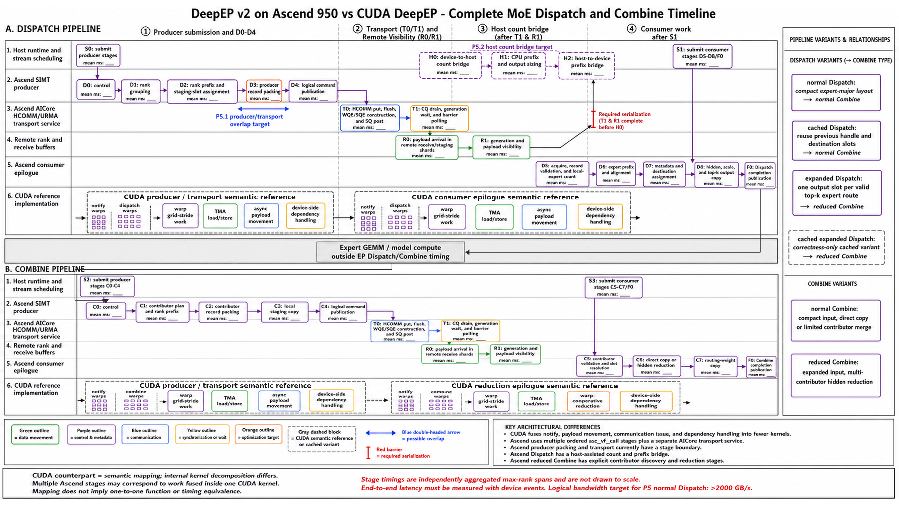

# EPv2 Ascend P5 Timeline, CUDA Parity, and Overlap Optimization

## 1. Purpose

P5 targets the remaining gap between the Ascend 950 production EP path and
the available HCCS payload transport capability. The representative
transport-only probe reaches `2535.046 GB/s`, while the retained P4 normal
Dispatch result reaches about `217.1 logical GB/s`. These values use different
byte formulas and cannot be divided to obtain a hardware-efficiency number.
They do establish that large contiguous HCOMM payload puts are not the first
layer to optimize.

P5 first builds a common Ascend/CUDA timeline and parity matrix, then uses that
evidence to remove serialization in packing, transport submission, count and
prefix handling, and consumer copy or reduction. The work does not start by
changing HCOMM or the SIMT transport facade. Those layers are changed only
when a production-aligned measurement attributes a remaining critical-path
cost to them.

This document is both the P5 design specification and the assignment boundary
for later implementation tasks. It defines:

- the primary performance target and measurement protocol;
- the existing P3/P4 timeline evidence and its limits;
- the complete Dispatch and Combine data flows;
- the relationship among the three timed Dispatch operations and two timed
  Combine operations;
- a stage-by-stage Ascend/CUDA parity matrix;
- the P5.0 through P5.5 optimization order and decision gates; and
- the prompt used to generate the companion timeline image.

## 2. Primary Goal and Measurement Contract

### 2.1 Primary target

The P5 primary acceptance target is:

```text
Ascend 950, single-host EP8, normal FP8 Dispatch
logical bandwidth > 2000 GB/s
```

The target applies to the full public normal Dispatch operation, not to the
transport-only probe, an internal kernel stage, or the sum of per-rank
bandwidth values computed with a different byte formula.

The selected representative case is:

| Setting | Value |
| --- | --- |
| Device | Ascend 950 |
| Topology | single-host EP8 |
| Tokens | 8,192 maximum per rank |
| Hidden width | 7,168 |
| Top-k | 8 |
| Experts | 256 |
| Dispatch representation | FP8 |
| Combine representation | BF16 |
| Expert alignment | 128 |
| Ascend data blocks | 72 |
| Warmup / measured samples | 30 / 30 |
| Timing | device event, rank-max per sample |
| Case ID | `ep-fp8-align128-bias0-hcopy1-prev0-async0-alloc0` |

The synchronous `async0/alloc0` case is intentional. It exposes the complete
production dependency chain and prevents an external workload from hiding a
mandatory Dispatch stage. Async/event variants remain secondary overlap
qualification cases.

The representative normal Dispatch logical byte count is about `7.786 GB`.
Therefore the target implies an end-to-end mean latency below approximately:

\[
T_{2000} = \frac{7.786\times 10^9}{2000\times 10^9}
         \approx 3.893\ \text{ms}
\]

The retained P4 result is about `35.868 ms`, so the target requires a major
pipeline change rather than another isolated scalar-loop improvement.

### 2.2 Secondary gates

Every P5 performance run also reports all five timed operations:

1. normal Dispatch;
2. expanded Dispatch;
3. cached normal Dispatch;
4. normal Combine; and
5. reduced Combine.

Normal Dispatch is the primary bandwidth target. The other four operations
are regression and attribution gates. A candidate is not retained if it
changes routing, output layout, contributor ordering, generation handling,
timeout behavior, or public tensor ownership.

Each retained optimization must pass:

- focused host contract tests;
- Ascend source compilation;
- two-rank production and SIMT/AICore correctness checks;
- an unchanged EP8 representative ABBA comparison;
- mean, p50, p95, and logical-bandwidth reporting; and
- the complete 144-case, 720-operation correctness and performance gate before
  P5 is declared complete.

There is no per-item percentage threshold. Stage improvement must explain an
end-to-end movement, and the final P5 goal remains `>2000 GB/s` for normal
Dispatch.

## 3. Baseline Evidence

### 3.1 Retained P4 end-to-end results

The current P4 retained version uses the same EP8 representative workload,
72 blocks, 30 warmups, and 30 measured samples:

| Operation | Mean | P95 | Approximate logical bandwidth |
| --- | ---: | ---: | ---: |
| Dispatch | 35.868 ms | 37.545 ms | 217.1 GB/s |
| Expanded Dispatch | 37.286 ms | 38.739 ms | 248.1 GB/s |
| Cached Dispatch | 84.667 ms | 86.272 ms | 92.0 GB/s |
| Combine | 104.675 ms | 106.901 ms | 104.1 GB/s |
| Reduced Combine | 168.137 ms | 169.780 ms | 64.8 GB/s |

Logical bandwidth is the benchmark's logical-byte throughput. It is not HCCS
physical link bandwidth.

### 3.2 HCCS and transport-only evidence

The Ascend HCCS benchmark separates physical and software layers:

| Probe | Result | Interpretation |
| --- | ---: | --- |
| One-way 64 MiB P2P | about 52.282 GB/s | large-message per-sender reference |
| EP8 32 MiB/peer all-to-all | 2507.178 aggregate GB/s | measured concurrent HCCS/HCOMM result |
| Independent-link extrapolation | 2927.775 aggregate GB/s | topology reference, not measured production bandwidth |
| Representative transport-only | 0.903 ms, 2535.046 aggregate GB/s | production facade, command queue, service, put, flush, and CQ |
| Full representative Dispatch | about 35.9-37.3 ms | includes all production preparation and consumer work |

The transport-only probe sends the representative remote payload matrix but
excludes grouping, offsets, production record packing, control publication,
consumer copy, and host count handling. It proves that payload data-plane
capacity is available; it does not reproduce the full Dispatch protocol.

## 4. Existing Timeline Capability

### 4.1 Device-stage timeline

P3.0 and P4.0 provide absolute device-stage timestamps and derived phase
accounting:

```text
producer
publication
service_submit
cq_wait
barrier_wait
consumer_wait
consumer_compute
epilogue
```

The named producer and consumer stages further identify control, grouping,
prefix, record construction, validation, expert counting, metadata,
destination assignment, copy, reduction, weights, and completion.

The P3 profile baseline for normal Dispatch and normal Combine is:

| Phase | Dispatch | Combine |
| --- | ---: | ---: |
| Producer | 4.470 ms | 47.147 ms |
| Publication | 0.163 ms | 51.361 ms |
| Service submit | 5.734 ms | 7.384 ms |
| CQ wait | 0.851 ms | 1.557 ms |
| Consumer wait | 0.605 ms | 10.782 ms |
| Consumer compute | 8.179 ms | 7.639 ms |
| Completion publication | 0.003 ms | 0.002 ms |

These values are initial attribution references. P5.0 refreshes the same
fields on the retained P4 binary before selecting a P5.1 candidate.

### 4.2 Host/device scheduling timeline

P4.4 adds an optional host timeline around uncached Dispatch. It records:

```text
stream synchronization
count copies from device to host
CPU prefix calculation
prefix copies from host to device
output allocation
epilogue setup
epilogue submission
completion event publication
completion wait and async-state retirement
```

The P4.4 representative measurements include:

| Host phase | Normal Dispatch | Expanded Dispatch |
| --- | ---: | ---: |
| Stream synchronization | 15.490 ms | 17.152 ms |
| Completion wait | 6.108 ms | 7.912 ms |
| Three D2H count copies before batching | 1.119 ms | 1.711 ms |
| Two H2D prefix copies before batching | 0.906 ms | 0.978 ms |
| CPU prefix calculation | about 0.007 ms | about 0.007 ms |

P4.4 retained count-bridge batching, reducing three D2H calls plus two H2D
calls to one call in each direction. Required visibility, allocation,
completion, and buffer-lifetime waits remain.

### 4.3 Interpretation constraints

For sample `i`, the formal operation latency is:

\[
T_i = \max_{0\le r<8} T_{i,r}
\]

The mean, p50, and p95 are computed from these rank-max samples. Stage
profiling independently selects the maximum for each phase, so one reported
phase vector may contain components from different ranks. Consequently:

- stage values must not be summed to reconstruct end-to-end latency;
- stage spans may include separate launch and context setup;
- barrier spans can include rank-arrival skew;
- an overlap ceiling is a diagnostic bound, not a measured speedup; and
- the companion image must be labeled `not to scale`.

## 5. Timeline Gaps P5.0 Must Close

The existing timeline identifies long stages but does not yet provide a
CUDA-parity critical-path trace. P5.0 adds or derives the following fields:

| Field | Required interpretation |
| --- | --- |
| `stage_id` | Stable ID shared by the figure, JSON, tables, and code mapping; `D0-D8`, `C0-C7`, `T0-T1`, `H0-H2`, `S0-S3`, and `F0` are reserved by this spec |
| `operation` | Dispatch, expanded Dispatch, cached Dispatch, Combine, or reduced Combine |
| `rank` | Rank that produced the interval; do not discard it before critical-path analysis |
| `lane` | Host, SIMT producer, AICore service, remote receive, or consumer epilogue |
| `start_cycle/end_cycle` | Absolute device timestamps for overlap calculation |
| `host_start_ns/host_end_ns` | Host submission and blocking intervals |
| `implementation` | Ascend function or runtime method responsible for the stage |
| `cuda_counterpart` | CUDA kernel or warp role that performs equivalent semantic work |
| `parallel_unit` | Thread, subgroup, warp, block, SM, rank owner, expert owner, or service channel |
| `work_items` | Tokens, records, contributors, experts, hidden elements, commands, or bytes |
| `bytes` | Payload, scale, metadata, D2H, H2D, SQ, and CQ bytes where defined |
| `dependency` | Stream order, event, generation, barrier, CQ completion, or host allocation |
| `active/idle/overlap` | Device active union, inter-stage idle span, and measured overlap |

P5.0 must split broad stages enough to distinguish:

- hidden record packing from scale and top-k metadata packing;
- command reserve/write/publication from WQE/SQE construction and SQ post;
- payload flush from control publication;
- barrier submission from remote-generation polling;
- expert count from expert prefix and destination assignment;
- vector main-body copy from scalar tail; and
- contributor discovery from hidden reduction and final output write.

If production in-kernel timestamps exceed the AIV scalar internal-buffer
limit, use separately compiled profile kernels or repeated stage ablations.
Profiling must remain disabled by default and must not change disabled-path
generated code or performance.

## 6. Dispatch and Combine Mode Relationships

### 6.1 Dispatch modes

The three timed Dispatch operations are not three independent layouts.
Normal and expanded select the output layout; cached selects whether a valid
previous handle is reused.

| Timed operation | Layout | Behavior | Downstream operation |
| --- | --- | --- | --- |
| Normal Dispatch | compact expert input | One source token record is sent once per destination rank; the receiver resolves local expert placement | Normal Combine |
| Expanded Dispatch | expanded expert-major input | Each valid top-k expert route receives an independent output slot | Reduced Combine |
| Cached Dispatch | cached compact layout | Reuses validated destination slots and handle metadata from a previous normal Dispatch | Normal Combine |

A cached-expanded variant also exists. It reuses an expanded Dispatch handle
and validates zero padding and output placement. The canonical suite prepares
and checks it, but does not report it as a sixth timed operation.

The relationship is:

```text
router output: x + scale + top-k index/weight
    |
    +-- normal Dispatch ----------------> compact expert input
    |       `-- cached normal replay ----> same compact layout
    |                                      `-- normal Combine
    |
    `-- expanded Dispatch --------------> expanded expert-major input
            `-- cached expanded replay --> same expanded layout
                                           `-- reduced Combine
```

### 6.2 Combine modes

| Timed operation | Input layout | Behavior |
| --- | --- | --- |
| Normal Combine | compact layout from normal Dispatch | Returns expert output to the source rank and performs direct copy or bounded contributor merging |
| Reduced Combine | expanded layout from expanded Dispatch | Resolves multiple expert or rank contributors for a token, reduces hidden values, and writes the final BF16 output |

`allow_multiple_reduction` controls whether compatible local contributions can
be reduced before they are represented as remote records. It does not turn
normal Combine and reduced Combine into identical operations. Their input
layouts and contributor work remain different.

### 6.3 Timeline selection

The primary timeline and P5 bandwidth gate use:

```text
normal FP8 Dispatch -> expert compute boundary -> normal BF16 Combine
```

This path contains grouping, prefix, record packing, transport, consumer
layout, and reverse communication without cached-handle reuse or expanded
reduction amplification.

The companion figure also contains a secondary branch:

```text
expanded FP8 Dispatch -> expert compute boundary -> reduced BF16 Combine
```

This branch is the P5.4 reduction target. Cached normal and cached-expanded
operations are shown as dashed replay branches instead of separate main
timelines.

## 7. End-to-End Stage Model

### 7.1 Dispatch

```text
D0 input and control
 -> D1 rank grouping and count
 -> D2 rank prefix and staging-slot assignment
 -> D3 hidden/scale/top-k/metadata record packing
 -> D4 logical command publication
 -> T0 AICore HCOMM put/flush and request submission
 -> T1 CQ, generation, and remote visibility wait
 -> D5 acquire, record validation, and local-expert count
 -> D6 expert prefix and alignment
 -> D7 metadata and destination assignment
 -> D8 hidden/scale/top-k output copy
 -> F0 completion publication
```

### 7.2 Combine

```text
C0 input control and validation
 -> C1 contributor plan and rank prefix
 -> C2 contributor record packing
 -> C3 local staging copy
 -> C4 logical command publication
 -> T0 AICore HCOMM put/flush and request submission
 -> T1 CQ, generation, and remote visibility wait
 -> C5 contributor validation and slot resolution
 -> C6 direct copy or hidden reduction
 -> C7 routing-weight output
 -> F0 completion publication
```

The expert GEMM lies between Dispatch and Combine. It is a model dependency,
not part of either EP operator's measured latency. The image must show this
boundary without adding GEMM time to the five-operation benchmark.

## 8. Ascend/CUDA Parity Matrix

### 8.1 Function mapping

| Stage | Ascend implementation | CUDA implementation |
| --- | --- | --- |
| D0 control | `direct_dispatch_producer_control_vf` | `dispatch_impl` prologue and notify-warps setup |
| D1 grouping | `direct_dispatch_producer_group_vf` | notify warps in `dispatch_impl` |
| D2 prefix/slot | `direct_dispatch_producer_prefix_vf` | warp prefix and atomic destination-slot assignment in `dispatch_impl` |
| D3 record packing | `direct_dispatch_producer_record_vf` plus vector payload path | dispatch warps, TMA load/store, scale copy, and metadata writes in `dispatch_impl` |
| D4 publication | `direct_dispatch_producer_release_vf` | Gin put, put-value, flush, and GPU barrier in `dispatch_impl` |
| D5 acquire/count | `direct_dispatch_epilogue_acquire_vf`, `direct_dispatch_epilogue_validate_records_vf`, `direct_dispatch_epilogue_count_experts_vf` | notify results, acquire, validation, and token traversal in `dispatch_copy_epilogue_impl` |
| D6 expert prefix | `direct_dispatch_epilogue_prefix_vf` | warp prefix and exchange in `dispatch_copy_epilogue_impl` |
| D7 metadata/destination | `direct_dispatch_epilogue_metadata_vf`, `direct_dispatch_epilogue_assign_destinations_vf` | destination assignment and metadata traversal in `dispatch_copy_epilogue_impl` |
| D8 output copy | `direct_dispatch_epilogue_copy_outputs_vf` plus AICore DataCopy path | per-warp TMA load/store in `dispatch_copy_epilogue_impl` |
| C0 control | `direct_combine_producer_control_vf` | combine kernel prologue and workspace setup in `combine_impl` |
| C1 plan/prefix | `direct_combine_producer_plan_vf`, `direct_combine_producer_plan_prefix_vf` | contributor metadata traversal and prefix in `combine_impl` |
| C2 record | `direct_combine_producer_record_vf`, normal vector payload copy, and `direct_combine_producer_expanded_vector_reduce_impl` | TMA copy or warp-cooperative local reduction in `combine_impl` |
| C3 local staging | `direct_combine_producer_local_copy_vf` | local-copy and send-buffer preparation in `combine_impl` |
| C4 publication | `direct_combine_producer_release_vf` | Gin put and final GPU barrier in `combine_impl` |
| C5 contributor slots | `direct_combine_epilogue_validate_vf`, prepare-vector-slots, and slot workspace stages | warp ballot, exchange, and `compute_topk_slots` |
| C6 reduction/copy | `direct_combine_epilogue_reduce_vf` and vector implementation | `combine_reduce` in `combine_reduce_epilogue_impl` |
| C7 weights | `direct_combine_epilogue_weights_vf` | lane-level top-k weight copy in `combine_reduce_epilogue_impl` |
| T0 transport service | staged command queue and `aicore_transport_service` | NCCL Device API Gin executed by kernel warps |
| T1 completion | CQ drain, generation checks, barrier polling | Gin barrier and CUDA programmatic dependency |
| F0 completion | Dispatch/Combine complete VFs | final store, barrier, or programmatic launch completion |

CUDA source references:

- `deep_ep/include/deep_ep/impls/dispatch.cuh`;
- `deep_ep/include/deep_ep/impls/dispatch_copy_epilogue.cuh`;
- `deep_ep/include/deep_ep/impls/combine.cuh`; and
- `deep_ep/include/deep_ep/impls/combine_reduce_epilogue.cuh`.

Ascend source references:

- `csrc/backends/ascend/elastic/dispatch.asc`;
- `csrc/backends/ascend/elastic/combine.asc`;
- `csrc/backends/ascend/transport/device_transport_commands.hpp`;
- `csrc/backends/ascend/transport/aicore_transport_service.hpp`; and
- `csrc/backends/ascend/runtime/host_timeline.hpp`.

### 8.2 Parallelism gaps

| Dimension | CUDA DeepEP | Current Ascend | P5 consequence |
| --- | --- | --- | --- |
| Main-kernel roles | Notify warps and dispatch warps advance inside one kernel | Control, group, prefix, record, release, and service are separate ordered stages | Measure and then overlap record chunks with publication/service |
| Payload work unit | Warp owns a token; lanes cooperate over top-k and hidden chunks | 72-block record grid gives record ownership, but release waits for the complete stage | Add bounded chunk lifecycle and independent staging ownership |
| Data movement | TMA load/store, `cp.async`, and metadata work are pipelined per token | Vector/DataCopy main bodies exist, but metadata and service are separated by stage barriers | Trace vector body, scalar tail, and service overlap separately |
| Communication issue | Gin calls are issued from the executing CUDA warp/channel | SIMT records commands; a later AICore service constructs and posts URMA requests | Preserve staged ABI but pipeline producer and service generations |
| Count and prefix | Device-side notify reduction and warp prefix are available | Synchronous path crosses D2H, CPU prefix, and H2D boundaries | Move prefix and output sizing off the host critical path where contracts allow |
| Consumer start | CUDA PDL and device dependency start the epilogue without a host round trip | Ascend submits multiple epilogue stages after host-visible counts and allocation | Create a device-visible epilogue boundary and separate exact allocation from critical progress |
| Expert metadata | Warp/subgroup primitives keep small count and prefix state near the kernel | Rank/expert owner scans and one-block control stages serialize parts of the path | Increase subgroup and block participation without changing deterministic order |
| Combine reduction | Warp-cooperative contributor selection, vector reduction, and TMA output | Normal Combine has a retained DataCopy path; expanded/reduced paths use more explicit contributor and hidden loops | Align reduced Combine with subgroup/vector execution before transport tuning |
| Queue/channel use | Warps can map to multiple Gin/QP channels | Production uses a staged service and bounded queues; prior HWM was only 4/4 | Do not add channels until the new timeline proves service saturation |
| Launch and wait | Fewer fused kernels and device-side dependency | More `asc_vf_call` stages, stream waits, count copies, and completion waits | Attribute launch gaps and fuse only stable critical-path boundaries |

## 9. P5 Workstreams

### 9.1 P5.0: Timeline and CUDA parity instrumentation

P5.0 produces one machine-readable critical-path report for each of the five
operations and a Markdown table using the stable stage IDs in this spec.

Required outputs:

- per-rank absolute stage timestamps;
- host submission and blocking intervals;
- stage work counts and byte counts;
- active-stage union, idle gaps, and measured overlap;
- Ascend function and CUDA counterpart fields;
- normal Dispatch/normal Combine primary timeline;
- expanded Dispatch/reduced Combine secondary timeline; and
- a refreshed P4-final baseline before an implementation candidate is chosen.

The CUDA side first uses existing kernel boundaries and profiler/NVTX ranges.
It does not require invasive per-warp timing in production code. Nsight or
equivalent evidence may refine a stage, but the formal cross-platform table
compares semantic stages rather than claiming that differently decomposed
kernels have identical timer overhead.

P5.0 is complete when the report can answer:

1. how much device idle time exists between packing, service, and consumer;
2. whether producer work and HCOMM service overlap at all;
3. which host dependency blocks the consumer submission;
4. how much work is executed by one block, one owner, or the 72-block grid;
5. which Ascend GM round trips have no CUDA counterpart; and
6. which long interval is computation, arrival skew, or communication wait.

#### P5.0 measured baseline

P5.0 is complete on the retained P4 tree. NPU8P task
`task_20260826_181006_24299589105` ran the representative EP8 case with 30
warmups and 30 measured samples for all five operations. The workload
fingerprint was
`d6338cb40be7a4b6d35c4a8c9ee106ea0385751cdd5a20f1ba366baa28324f00`.
The raw profile SHA-256 was
`e0ebde74557e24ef3ef0eb6ee6ad73f20d716488fbb6a1062917c0b53f625ef3`.

| Operation | Mean (ms) | p50 (ms) | p95 (ms) | Logical GB/s |
| --- | ---: | ---: | ---: | ---: |
| Dispatch | 36.016 | 35.814 | 37.755 | 216.185 |
| Expanded Dispatch | 37.403 | 37.523 | 38.776 | 247.349 |
| Cached Dispatch | 85.272 | 85.315 | 87.318 | 91.309 |
| Combine | 105.785 | 105.657 | 107.976 | 103.050 |
| Reduced Combine | 168.096 | 168.126 | 169.730 | 64.851 |

The normal Dispatch attribution selected P5.1 before P5.2: D3 record packing
was `3,863,793 cycles`, the network envelope was `7,854,781 cycles`, D5-D8
consumer work was `8,628,304 cycles`, and measured producer/transport overlap
was zero. The split host path contained a `0.343 ms` count copy, `0.004 ms`
CPU prefix, `0.345 ms` prefix publication, and a `16.158 ms` maximum-rank
synchronization interval.

### 9.2 P5.1: Producer/transport chunk overlap

P5.1 is the first performance implementation after P5.0. It replaces the
all-records-then-release schedule with a bounded chunk lifecycle:

```text
chunk n packing
    -> publish chunk n
    -> service chunk n
       || chunk n+1 packing
    -> remote visibility and chunk completion
```

The candidate uses double-buffered or bounded ring staging only when every
chunk owns independent records, commands, request state, generation, and
completion state. A producer may not reuse a chunk slot until its request and
remote visibility contract are complete.

The first slice applies to normal non-cached Dispatch. Expanded, cached,
hybrid, and scale-out paths keep their existing schedule until the lifecycle
is qualified. Chunk count is a measured tiling choice, not an unrestricted
runtime knob.

#### P5.1 retention result

The current tree already contained the P3.2 two-stream, two-request-slot,
2,048-slot chunk pipeline. P5.1 therefore requalified that implementation
instead of adding a second protocol. NPU8P task
`task_20260826_181658_245649824291` ran baseline A, candidate A, candidate B,
and baseline B from the same binary and immutable workload manifest.

| Operation | Baseline mean (ms) | Candidate mean (ms) | Mean delta | Baseline p95 (ms) | Candidate p95 (ms) | p95 delta |
| --- | ---: | ---: | ---: | ---: | ---: | ---: |
| Dispatch | 36.983 | 39.086 | +5.69% | 38.924 | 41.003 | +5.34% |
| Expanded Dispatch | 37.839 | 39.869 | +5.36% | 39.824 | 41.398 | +3.95% |
| Cached Dispatch | 85.330 | 84.738 | -0.69% | 87.039 | 86.551 | -0.56% |
| Combine | 104.212 | 104.356 | +0.14% | 106.281 | 105.980 | -0.28% |
| Reduced Combine | 167.933 | 168.119 | +0.11% | 170.007 | 169.622 | -0.23% |

P5.1 is rejected for this tree. The 2,048-slot pipeline remains experimental
and disabled by default; later P5 candidates must not stack on it.

### 9.3 P5.2: Remove the host count bridge from the critical path

P5.2 selects one of two approaches from P5.0 evidence:

1. device-side count/prefix and conservative preallocation; or
2. asynchronous count copy and prefix publication that overlaps independent
   work without violating output-allocation ownership.

The design must preserve exact public tensor shapes, zero-token behavior,
cached-handle validation, stream ownership, and error propagation. CPU prefix
arithmetic is not the target; the target is the dependency and copy chain
around it.

#### P5.2 retained implementation and evidence

The retained candidate is selected only by
`DEEP_EP_ASCEND_DISPATCH_DEVICE_PREFIX=1` and only for direct, uncached,
synchronous, non-hybrid, non-stream Dispatch. It preallocates the maximum
receive capacity and launches D5-D8/F0 as one continuous device pipeline. One
final stream synchronization is followed by count readback, public-result
validation, exact-shape tensor narrowing, and publication of the public prefix
tensor. Cached, hybrid, asynchronous/event, communication-stream, expanded
protocol semantics, and the rejected P5.1 chunk pipeline are unchanged.

This distinction matters: P5.2 removes the D6-to-D7 host dependency; it does
not remove the final D2H count read or the H2D publication needed by the public
return contract. The host timeline fields still report those final copies,
but they no longer sit between D6 and D7. Across eight ranks, the measured
D6-end to D7-start gap changed as follows:

| Gap metric | P5.0 split path (cycles) | P5.2 device path (cycles) |
| --- | ---: | ---: |
| Minimum | 379,287 | 2,042 |
| Median | 973,796 | 2,673 |
| Maximum | 1,229,521 | 3,053 |
| Mean | 933,451 | 2,561 |

Build task `task_20260826_183246_252565021205` and two-rank correctness task
`task_20260826_183457_253242031277` both exited zero. The correctness task ran
one baseline and two candidate generations; normal, expanded, and cached
Dispatch plus normal and reduced Combine all passed. EP8 ABBA task
`task_20260826_183635_253767416396` used 8,192 tokens/rank, hidden 7,168,
top-k 8, 256 experts, FP8 Dispatch, BF16 Combine, alignment 128, 72 blocks,
30 warmups, and 30 samples. All four reports used workload fingerprint
`d6338cb40be7a4b6d35c4a8c9ee106ea0385751cdd5a20f1ba366baa28324f00`.

| Operation | Baseline mean (ms) | Candidate mean (ms) | Mean delta | Baseline p95 (ms) | Candidate p95 (ms) | p95 delta | Baseline GB/s | Candidate GB/s |
| --- | ---: | ---: | ---: | ---: | ---: | ---: | ---: | ---: |
| Dispatch | 37.439 | 35.620 | -4.86% | 40.114 | 37.541 | -6.41% | 208.001 | 218.627 |
| Expanded Dispatch | 37.663 | 37.246 | -1.11% | 39.469 | 39.736 | +0.68% | 245.740 | 248.429 |
| Cached Dispatch | 84.627 | 84.696 | +0.08% | 86.127 | 86.160 | +0.04% | 92.039 | 91.931 |
| Combine | 104.956 | 105.139 | +0.17% | 106.210 | 106.559 | +0.33% | 103.872 | 103.688 |
| Reduced Combine | 168.240 | 168.289 | +0.03% | 170.143 | 169.687 | -0.27% | 64.796 | 64.777 |

The Dispatch mean and p95 improvements exceed the baseline and candidate
pair variation (`2.54%` and `2.77%` for the mean). The other four operations
remain within run-to-run variation. Candidate profile task
`task_20260826_184235_255533624664` exited zero; its raw profile SHA-256 is
`93c27e312d6c9f03bdb30c007b805679e6a1c42be42190623fa884ad12fad680`.
P5.2 is therefore retained behind its experimental environment switch.

### 9.4 P5.3: Consumer metadata and copy parallelism

P5.3 addresses the longest retained consumer substage in this order:

1. expert count;
2. expert prefix and alignment;
3. destination assignment;
4. metadata copy;
5. hidden and scale output copy.

Candidates use record-oriented or subgroup-oriented work distribution and
reuse already valid compact source bases and counts. They must not restore a
scan over all reserved source slots or introduce a new full GM temporary.

#### P5.3 retained D8 consumer-copy tile

The first P5.3 slice targets D8 because the retained P5.2 profile measured it
at about `4.53M` cycles and it was the largest deterministic consumer-copy
stage. The implementation adds
`DEEP_EP_ASCEND_DISPATCH_CONSUMER_TILE_BYTES` with four same-binary AICore
specializations: 512, 1,024, 2,048, and 4,096 bytes. It is eligible only with
the P5.2 device-prefix path for direct, uncached, synchronous, non-expanded,
non-hybrid, non-stream Dispatch. The 512-byte specialization remains the
control. DataCopy handles the 32-byte-aligned body, while SIMT handles only a
sub-32-byte suffix. Producer D3 and the other Dispatch modes are unchanged.

Build task `task_20260826_190337_295817018989` exited zero after correcting
two build-plumbing omissions found by the first remote compile. Two-rank task
`task_20260826_190932_297407620387` then passed BF16 hidden width 7,184 for
all four tile sizes and all five operations, including the 16-byte scalar
tail. EP8 screening task `task_20260826_191240_298247132314` used the
representative workload and produced:

| D8 tile | Dispatch mean (ms) | Dispatch p95 (ms) | Logical GB/s |
| ---: | ---: | ---: | ---: |
| 512 bytes | 34.767 | 36.952 | 223.949 |
| 1,024 bytes | 33.073 | 34.952 | 235.425 |
| 2,048 bytes | 30.763 | 32.242 | 253.096 |
| 4,096 bytes | 31.222 | 32.419 | 249.381 |

The 2,048-byte tile was selected. The 4,096-byte candidate was not selected
because it was slower for normal Dispatch and its screening run moved cached
Dispatch backward by about `2.37%`.

The first formal ABBA task `task_20260826_191704_299593930433` encountered a
single non-deterministic AIV vector timeout while preparing candidate A on
ranks 6 and 7. Candidate-only retry
`task_20260826_195330_307725124919` passed 30 of 30 measured iterations, and
the complete clean ABBA task `task_20260826_195502_308644325056` exited zero.
All reports used workload fingerprint
`d6338cb40be7a4b6d35c4a8c9ee106ea0385751cdd5a20f1ba366baa28324f00`.

| Operation | Baseline mean (ms) | Candidate mean (ms) | Mean delta | Baseline p95 (ms) | Candidate p95 (ms) | p95 delta | Baseline GB/s | Candidate GB/s |
| --- | ---: | ---: | ---: | ---: | ---: | ---: | ---: | ---: |
| Dispatch | 34.782 | 31.851 | -8.43% | 36.639 | 33.646 | -8.17% | 223.928 | 244.467 |
| Expanded Dispatch | 37.186 | 36.200 | -2.65% | 40.163 | 37.822 | -5.83% | 248.800 | 255.638 |
| Cached Dispatch | 84.904 | 84.337 | -0.67% | 86.841 | 86.032 | -0.93% | 91.714 | 92.323 |
| Combine | 104.632 | 104.458 | -0.17% | 106.156 | 106.257 | +0.10% | 104.186 | 104.360 |
| Reduced Combine | 168.101 | 168.511 | +0.24% | 169.919 | 169.723 | -0.12% | 64.849 | 64.693 |

Baseline and candidate Dispatch pair variation was `3.6975%` and `1.6549%`,
respectively. The normal Dispatch mean and p95 changes exceed that variation,
while the other operations remain within run-to-run movement.

Candidate profile task `task_20260826_200056_312173825076` exited zero. Its
raw profile SHA-256 is
`326b7ff07f14bcbccd8ca161553ae69d37f9d163d95fe35d8524f8a99c7c141e`.
D8 changed from a P5.2 eight-rank mean/max of
`4,576,035 / 4,696,548 cycles` to
`1,661,183 / 1,678,658 cycles`, a `63.7% / 64.3%` reduction. The end-to-end
gain is smaller because D3 packing, D4 publication/transport, D5 counting,
and D6 prefix remain serialized around D8. D6 is now the longest stable
consumer substage at an eight-rank mean of about `2.774M cycles`, so it is the
next P5.3 optimization target.

The 2,048-byte specialization is retained as an opt-in configuration together
with P5.2. It is not made unconditional for cached, expanded, asynchronous,
hybrid, stream, or device-prefix-disabled calls.

Final two-rank gate `task_20260826_200913_349307319589` reran the retained
tree after the profile. It exited zero with one passing representative case
for each of the four tile sizes and all five operations. The local focused
suite also passed `238` tests and `48` subtests.

#### P5.3 retained parallel D6 expert prefix

The second P5.3 slice replaces the serial local-expert tile scan in D6 with an
opt-in same-binary candidate selected by
`DEEP_EP_ASCEND_DISPATCH_PARALLEL_PREFIX=1`. It has the same eligibility as
the retained P5.2 device-prefix path and the 2,048-byte D8 candidate. For the
representative EP8 shape, 32 active SIMT threads each own one of the 32 local
experts. Each active thread converts that expert's per-source-tile counts into
exclusive tile prefixes and publishes the expert total. A block fence and
barrier make those totals visible before thread 0 performs the smaller rank
prefix, 256-entry global expert prefix, alignment, capacity check, and final
publication. The disabled path retains the serial D6 algorithm as the control.

The work changes from one thread scanning all local-expert columns,

```text
T_serial proportional to local_experts * source_tiles,
```

to one column per active thread followed by a short serial tail,

```text
T_parallel proportional to source_tiles + global_experts + barrier_cost.
```

This is not a change to token routing or prefix semantics. It only changes who
computes independent local-expert columns. All 512 threads reach the barrier;
threads without a local-expert column participate only in synchronization.

Build task `task_20260826_202800_353682926752` completed the ASC compile and
extension link. Two-rank correctness task
`task_20260826_203249_354704121753` tested hidden widths 7,168 and 7,184, one
serial generation and two parallel generations, including the 16-byte D8
scalar tail. All five operations passed. EP8 ABBA task
`task_20260826_203622_35559387802` used the same representative workload,
72 blocks, 30 warmups, 30 samples, and fingerprint
`d6338cb40be7a4b6d35c4a8c9ee106ea0385751cdd5a20f1ba366baa28324f00`.

| Operation | Baseline mean (ms) | Candidate mean (ms) | Mean delta | Baseline p95 (ms) | Candidate p95 (ms) | p95 delta | Candidate GB/s |
| --- | ---: | ---: | ---: | ---: | ---: | ---: | ---: |
| Dispatch | 32.536 | 29.553 | -9.17% | 33.864 | 31.329 | -7.49% | 263.462 |
| Expanded Dispatch | 36.627 | 36.845 | +0.59% | 38.509 | 39.693 | +3.07% | 251.124 |
| Cached Dispatch | 85.009 | 84.515 | -0.58% | 86.315 | 86.621 | +0.36% | 92.127 |
| Combine | 105.014 | 104.295 | -0.68% | 106.487 | 106.497 | +0.01% | 104.525 |
| Reduced Combine | 168.745 | 168.199 | -0.32% | 170.174 | 169.873 | -0.18% | 64.812 |

Dispatch baseline and candidate mean pair variation was `3.2650%` and
`0.0508%`, respectively. The mean and p95 gains exceed that variation. The
other operation changes are within their own pair variation or isolated p95
movement, and the candidate changes neither their eligible path nor outputs.
The parallel D6 candidate is therefore retained behind its selector.

The first profile attempts exposed a profiling-only compiler issue rather
than a production-path or parallel-prefix failure. The large inlined service
loop lost `service_start_cycles` across code generation; candidate and serial
baseline reproduced the same AIV PC failure. Profiling now uses direct service
start/end and per-command count writes plus a noinline boundary only for the
`ProfileEnabled=true` service specialization. The non-profile production
specialization remains inline. Build task
`task_20260826_220753_381377626032` passed after this correction, and final
EP8 profile task `task_20260826_221014_381982612120` exited zero with one
passing case. The raw profile, JSON timeline, and Markdown timeline SHA-256
values are, respectively:

```text
b1952b315a1dda1869e7e0990bd54554ac4874bd4f16ba7a03512159e79e718c
71ab05a3e4296a59db50545e3471363358310dd608f738c6bfe699289ee8e576
d6794e23921a0801e6209c5421bb589427681440efa5ffd752cdb7022c9e83fd
```

The final eight-rank profile changes D6 from the previous approximately
`2.774M cycles` to a mean/max of `189,738 / 190,141 cycles`, about a `93.2%`
mean reduction. D8 remains stable at `1,665,678 / 1,683,667 cycles`. The main
normal-Dispatch stages are now:

| Stage | Eight-rank mean (cycles) | Minimum | Maximum | Interpretation |
| --- | ---: | ---: | ---: | --- |
| D3 packing | 3,822,134 | 3,786,297 | 3,864,876 | Largest stable compute stage |
| D4 publication/transport | 3,283,054 | 1,271,594 | 7,077,599 | Largest rank skew; includes exposed communication/control time |
| D5 expert count | 945,567 | 943,557 | 947,805 | Stable serialized consumer work |
| D6 expert prefix | 189,738 | 188,669 | 190,141 | No longer a bottleneck |
| D7 destination/metadata | 202,294 | 200,468 | 203,800 | Small stable stage |
| D8 output copy | 1,665,678 | 1,647,687 | 1,683,667 | Second-largest stable compute stage |

D3 is therefore the next normal-Dispatch compute target. D4 must first be
split by service/publication timing before treating its `7.08M-cycle` rank
tail as packing work. P5.4 remains the next operation-level target because
Reduced Combine still spends about `71.7M cycles` in C2 expanded contributor
payload reduction and record packing before communication.

Final two-rank retained-tree task `task_20260826_221835_38598815525`
repeated hidden widths 7,168 and 7,184 with one serial generation and two
parallel generations. All five operations passed, including the 16-element
scalar tail, after the final profiler changes.

### 9.5 P5.4: Reduced Combine parity

P5.4 aligns the expanded/reduced producer path with CUDA's cooperative
structure. The pre-P5.4 implementation evaluated the following scalar loop
nest for every output record:

```text
for hidden in [0, H):
    sum = 0
    for lane in [0, K):
        input_row = metadata[2 + lane]
        if input_row != -1:
            sum += BF16_to_FP32(x[input_row, hidden])
    record[hidden] = FP32_to_BF16(sum)
```

For representative `H=7168` and `K=8`, this repeatedly reads and checks the
same eight contributor indices 7,168 times per record. P5.4 instead resolves
the valid contributor rows once, then reduces 256 hidden elements at a time:

```text
input_rows = valid metadata[2:2 + K] in increasing lane order
for hidden_tile in [0, floor(H / 256) * 256) step 256:
    accumulation[0:256] = FP32(0)
    for input_row in input_rows:
        contribution = BF16_to_FP32(x[input_row, hidden_tile:hidden_tile+256])
        accumulation += contribution
    record[hidden_tile:hidden_tile+256] = FP32_to_BF16_RINT(accumulation)
```

The implementation has these boundaries:

- `DEEP_EP_ASCEND_COMBINE_EXPANDED_VECTOR_REDUCE=1` enables the candidate;
  unset and `0` preserve the scalar control, and all other values fail fast;
- eligibility requires direct, expanded, non-hybrid Combine with
  `allow_multiple_reduction=true` and top-k in `[1, 32]`;
- `CombineArguments::expanded_vector_reduce` carries one 32-bit selector to
  the kernel without changing `CoreTiling` ABI;
- `direct_combine_producer_record_vf` still writes weights, metadata, headers,
  protocol state, and the scalar tail;
- `direct_combine_producer_expanded_vector_reduce_impl` owns the aligned body,
  collects at most 32 valid input rows once per record, and uses
  `DataCopy -> Cast(BF16 to FP32) -> Add -> Cast(CAST_RINT) -> DataCopy`;
- contributor accumulation order remains increasing top-k lane order, so the
  candidate preserves the scalar reference's floating-point order;
- hidden 7,168 is entirely vectorized; hidden 7,184 vectorizes 7,168 elements
  and leaves a 16-element SIMT tail; and
- normal Combine, expanded Combine without multiple reduction, hybrid
  Combine, transport release, consumer reduction, and every Dispatch path are
  unchanged.

Normal Combine remains the control because P4.1 already retained its
256-element BF16 DataCopy path. The P5.4 selector remains opt-in so the same
binary contains both implementations for later regression checks.

#### P5.4 verification and retention

The local selector/copy-plan compile probe covers unset, `0`, `1`, invalid
text, every ineligible mode, top-k 0 and 33, and hidden 7,168 and 7,184. The
four focused local suites passed with `243 passed, 48 subtests passed`.

NPU8P build task `task_20260826_223311_3882849615` compiled `combine.asc` and
linked the extension successfully. Two-rank task
`task_20260826_223657_3891415496` ran hidden widths 7,168 and 7,184 with one
disabled run and two enabled runs per width. All five operations passed the
benchmark reference checks, including the 16-element scalar tail.

The retained EP8 ABBA task `task_20260826_224101_39009137554` used 72 data
blocks, 30 warmups, 30 measured iterations, and the fixed workload:

```text
case: ep-fp8-align128-bias0-hcopy1-prev0-async0-alloc0
world_size=8, num_tokens=8192, hidden=7168
num_topk=8, num_experts=256, seed=0
workload fingerprint:
d6338cb40be7a4b6d35c4a8c9ee106ea0385751cdd5a20f1ba366baa28324f00
```

Only `DEEP_EP_ASCEND_COMBINE_EXPANDED_VECTOR_REDUCE` changed between ABBA
legs. All previously retained P5 selectors stayed enabled.

| Operation | Baseline mean (ms) | Candidate mean (ms) | Mean delta | Baseline p95 (ms) | Candidate p95 (ms) | P95 delta | Baseline pair variation | Candidate pair variation | Candidate logical GB/s |
| --- | ---: | ---: | ---: | ---: | ---: | ---: | ---: | ---: | ---: |
| Dispatch | 29.986 | 29.699 | -0.95% | 32.040 | 31.877 | -0.51% | 0.82% | 4.25% | 262.282 |
| Expanded Dispatch | 37.227 | 37.119 | -0.29% | 39.867 | 38.224 | -4.12% | 2.30% | 2.14% | 249.269 |
| Cached Dispatch | 86.069 | 85.532 | -0.62% | 87.955 | 87.206 | -0.85% | 0.48% | 0.20% | 91.032 |
| Combine | 105.629 | 105.155 | -0.45% | 107.284 | 106.426 | -0.80% | 0.29% | 0.41% | 103.669 |
| Reduced Combine | 169.878 | 107.066 | **-36.97%** | 171.565 | 108.320 | **-36.86%** | 0.15% | 0.81% | 101.819 |

The other four operations show no stable regression. Reduced Combine improves
far beyond either ABBA pair's variation, so the candidate is retained.

Candidate profile task `task_20260826_224621_391511730234` confirms that the
end-to-end movement comes from C2 rather than a measurement shift:

| Reduced Combine stage | P5.3 mean cycles | P5.4 mean cycles | Delta | Interpretation |
| --- | ---: | ---: | ---: | --- |
| C1 contributor plan/prefix | 1,791,914 | 1,791,751 | -0.01% | Unchanged as intended |
| C2 contributor record packing | 71,698,890 | 9,729,492 | **-86.43%** | Repeated scalar top-k scans replaced by vector reduction |
| C4 publication/transport | 56,476,244 | 56,720,708 | +0.43% | Unchanged within run variation; now the largest stage |
| C5 validation/slots | 10,751,069 | 10,645,874 | -0.98% | Unchanged consumer path |
| C6 final reduction | 7,435,896 | 7,438,467 | +0.03% | Unchanged consumer reduction |
| C7 weights | 23,288 | 23,126 | -0.70% | Unchanged metadata tail |

C2 maximum is `9,845,416 cycles`, down from `71,807,703`. The remaining
Reduced Combine critical path is C4 at about `56.7M cycles`, followed by C5,
C2, and C6. P5.5 should therefore split and optimize C4 publication/service
before spending more effort on contributor planning.

Raw evidence SHA-256 values:

```text
40779c65fd82d58120c66dfd89f015e917e7793f7cd79fe7a4a3e62cf65d2713  baseline-a.json
1c0dadb0659bde4a7e90ae458cd4fb45c686534301febcc389f28767ab416aad  baseline-b.json
26b6f04be8980dd8db52a4adddcb501a199e94ddefb700978c4a936a91e8941d  candidate-a.json
71b651d4c16274ac3dba1258e45f7af419787afa4d427edb732dee1883069690  candidate-b.json
fbcbb5f369120c8b1466ebec7f381e58fd205a1e0b62d5b36a58064f795ad2b9  p5-4-profile.json
fba23dccd4a62ea303ba64b9c06ca7d6a84743e7547017571106c3de2c6c1cfc  p5-4-timeline.json
c8aa1a54023fc850c5a321d592cbf4dfbb48a5eedfcf637cc5ffadbeeaed57c1  p5-4-timeline.md
```

Two-rank correctness evidence SHA-256 values:

```text
7c24c6602d4baed57aafd4009ab59b813186a5727d8307740b58ae06b1a0f53c  hidden-7168-baseline.json
28fd99b9e8fc337879015ddee596d334fc1cfd77338729baf4b9436f2d3fb01c  hidden-7168-candidate-a.json
8088b185de5dde606be0355f3e4b0c1c2f037dc9b81cee4d5b67014e949091bf  hidden-7168-candidate-b.json
780733668523e4435f2cc73b05fe95ce7944193f58f3d216b218cc4df49225c1  hidden-7184-baseline.json
73253afa65819c883e78e74115f2896535418f6768f0d20b79ce850f15d81f1d  hidden-7184-candidate-a.json
2729734da0c9b615c0b68db2b2149ecaf87852d9aff4bf153e9ddc6f4797fdbe  hidden-7184-candidate-b.json
```

Final retained-tree task `task_20260826_225215_392492315659` repeated the
same two-rank 7,168/7,184 gate after the documentation and evidence update;
all five operations passed in the disabled run and both enabled runs.

### 9.6 P5.5: SIMT/HCOMM control and service

P5.5 starts only if P5.0-P5.4 leave a stable service-side critical path. Its
candidate order is:

1. batch command resolution and request construction;
2. cache per-peer channel and registered-buffer metadata for one execution;
3. combine adjacent compatible control writes while preserving ordering;
4. overlap barrier polling with independent consumer preparation; and
5. add channels only after SQ/CQ saturation evidence.

Direct SIMT URMA doorbell submission remains outside the first response
because CANN 9.2 does not expose the required operation to the current SIMT VF
environment. Replacing the staged architecture requires a separately
qualified vendor interface or compiler/runtime capability.

#### P5.5.0: rejected staged-release fence elision

The first P5.5 experiment tested whether the `system_fence()` at the beginning
of each separately launched direct Combine release stage was redundant. The
hypothesis was deliberately narrow: same-stream kernel launch order might
already make the producer's staging writes visible before the later payload,
control, or barrier release kernel consumes them. The experimental selector
could skip the fence only for `kProducerRelease`,
`kProducerReleaseControl`, and `kProducerReleaseBarrier`.
`DirectCombineStage::kFull`, hybrid Combine, one-block Combine, expanded
Combine without multiple reduction, and every same-kernel release path kept
the fence.

Local contract verification passed before the experiment with `335 passed, 6
skipped, 67 subtests passed`. NPU8P build task
`task_20260826_230918_39518336387` completed successfully. Two-rank task
`task_20260826_231303_396082127844` covered hidden widths 7,168 and 7,184,
unset and explicit-zero baselines, and two enabled generations. All five
operations passed. EP8 ABBA task `task_20260826_231811_3973041715` and profile
task `task_20260826_232338_3987472193` used the representative workload
fingerprint
`d6338cb40be7a4b6d35c4a8c9ee106ea0385751cdd5a20f1ba366baa28324f00`.

| Operation | Baseline mean (ms) | Candidate mean (ms) | Mean delta | Baseline p95 (ms) | Candidate p95 (ms) | P95 delta | Baseline pair variation | Candidate logical GB/s |
| --- | ---: | ---: | ---: | ---: | ---: | ---: | ---: | ---: |
| Dispatch | 29.018 | 29.475 | +1.58% | 30.439 | 31.368 | +3.05% | 4.09% | 264.461 |
| Expanded Dispatch | 36.306 | 36.855 | +1.51% | 38.015 | 38.892 | +2.31% | 2.05% | 251.167 |
| Cached Dispatch | 88.728 | 85.998 | -3.08% | 99.773 | 87.878 | -11.92% | 7.49% | 90.540 |
| Combine | 104.470 | 104.851 | +0.36% | 105.967 | 107.288 | +1.25% | 0.05% | 103.975 |
| Reduced Combine | 106.037 | 106.904 | **+0.82%** | 107.467 | 108.748 | **+1.19%** | 0.33% | 101.972 |

Cached Dispatch's apparent movement is within its unusually large baseline
pair variation and cannot be attributed to a Combine-only selector. The
relevant Reduced Combine result is a regression beyond baseline pair noise.
The targeted profile reaches the same conclusion:

| Reduced Combine metric | Retained P5.4 | Fence candidate | Delta |
| --- | ---: | ---: | ---: |
| C4 publication phase | 51,474,281 | 51,812,426 cycles | +0.66% |
| C4 release-payload span | 53,093,000 | 53,452,000 cycles | +0.68% |
| CQ wait | 1,531,957 | 1,566,136 cycles | +2.23% |
| Device mean | 105.235 | 107.750 ms | +2.39% |

The result rejects the hypothesis that the roughly 51-million-cycle C4
publication phase is primarily fence overhead. It remains dominated by
payload publication and service work. The selector, kernel argument, helper,
and tests were therefore removed completely. The retained P5.4 files were
restored byte-for-byte, the focused post-revert suite passed with `131 passed,
48 subtests passed`, and `git diff --check` passed.

Raw evidence SHA-256 values:

```text
d677c3eb126532fc850bbc473520a30a3d62e54ceff7a7aa1304dafc8f47a32a  baseline-a.json
dd0e8051ea473ebc18892c9cfcfdf45aa5365621e52486bc560a270375d3cd8a  baseline-b.json
3e759df113244391b9f9e4953491dcb3e82e6406f59980ecc0636b702053265c  candidate-a.json
8d81a4575a68acba920ba126272d9686aaa4734c1b3ce669c086f9e0e75e6766  candidate-b.json
5d5f53d0aa4966e46072a425e85c4273cff5d47f24f53bccd1d635dfe8d99567  hidden-7168-baseline-unset.json
fdc454b375ae98a322ea773837b272227570011e0eefd41e79bb6ebc4fd3e1b5  hidden-7168-baseline-zero.json
933a9ded20a3d3777d18071b6ee2d992a52638ea9ba6f4141484115dac057be2  hidden-7168-candidate-a.json
0ca77a7a7eaf7f689affac7590238ee6b08165f44852e6952394e79e1147d57a  hidden-7168-candidate-b.json
7577f9c84d7411e8d328ff4c0dad4281f3eaa6cc738e9fa4fb77554e72600c70  hidden-7184-baseline-unset.json
c51e30afbe85bd1c50ea67009b3532541642879697c194664aa07a471c93fb23  hidden-7184-baseline-zero.json
1a21c01ce46321c996f52f14ccbb2683a6e80267fbe76dc729cf20f5d0155f28  hidden-7184-candidate-a.json
4019c8638312f376848a5dba840ce9d8160c13c43fe665cde8a82df109d03c9e  hidden-7184-candidate-b.json
71d938f59f718399189a2f9c2b2a3442ce1ee1fd68b9cdc8368921cdb6346251  p5-5-profile.json
ba56ffb473709a4d2afcdddefa4e9ecee16a0f3fce72b702c7299ef91b27a0dd  p5-5-timeline.json
d0097df21d3c33cdc0368835a888fde233a3764307641a33a23cb3b5123d7484  p5-5-timeline.md
```

#### P5.5.1: rejected adjacent control-request doorbell batching

The second P5.5 experiment targeted the repeated AICore service work for the
adjacent count and generation `kPutValue64` commands emitted by direct
Dispatch and Combine. The experiment was deliberately narrower than control
write coalescing. Two compatible commands still produced two ordinary
64-byte inline URMA WQEs with their original destination addresses, values,
ordering bits, and completion semantics. The service resolved the common
peer and SQ once, copied both WQEs, and published one final SQ head and
doorbell instead of publishing after each WQE.

The opt-in selector was
`DEEP_EP_ASCEND_TRANSPORT_BATCH_CONTROL_REQUESTS`. Unset and `0` selected the
retained single-request path; `1` enabled the experiment; every other value
failed buffer construction. A pair was eligible only when both commands were
valid adjacent `kPutValue64` operations with the same team, logical peer,
world peer, and channel. Payload puts, remote adds, signals, flushes,
barriers, singleton controls, invalid lookahead, and different routes all
kept the existing path. This boundary matters: the experiment reduced SQ
bookkeeping and doorbell publication, but did not reduce the number of WQEs
or network control writes.

The first build task, `task_20260826_235018_402260816333`, found two real
Bisheng portability errors in the host-tested implementation: an ordinary C++
reference could not bind a `__gm__ TransportCommand`, and the batch helper
called `resolve_remote_target` before its declaration. The implementation was
changed to use address-space-aware pointers and an explicit forward
declaration. Build task `task_20260826_235336_40286907359` then completed with
`exit=0`. The complete local Ascend suite passed with `334 passed, 6 skipped,
67 subtests passed` before NPU validation.

Two-rank correctness task `task_20260826_235957_404142732249` covered hidden
widths 7,168 and 7,184, unset and explicit-zero baselines, and two enabled
generations. Every run contained all five operations and two device and wall
samples per operation. All eight reports passed without a timeout, stale
generation, or protocol error.

EP8 ABBA task `task_20260827_000503_405357617375` used 72 data blocks, 30
warmups, 30 samples, and the representative workload fingerprint
`d6338cb40be7a4b6d35c4a8c9ee106ea0385751cdd5a20f1ba366baa28324f00`.
Only the batch selector changed in baseline-A, candidate-A, candidate-B,
baseline-B order.

| Operation | Baseline mean (ms) | Candidate mean (ms) | Mean delta | Baseline p95 (ms) | Candidate p95 (ms) | P95 delta | Baseline pair variation | Candidate pair variation | Candidate logical GB/s |
| --- | ---: | ---: | ---: | ---: | ---: | ---: | ---: | ---: | ---: |
| Dispatch | 30.152 | 28.876 | -4.23% | 31.981 | 30.446 | -4.80% | 0.03% | 5.11% | 269.820 |
| Expanded Dispatch | 37.216 | 36.304 | -2.45% | 38.864 | 39.251 | +1.00% | 1.61% | 4.98% | 254.994 |
| Cached Dispatch | 85.322 | 84.145 | -1.38% | 86.791 | 85.713 | -1.24% | 1.80% | 0.92% | 92.534 |
| Combine | 105.500 | 104.962 | -0.51% | 106.852 | 106.802 | -0.05% | 0.12% | 0.05% | 103.858 |
| Reduced Combine | 106.357 | 108.519 | **+2.03%** | 108.080 | 119.061 | **+10.16%** | 1.53% | 5.36% | 100.527 |

Dispatch's apparent mean improvement is smaller than the candidate pair
variation, and Expanded Dispatch has the same problem while its p95 moves in
the opposite direction. Combine is effectively flat. Reduced Combine has a
clear mean and tail regression, so the same-binary ABBA result does not meet
the retention gate.

Profile task `task_20260827_001049_406881120448` confirms that the intended
mechanism executed. The `release_control` span falls by about 17% to 19% for
all five operations. It also shows why the change does not provide a stable
end-to-end win: control publication is only about 0.22 million cycles in a
publication path dominated by payload transfer, service progress, and remote
completion. The profile comparison below uses the retained P5.4 profile as a
stage-attribution reference; the ABBA table remains the end-to-end decision
source.

| Operation | Release control, P5.4 -> candidate | Service-submit delta | CQ-wait delta | Profile device-mean delta |
| --- | ---: | ---: | ---: | ---: |
| Dispatch | 268,375 -> 223,197 cycles (-16.83%) | -0.03% | -9.92% | +0.52% |
| Expanded Dispatch | 269,099 -> 222,511 cycles (-17.31%) | -23.48% | +1.34% | -3.72% |
| Cached Dispatch | 268,421 -> 222,559 cycles (-17.09%) | +5.95% | +1.54% | -1.71% |
| Combine | 268,012 -> 219,441 cycles (-18.12%) | -4.60% | +0.64% | -0.76% |
| Reduced Combine | 267,894 -> 218,323 cycles (-18.50%) | -4.94% | +1.62% | +0.67% |

For Reduced Combine, publication moves from `51,474,281` to `51,819,354`
cycles (`+0.67%`), service-submit falls from `11,599,540` to `11,026,621`
cycles (`-4.94%`), and CQ wait rises from `1,531,957` to `1,556,709` cycles
(`+1.62%`). The saved control work is therefore too small to shorten the
critical path and is accompanied by the CQ regression prohibited by the P5
retention rules.

The candidate was rejected. Its selector, transport flag, batch SQ helper,
two-WQE post path, lookahead dispatch, and candidate-specific tests were
removed completely. The result does not reject control-path optimization in
general. It rejects paying lookahead and branching cost merely to share SQ
state and one doorbell while still emitting two WQEs. A later control
candidate should first reduce WQE count or cache per-peer metadata across a
larger command run, and it must demonstrate lower service and CQ time in the
same-binary ABBA gate.

After removal, retained-tree build task
`task_20260827_002245_40862966010` completed with `exit=0`. Final two-rank
task `task_20260827_002643_411322231830` ran on devices 6 and 7 and repeated
the P5.4 gate at hidden widths 7,168 and 7,184. The disabled baseline and both
retained vector-reduction generations passed all five operations. The final
local suite passed with `334 passed, 6 skipped, 67 subtests passed`, and
`git diff --check` passed.

ABBA and profile evidence SHA-256 values:

```text
bc1be2a156b3f135bff252f9cfd044c1d035ae7b51eec93fd33b81a90f5f0ef3  baseline-a.json
4d94e41b6af5a1578dca94b5fb14afb5626c967968cf532d0c66055b9dba415e  baseline-b.json
aa49a0a9e8ddf89441c4e12ef71222c12f6ad32213c9687b1a53e1daed920a59  candidate-a.json
93f46f2f7bdbb6813f42839c189d910d97d54bf64f1adba2ad26b06c39a947f8  candidate-b.json
c40c1971e2327b9bb8ced5532ac7e41c2c2df569ccbc7d1ac0ffa2a6fe8d1373  profile.json
c63832dea25ffb68402cd272cbae5e8f47d9de5046a3ef93bd6c7a4259629a12  timeline.json
4dfc87b7da298abebe62a9839422d0cc23592621a0309e3a7a8e4b0d1328b3b9  timeline.md
```

Two-rank correctness evidence SHA-256 values:

```text
b30c34cbf39a8a6baba45a19178f5b9034ae152cc45a06731eea629833437082  hidden-7168-baseline-unset.json
9fb83af2bd9930f69634d1cd92ebac968a8752332049d3096b944515a51c876a  hidden-7168-baseline-zero.json
a6212c5ff0a14b1b2d6d157b323c82330c96143bea26d2de8b2a1bcc61b3f7fc  hidden-7168-candidate-a.json
827cbee4b86b832fc83f3ed9bbdb3e81fee403a7239e35cf646a4c732b278d4c  hidden-7168-candidate-b.json
9f30e6f4a03fb23b341855401deae50141e3d73706f45fdb40f3e51e3774b2ac  hidden-7184-baseline-unset.json
de0902b2a7a2855f7218264c759096332ef49a8ad9bd9279bf71e472dc6a3402  hidden-7184-baseline-zero.json
0c81b4c83c01bb61957cc589cd15e2d194e1e08735bed4b70c809850930708ee  hidden-7184-candidate-a.json
9820205fd1d5be573c74c3033f4b7ecd376c9ba8672dd0c90d59a35e00dc3967  hidden-7184-candidate-b.json
```

#### P5.5.2: rejected single-entry execution metadata cache

The third P5.5 experiment tested whether repeated route, queue, and registered
buffer lookup was a material part of AICore HCOMM service time. It added one
execution-local cache entry to `service::execute_body()`. For `kPut` and
`kPutValue64`, the entry retained the most recently used `(world_peer,
channel)` route, channel/SQ/CQ pointers, an SQ WQE metadata snapshot, and the
most recently matched local and remote registered-buffer ranges. A route or
range miss fell back to the original lookup and refreshed the entry. Signal,
FAA, flush, barrier, SQ publication, completion, and ordering behavior did not
change.

The selector was `DEEP_EP_ASCEND_TRANSPORT_METADATA_CACHE`. Unset and `0`
selected the retained path, `1` enabled the candidate, and any other value
failed buffer construction. The cache existed for one service execution only;
it was neither shared across AICore invocations nor persisted in the staged
transport ABI. This boundary avoided stale channel or registration state, but
also limited reuse to adjacent commands that happened to use the same route
and registered range.

The focused local suite passed with `163 passed, 3 skipped, 48 subtests
passed`, and the complete Ascend suite passed with `334 passed, 6 skipped, 67
subtests passed`. NPU8P build task `task_20260827_004433_4057514136`
completed with `exit=0` and did not report a Bisheng address-space or resource
overflow error. Two-rank task `task_20260827_004806_622329541` covered hidden
widths 7,168 and 7,184, unset and explicit-zero baselines, and two enabled
generations. All five operations passed.

EP8 ABBA task `task_20260827_005218_7304613896` used 72 data blocks, 30
warmups, 30 samples, and the representative workload fingerprint
`d6338cb40be7a4b6d35c4a8c9ee106ea0385751cdd5a20f1ba366baa28324f00`.
Only the metadata-cache selector changed in baseline-A, candidate-A,
candidate-B, baseline-B order.

| Operation | Baseline mean (ms) | Candidate mean (ms) | Mean delta | Baseline p95 (ms) | Candidate p95 (ms) | P95 delta | Baseline pair variation | Candidate pair variation | Candidate logical GB/s |
| --- | ---: | ---: | ---: | ---: | ---: | ---: | ---: | ---: | ---: |
| Dispatch | 29.422 | 28.962 | -1.57% | 32.257 | 30.780 | -4.58% | 2.90% | 5.59% | 269.050 |
| Expanded Dispatch | 35.957 | 36.422 | +1.29% | 37.967 | 38.108 | +0.37% | 1.23% | 4.71% | 254.150 |
| Cached Dispatch | 85.090 | 85.079 | -0.01% | 86.910 | 86.694 | -0.25% | 0.08% | 1.15% | 91.519 |
| Combine | 104.776 | 105.292 | +0.49% | 106.583 | 108.503 | +1.80% | 0.26% | 2.00% | 103.543 |
| Reduced Combine | 104.861 | 107.627 | **+2.64%** | 106.992 | 111.184 | **+3.92%** | 0.55% | 1.58% | 101.293 |

Dispatch's apparent improvement is smaller than the candidate pair
variation, while Expanded Dispatch and both Combine variants regress. Reduced
Combine moves beyond baseline pair noise in both mean and p95. The same-binary
ABBA result therefore rejects the candidate without relying on a percentage
retention threshold.

Profile task `task_20260827_005656_8667710097` confirms why lower lookup work
does not translate into lower end-to-end time. The table compares the
candidate profile with the retained P5.4 attribution profile. It is useful for
mechanism diagnosis; the ABBA table remains the retention decision source.

| Operation | Service-submit delta | CQ-wait delta | Publication delta | Profile device-mean delta |
| --- | ---: | ---: | ---: | ---: |
| Dispatch | -36.03% | -8.55% | -1.22% | +4.12% |
| Expanded Dispatch | -3.89% | +3.45% | -2.86% | +0.60% |
| Cached Dispatch | +1.70% | +1.86% | +2.01% | -0.10% |
| Combine | +17.23% | -1.19% | -0.09% | +0.13% |
| Reduced Combine | -26.67% | +2.15% | +0.63% | +1.09% |

The cache can reduce measured service-submit time in one run, but the effect
is not consistent across operations. For Reduced Combine, service-submit
moves from `11,599,540` to `8,505,500` cycles while CQ wait increases from
`1,531,957` to `1,564,948` cycles and publication increases from `51,474,281`
to `51,798,862` cycles. Its release-payload span also rises from `53,093,252`
to `53,408,832` cycles. Route/range lookup is therefore not the limiting part
of this critical path. The extra per-command cache branch and state traffic do
not produce stable overlap or shorten remote completion.

The candidate was rejected. Its selector, staged flag, cache helper and state,
cached lookup branches, and candidate-specific tests were removed. A future
service optimization should operate on a larger unit than a single-entry
lookup cache: reduce WQE or command count, overlap independent work with
barrier/CQ progress, or change service scheduling only after profile evidence
shows which queue is saturated.

After removal, retained-tree build task
`task_20260827_010949_10444816059` completed with `exit=0`. Final two-rank
task `task_20260827_011322_1130982954` ran on devices 6 and 7 and repeated
the P5.4 gate at hidden widths 7,168 and 7,184. The disabled baseline and both
retained vector-reduction generations passed all five operations. The final
local suite passed with `334 passed, 6 skipped, 67 subtests passed`, and
`git diff --check` passed.

ABBA and profile evidence SHA-256 values:

```text
f686f0cc73fcfcb948ca2c58dbb20ca4e57af7308fed383f2b1a8df579d9f7b0  baseline-a.json
01b02d17ea3a550b86edb113cc10abfd931a8bf3175bbba53abd34d104e1801c  baseline-b.json
b439cbe926253278cdcd621e05afc75f1f7d0c36d3ec6aaf5cf8e81bab5f865a  candidate-a.json
a2e0fc8308b2e66fb9575cf0d7742f200b924b628594fdaa6a7834f3346bea08  candidate-b.json
8327b00f9be48dc56720fdd46840f18c2863061365488e1df3111424ea72c6c3  profile.json
9e6682d59233560e5086c638ff2eda2c18be6065587ed1f4948fc8188a41cdb2  timeline.json
e19856ddccd3a397443f04817a2b63342ad4632ea026cebd50dd273b3ae34cd1  timeline.md
```

Two-rank correctness evidence SHA-256 values:

```text
2f5fa43af370b609074bd00a5a8f2bf8570bd5c3749da09ce9eec067cdf6d3a5  hidden-7168-baseline-unset.json
4e82a80e8611302c0deb16d9fa0fa3e04df51b5318feebf39a5eab6d890d443f  hidden-7168-baseline-zero.json
234c5ab94d3377a2e306f05e8f5a001d856dc9558b6a3a754434d34f6c46fd79  hidden-7168-candidate-a.json
964e82ccdbf093c6eb64ed85f3befe32090d3b5bdf0d62f7984cb0f521ed900f  hidden-7168-candidate-b.json
6ce183bd3960abdfd991484f3a48bb26e21cc6d129a45177f7f8e0c2c1329c85  hidden-7184-baseline-unset.json
cb330314c36578d94a492552455a1cc219a1e0f9c900307735a897e1414055a7  hidden-7184-baseline-zero.json
8fbbd236505586d132f09de3ac77fabd935c558948cd9010701bce446c563189  hidden-7184-candidate-a.json
cca7a2d814cd57656c1d105153f19106880ccc7106b2ddef3e13805bbc1da4f0  hidden-7184-candidate-b.json
```

## 10. Decision and Retention Rules

For every workstream:

1. preserve the workload manifest and logical-byte formula;
2. compare the same binary configuration and case in ABBA order;
3. retain raw per-rank and rank-max samples;
4. record mean, p50, p95, logical bandwidth, stage time, and work counts;
5. explain the end-to-end movement with a targeted stage movement;
6. reject a candidate that merely moves time into an unmeasured stage;
7. reject a candidate with correctness, generation, timeout, or buffer-lifetime
   regressions; and
8. do not add the percentages of independent workstream experiments.

The final P5 report compares the complete retained tree with the retained P4
baseline. It does not construct a projected result by summing isolated gains.

## 11. Companion Timeline Figure Contract

The generated image is tracked under the design assets directory with an ASCII
filename so Markdown renderers and review tools can load it consistently. It
was generated from the GPT Image prompt in section 11.1 through the
authenticated Codex image-generation workflow.



Asset path:

```text
docs/ascend-design/assets/epv2-p5-dispatch-combine-timeline.png
```

The image is an explanatory reference. Numeric latency fields are intentionally
blank in the generated asset; P5.0 fills them from the machine-readable
timeline report and the corresponding Markdown table.

The figure must:

- use a left-to-right time direction;
- show Host, Ascend SIMT producer, AICore HCOMM service, remote receive,
  Ascend consumer, and CUDA reference swimlanes;
- contain both the normal Dispatch/normal Combine main path and the
  expanded Dispatch/reduced Combine secondary path;
- show cached modes as dashed replay branches;
- label every block with the stage ID used by the timeline table;
- show explicit serialization barriers and possible overlap regions;
- map each Ascend stage to its CUDA counterpart;
- link stage IDs to the exact implementation table in section 8.1 rather than
  rendering long source symbols in the bitmap;
- include a latency placeholder for P5.0 data; and
- state that stage timings are independently aggregated and not drawn to
  scale.

### 11.1 Self-contained GPT Image prompt

Use this prompt in a new image-generation context. Do not provide any previous
image as input; the prompt defines the complete composition and is the single
source of truth.

```text
Create a new high-resolution technical engineering diagram titled:

"DeepEP v2 on Ascend 950 vs CUDA DeepEP - Complete MoE Dispatch and Combine Timeline"

Start from a blank canvas. Do not imitate or edit a previous image. The result is for a desktop engineering design specification, so use a very wide landscape canvas of at least 3840 x 2160 pixels, a clean white background, thin straight arrows, square or slightly rounded rectangular phase blocks, and highly readable text. Use monospace text for stage IDs. Do not use gradients, 3D effects, illustrations, decorative shapes, or marketing styling.

The figure has three vertically stacked sections:

1. A. DISPATCH PIPELINE
2. a gray EXPERT GEMM boundary
3. B. COMBINE PIPELINE

Dispatch and Combine each use exactly these six horizontal swimlanes:

1. Host runtime and stream scheduling
2. Ascend SIMT producer
3. Ascend AICore HCOMM/URMA transport service
4. Remote rank and receive buffers
5. Ascend consumer epilogue
6. CUDA reference implementation

Time moves from left to right.

CRITICAL LAYOUT RULE:
Each stage ID must appear exactly once in each pipeline. Never duplicate a stage in another swimlane. Arrows may cross swimlanes, but the stage block remains only in its actual execution lane.

Place Dispatch stages as follows:

Host runtime lane:
- S0: submit producer stages
- H0: device-to-host count bridge
- H1: CPU prefix and output sizing
- H2: host-to-device prefix bridge
- S1: submit consumer stages D5-D8/F0

Ascend SIMT producer lane:
- D0: control
- D1: rank grouping
- D2: rank prefix and staging-slot assignment
- D3: producer record packing
- D4: logical command publication

Ascend AICore HCOMM/URMA transport service lane:
- T0: HCOMM put, flush, WQE/SQE construction, and SQ post
- T1: CQ drain, generation wait, and barrier polling

Remote rank and receive-buffer lane:
- R0: payload arrival in remote receive/staging shards
- R1: generation and payload visibility

Ascend consumer epilogue lane:
- D5: acquire, record validation, and local-expert count
- D6: expert prefix and alignment
- D7: metadata and destination assignment
- D8: hidden, scale, and top-k output copy
- F0: Dispatch completion publication

CUDA reference lane:
- one dashed CUDA producer/transport semantic-reference block spanning the work corresponding to D0-D4 and T0-T1
- one dashed CUDA consumer-epilogue semantic-reference block spanning the work corresponding to D5-D8/F0
- show notify warps and dispatch warps executing inside one main kernel
- show warp grid-stride work, TMA load/store, asynchronous payload movement, and device-side dependency

The Dispatch arrows must show this order:

S0 -> D0 -> D1 -> D2 -> D3 -> D4 -> T0 -> T1 -> R0/R1 -> H0 -> H1 -> H2 -> S1 -> D5 -> D6 -> D7 -> D8 -> F0

Divide the Dispatch timeline into four visible time bands from left to right:
1. producer submission and D0-D4;
2. T0/T1 transport and R0/R1 remote visibility;
3. only after T1 and R1 complete, H0/H1/H2 host count bridge;
4. S1 and D5-D8/F0 consumer work.

Draw an explicit dependency arrow from T1/R1 to H0. H0 must be positioned to the right of T1 and R1. Do not draw H0, H1, or H2 concurrently with T0 or T1 in the current synchronous path.

Show a blue possible-overlap arrow between D3 packing and T0 transport, labeled:
"P5.1 producer/transport overlap target"

Show the host count bridge H0 -> H1 -> H2 as a dashed purple path, labeled:
"P5.2 host count bridge target"

Place a gray horizontal boundary after Dispatch F0 and before Combine C0. Label it exactly:

"Expert GEMM / model compute"
"outside EP Dispatch/Combine timing"

Show the logical model flow:

Dispatch F0 -> Expert GEMM / model compute -> Combine C0

Draw the complete arrow through all three items. Do not terminate the arrow at the gray boundary, and do not start Combine as an unrelated flow.

Place Combine stages as follows:

Host runtime lane:
- S2: submit producer stages C0-C4
- S3: submit consumer stages C5-C7/F0

Ascend SIMT producer lane:
- C0: control
- C1: contributor plan and rank prefix
- C2: contributor record packing
- C3: local staging copy
- C4: logical command publication

Ascend AICore HCOMM/URMA transport service lane:
- T0: HCOMM put, flush, WQE/SQE construction, and SQ post
- T1: CQ drain, generation wait, and barrier polling

Remote rank and receive-buffer lane:
- R0: payload arrival in remote receive shards
- R1: generation and payload visibility

Ascend consumer epilogue lane:
- C5: contributor validation and slot resolution
- C6: direct copy or hidden reduction
- C7: routing-weight copy
- F0: Combine completion publication

CUDA reference lane:
- one dashed CUDA producer/transport semantic-reference block spanning the work corresponding to C0-C4 and T0-T1
- one dashed CUDA reduction-epilogue semantic-reference block spanning the work corresponding to C5-C7/F0
- show warp grid-stride work, TMA load/store, asynchronous payload movement, warp-cooperative reduction, and device-side dependency

The Combine arrows must show this order:

S2 -> C0 -> C1 -> C2 -> C3 -> C4 -> T0 -> T1 -> R0/R1 -> S3 -> C5 -> C6 -> C7 -> F0

Do not label any unmeasured hardware interval as "Idle". Empty lane space means only that no stage block is assigned there; it is not measured idle time.

Add a right-side relationship panel. It must show:

Dispatch variants:
- normal Dispatch: compact expert-major layout -> normal Combine
- cached Dispatch: reuse previous handle and destination slots -> normal Combine
- expanded Dispatch: one output slot per valid top-k expert route -> reduced Combine
- cached expanded Dispatch: correctness-only cached variant -> reduced Combine; use a gray dashed border

Combine variants:
- normal Combine: compact input, direct copy or limited contributor merge
- reduced Combine: expanded input, multi-contributor hidden reduction

The timeline blocks must contain only:
- exact stage ID
- short stage name
- a blank field written exactly as "mean ms: ___"

Do not render a parity table, source-code function names, file paths, or long implementation symbols anywhere in the image. The Markdown specification contains the authoritative implementation mapping. The image and that table correspond through the stage IDs only.

Add this exact clarification below the timelines:

"CUDA counterpart = semantic mapping; internal kernel decomposition differs. Multiple Ascend stages may correspond to work fused inside one CUDA kernel. Mapping does not imply one-to-one function or timing equivalence."

Visually emphasize these differences without duplicating stages:
- CUDA fuses notify, payload movement, communication issue, and dependency handling into fewer kernels.
- Ascend uses multiple ordered asc_vf_call stages plus a separate AICore transport service.
- Ascend producer packing and transport currently have a stage boundary.
- Ascend Dispatch has a host-assisted count and prefix bridge.
- Ascend reduced Combine has explicit contributor discovery and reduction stages.

Use this restrained legend:
- green = data movement
- purple = control and metadata
- blue = communication
- yellow = synchronization or wait
- orange outline = optimization target
- gray dashed block = CUDA semantic reference or cached variant
- blue double-headed arrow = possible overlap
- red barrier = required serialization

Add this exact note at the bottom:

"Stage timings are independently aggregated max-rank spans and are not drawn to scale. End-to-end latency must be measured with device events. Logical bandwidth target for P5 normal Dispatch: >2000 GB/s."

Before generating the final image, perform these consistency checks:
1. Every Dispatch and Combine stage appears exactly once in its assigned Ascend swimlane.
2. Dispatch host IDs are S0, H0, H1, H2, S1; Combine host IDs are S2 and S3.
3. There is no D9 and no HB0, HB1, or HB2.
4. Expert GEMM is shown between Dispatch and Combine and marked outside EP timing.
5. No parity table, source-code function name, or file path appears in the image.
6. The CUDA mapping is explicitly semantic, not one-to-one.
7. T1/R1 visibly precede H0/H1/H2 in Dispatch.
8. No empty region is labeled as measured idle time.
9. All text is legible at desktop viewing size and no text overlaps a border, arrow, or adjacent label.
```

## 12. Deliverables

P5 produces:

1. this specification;
2. the generated Dispatch/Combine companion timeline image;
3. a machine-readable Ascend/CUDA parity timeline report;
4. refreshed P4-final stage and end-to-end baseline data;
5. independently qualified P5.1-P5.5 candidates;
6. five-operation EP8 performance tables after every retained workstream;
7. the final 144-case, 720-operation gate; and
8. a final P4-to-P5 comparison stating whether normal Dispatch exceeds
   `2000 logical GB/s`.

P5 is not complete merely because every planned candidate has been tried. It
is complete only when the correctness gates pass, the final retained tree is
reported, and the primary target result is explicitly accepted or the
remaining hardware/runtime boundary is demonstrated with a minimal aligned
probe.
