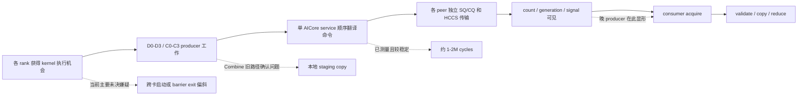

# EPv2 Ascend Normal Dispatch / Combine Rank 长尾问题分析

## 1. 文档目的

本文记录 Ascend 950 NPU8P 上 EPv2 Normal Dispatch 和 Normal Combine 的
rank 长尾问题，包括：

- 如何从 benchmark 和 stage profile 识别 rank 长尾；
- 已观察到的稳定现象；
- 对通信库管理面、SQ/CQ、channel、运行时调度和算子实现的怀疑；
- 已完成的验证、被否决的方案及其数据；
- 当前正在验证和设备恢复后仍需验证的项目。

本文区分三个概念：

1. **长尾出现的位置**：哪个 stage 在等待；
2. **长尾的来源**：哪个更早的 producer 或管理面动作晚到；
3. **性能修复**：是否真的让最慢 rank 更早完成，而不是把等待搬到另一个 stage。

“acquire wait 变短”或“rank 曲线更整齐”不等于整体性能提升。所有修复最终都必须以
8 rank 的最大完成时间、Normal Dispatch / Combine 均值与 P95、正确性和完整完成语义为准。

多 channel 的通信库调研、资源模型、自适应策略和验收要求单独定义在
[EPv2 Ascend Normal Dispatch / Combine 多 Channel 设计规范](epv2-ascend-multi-channel-design-spec-zh.md)。

## 2. 代表性环境和口径

主要证据来自以下固定 workload：

| 项目 | 配置 |
| --- | --- |
| 平台 | Ascend 950 NPU8P，8 rank |
| CANN | 9.2.0 |
| tokens | 每 rank 8192 |
| hidden | 7168 |
| top-k | 8 |
| experts | 256 |
| data blocks | 72 |
| case | `ep-fp8-align128-bias0-hcopy1-prev0-async0-alloc0` |

性能汇总使用最慢 rank 的 device event 时间。`rank spread` 指同一轮或各 rank
均值中的 `max(rank_time) - min(rank_time)`。stage cycle 只在同一张卡内做差，不能直接
比较不同卡的 `GetSystemCycle()` 绝对值，因为各卡 cycle 时钟原点不同。

## 3. 如何从 Profiling 看出 rank 长尾

### 3.1 先看端到端 per-rank 时间

聚合均值会隐藏 collective 的等待结构。应先同时检查：

- operation 的最大 rank 时间；
- 每个 rank 的 device time；
- 每轮 `max-min` 和 30 次 rank 均值的 `max-min`；
- 慢 rank 是否固定，还是随发送顺序或运行轮次变化。

正式 30+30 terminal-flush 基线中：

| Operation | 时间 / 逻辑带宽 | rank 均值 spread |
| --- | ---: | ---: |
| Normal Dispatch | `18.743 ms / 415.41 GB/s` | `1.069 ms` |
| Normal Combine | `87.867 ms / 124.07 GB/s` | 约 `0.215 ms` |

这里 Dispatch 已经达到实测 400G 以上，但 collective 仍由最慢 rank 决定；约 1 ms 的
rank 均值差仍是需要解释的尾部。单次 profile 会因为插桩和运行抖动呈现更大的差异，
因此 profile 用于归因，正式非 profile 多次结果用于性能结论。

### 3.2 再看 stage，而不是只看 acquire

Normal Dispatch 的主要阶段为：

```text
D0 control -> D1 grouping -> D2 prefix/slot -> D3 record
           -> D4 payload/control/terminal drain
           -> D5 acquire -> D6/D7 validate/prefix -> D8 copy
```

完成语义修复后的一个 8-rank profile 中，D4 和 transport service 很稳定：

| 指标 | 8 rank 范围 |
| --- | ---: |
| D4 release payload | `0.910M - 1.015M cycles` |
| D4 release control | `0.291M - 0.310M cycles` |
| terminal drain | `0.034M - 0.037M cycles` |
| service 总周期 | `1.190M - 1.295M cycles` |
| service CQ wait | `0.772M - 0.878M cycles` |
| D5 epilogue acquire | `0.077M - 5.031M cycles` |

如果某些 rank 的 SQ/CQ progress 本身慢，应该在 service、CQ wait、queue depth 或
release span 中看到同量级差异。实际数百万 cycle 差异集中在 acquire，而本地 D4/service
只相差几十到约一百微秒。这说明 acquire 是长尾的**观测点**，不一定是根因发生点。

Normal Combine 的旧路径中还存在额外的真实工作：

| 指标 | 8 rank 范围 |
| --- | ---: |
| producer local copy | `44.2M - 51.2M cycles` |
| release payload | `1.60M - 1.67M cycles` |
| service 总周期 | `1.88M - 1.95M cycles` |
| epilogue acquire | `0.075M - 7.65M cycles` |

因此 Combine 需要同时区分“真实的本地数据搬运成本”和“等待其他 rank 到达”。main
分支已有 direct-local placement 等优化来删除旧路径的本地 staging copy；D4 归因分支
rebase 后必须基于新路径重新 profile，不能继续把旧路径的 44--51M cycles 当成当前现状。

### 3.3 看 signal 和 control 是否一起晚到

consumer 进入 acquire 时曾一次性快照每个 source 的 release signal 和 control
generation。64 个 source-destination 关系中只观察到：

- `SG`：signal 和 generation 都已到；
- `sg`：signal 和 generation 都未到。

没有出现 `sG`（generation 已到但独立 signal 未到）。这排除了“payload/control 已完成，
只有额外 signal WQE 单独拖尾”的主要嫌疑。晚到的是整条 peer payload/control/release
链，而不是最后一个 signal 标记。

典型快照呈三角形：较小 destination rank 进入 acquire 时已看到更多 source ready，较大
destination rank 看到更多 `sg`。反转发送顺序会反转“谁慢”，但不会缩短最晚 producer。
这说明固定 destination 顺序影响长尾的**分布**，但不是全局临界路径的根因。

```text
source 0: dst0 -> dst1 -> dst2 -> ... -> dst7
source 1: dst0 -> dst1 -> dst2 -> ... -> dst7
...

较早 destination: 进入 acquire 时更多 release 已到
较晚 destination: 进入 acquire 时更多 release 未到

改变顺序 => 慢 rank 翻转
全局最晚 producer 不变 => 总时间不降
```

### 3.4 用 queue completion 证据排除“假完成”干扰

旧实现会在 SQ/CQ 尚有 outstanding 时发布 `consumed_generation`，下一代 `reset()`
还可能复用未完成状态。这会把真正的 CQ/远端可见性等待泄漏到 consumer acquire，导致
profiling 归因不可靠。

修复后必须同时满足：

- `completion_generation == queue generation`；
- 所有 rank 的 SQ depth 和 CQ depth 均为 0；
- diagnostic clean；
- active、部分消费或未完成 generation 不能 reset/reuse。

完成语义修复后的 8 卡五操作 profile 已满足以上条件，但 Dispatch acquire 仍有
`0.077M - 5.031M cycles` 的差异。因此“假完成”是已确认并修复的管理面 bug，但不是
剩余 rank 长尾的唯一根因。

## 4. 当前对现象的整体解释

现有证据支持以下数据流：



release-entry barrier 诊断给出了最强的“等待搬移”证据：

- Dispatch acquire 从 `0.077--5.456M` 收敛为 `0.077--0.078M cycles`；
- 同一批长尾搬到 release payload：`1.085--5.237M cycles`；
- Combine acquire 从 `0.074--10.731M` 收敛为 `0.075M` 左右；
- 同一批长尾搬到 release payload：`1.946--10.111M cycles`；
- Dispatch 总时间从 `21.292 ms` 退化到 `21.975 ms`，Combine 也退化。

这证明等待在进入 release 之前已经形成。入口 barrier 只能让早到 rank 等最晚 rank，
不能让最晚 rank 更早完成，所以不能作为修复。

## 5. 怀疑点与验证状态

### 5.1 总表

| 怀疑点 | 状态 | 结论 |
| --- | --- | --- |
| `consumed_generation` 提前发布、未完成代被 reset 复用 | 已确认并修复 | 是真实管理面语义 bug；修复后 outstanding 清零，但剩余 rank tail 仍在 |
| 某些 rank 的 SQ/CQ drain 特别慢 | 已排除为主要根因 | 各 rank service/CQ wait 稳定，量级不足以解释 5--10M cycle 差异 |
| barrier 逐 peer 串行轮询累计等待 | 已修复/排除 | 已改为 pending bitmap 轮询全部 peer；尾部仍在 |
| 固定 `0 -> 7` peer 顺序导致固定慢 rank | 已验证 | 会决定谁慢；环形/逆序只搬移尾部且性能回退 |
| lane 0 串行 acquire 放大等待 | 已验证并否决 | 多 lane 并行 acquire 未消除最大 wait，Dispatch 降到约 `329.9 GB/s` |
| 独立 signal WQE/sync-memory 路径晚于 generation | 已排除 | 只见 `SG`/`sg`，未见 `sG` |
| 普通 host launch skew | 基本排除 | host 对齐到约 `0--20 us` 或约 `36 us` 后，数毫秒 device tail 仍在 |
| barrier 回 CPU 后重新提交造成 skew | 已排除 | barrier 与 operation 在同一 device stream 串联后没有改善 |
| 单 service worker 的 per-peer control 串行 | 已验证多版并行方案 | 能去掉三角形偏置，但多 AICore launch/竞争使端到端回退 |
| **每 peer 只有一个 channel/QP/SQ** | **实现完成，待实机验证** | `DEEP_EP_ASCEND_CHANNELS=2/3/4` 可创建多 channel；Normal Dispatch/Combine 已按完整记录切片，NPU2 编译通过，尚无 8-rank 功能/性能数据 |
| barrier exit 在不同卡上释放时间不一致 | 待验证 | device-chained barrier 无收益使其仍有嫌疑，但还缺 D0 入口 arrival 数据 |
| NPU runtime/device scheduler 让 kernel 真正启动时间不同 | 当前主要怀疑 | Dispatch D0→release 本地工作稳定，晚到差异更像发生在获得执行机会之前 |
| producer 上游计算负载不均 | Dispatch 基本排除，Combine 部分确认 | Dispatch D0→release 约 `0.69--0.73M cycles`；Combine 旧 local copy 有 44--51M 差异 |
| consumer 边等边处理、隐藏晚到 source | 待验证的性能方案 | 可减少临界路径，但属于 overlap 修复，不直接解释最晚 producer 为何晚到 |
| persistent/fused device launch | 待验证的结构方案 | 若 D0 已有 arrival skew，可避免每轮跨进程 host/device launch 重新失步 |

### 5.2 单 queue / 单 channel 必须如何表述

通信库调研确认：HCCL/HCOMM 正式支持每 remote rank 多个独立 channel，CANN 9.2 的
All-to-AllV 实现也包含 `ShouldUseMultiChannelForAlltoAll()`、`channelsPerRank_` 和
send/recv 分片；因此对大块 All-to-All payload 验证多 channel 是正确方向。但共享同一
Jetty 的逻辑多 channel 被官方明确限制为串行使用，不是并发带宽方案。HCCL 的多 QP
策略还会在每 QP 数据量不足时减少 QP 数，说明生产策略应按每 peer payload bytes
自适应，而不是所有消息固定使用 4 channel。

当前实现属于独立 team channel 路径，不使用 shared-queue 配置；它完成了固定 1--4
channel 的资源创建和 record 切片，但尚未实现按字节阈值选择 active channel。完整约束和
待验证矩阵见多 Channel 设计规范。

当前实现有两层“单”：

1. 一个 command queue 和一个 AICore service worker，按命令顺序构造 WQE；
2. 基线默认 `requested_channels == 1`；当前实验实现可通过
   `DEEP_EP_ASCEND_CHANNELS=2/3/4` 创建每 peer 多个 channel/QP/SQ。

但 team 内不同 peer 的 channel 0 会解析到不同 peer 的 SQ/CQ context。因此此前的
per-peer 多 AICore 实验已经并行操作过“不同 peer 的 channel 0”，却**没有**创建
“每个 peer 多个 channel/QP/SQ”。

已经验证的三版并行 service：

| 方案 | Normal Dispatch | Normal Combine | 结论 |
| --- | ---: | ---: | --- |
| 单独并行 control stage | `21.23 ms / 366.8 GB/s`，spread `1.67 ms` | `88.50 ms / 123.2 GB/s` | 三角形消失，但额外 stage/launch 成本更大 |
| payload + control 全部多 AICore 并行 | `26.25 ms / 296.6 GB/s` | `141.15 ms / 77.2 GB/s` | 底层发送资源严重争用 |
| 同 kernel：payload 单 walker，control 多 worker | 10 次 `21.60 ms / 360.4 GB/s`，spread `1.25 ms` | `89.04 ms / 122.4 GB/s` | 扩展到 8 blocks 的调度成本抵消收益 |

所以“多 AICore 并行当前 peer SQ”已经被否决。真实多 channel 的代码路径现已补齐 CANN
channel 创建、SIMT 命令 channel 编码、按完整 token/record 分片、flush/barrier 全 channel
汇合和 generation completion 语义；但 NPU8P 不可达，尚未完成实机功能和性能验证。

同时应设置合理预期：当前 service 总周期约 1--2M，而观测尾部可达 5--10M cycles。
即使多 channel 把本地 service 理想压到 0，也不能单独解释全部长尾。它可能是吞吐优化，
但在证据出现前不能把它写成根因。

### 5.3 已否决的管理面微调

以下方案均没有获得可重复的端到端收益，相关临时代码已撤销：

- 环形、逆序或分相的 peer/control/signal 发布顺序；
- 多 lane 并行 acquire；
- generation polling 替代独立 signal；
- immediate first generation poll；
- poll address linearization；
- control-before-flush；
- deferred payload flush；
- phase-batched control；
- doorbell batching、packed control 等只减少管理命令的方案；
- release-entry barrier 和 device-chained pre-op barrier。

共同规律是：它们会移动等待位置、改变慢 rank，或节省几十到几百微秒，但没有让最晚
producer 的实际到达时刻稳定提前。

## 6. 当前正在验证的怀疑点

NPU8P 当前无法连接，因此以下 D0 入口实验只完成了设计和 host contract 检查，临时代码
未提交到生产分支。

### 6.1 D0 kernel-entry arrival gate

在 Normal Dispatch profile 的 D0 producer 工作之前：

1. reset 当前 transport generation；
2. 所有 rank 执行一次 device barrier；
3. 记录 barrier issue、CQ drain 和 generation poll cycles；
4. barrier 完成后再次安全 reset，再执行原 D0-D8 路径。

判定规则：

| 结果 | 解释 | 下一步 |
| --- | --- | --- |
| D0 gate 已等待数百万 cycles，且与原 acquire wait 互补 | rank 在 producer 工作前已经失步 | 追 runtime/device scheduler、barrier exit；评估 persistent/fused launch |
| D0 gate 很短，但 release-entry gate 很长 | skew 在 D0→release 之间形成 | 对每个 kernel/stage 间隙做 arrival gate 或 ready timestamp |
| 两个 gate 都短，但 consumer 仍长 | 重新检查远端可见性、consumer cache/acquire 和 per-destination 路径 |

该 gate 只用于归因。即使它让后续 acquire 收敛，只要端到端时间不降，也不能保留为修复。

### 6.2 per-source acquire 打点与反向顺序对照方法论

2026-09-22 在 NPU8P-ALT、CANN 9.3.0、8 rank、Ascend950DT 上重新验证了 Dispatch acquire
长尾。该方法论的目的是回答一个具体问题：**某个 source 看起来慢，是物理链路慢，还是
固定遍历顺序造成的队头阻塞？**

#### 打点位置

诊断打点由 `DEEP_EP_ASCEND_ACQUIRE_DIAGNOSTICS` 宏控制，默认关闭；开启时覆盖
`direct_dispatch_epilogue_acquire_vf` 和 `direct_dispatch_epilogue_validate_records_vf`：

1. 进入 acquire 循环前记录本 rank 的 `acquire_all_start`；
2. 对每个 source，在执行 `observe_release_control()` 前记录 `acquire_peer_start`，
   返回后记录 `acquire_peer_end`；
3. 两者都相对同一个 `acquire_all_start` 归一化，导出 `world_rank`、`start_cycles`、
   `end_cycles`；
4. 同时记录两个专用 VF 的绝对 `start/end` cycle，用于计算真实 VF 间隙；profile 结构体、
   pybind 导出和 benchmark 聚合只增加诊断字段，不改变通信协议。

由于 `threadIdx.x != 0` 直接 return，该打点只覆盖 lane 0 的真实 acquire 路径。新增
profile 写入使用局部计数器，字段用 `store_published()` 发布，最后写 count 并执行
`system_fence()`，避免诊断自身在 GM 上做读改写或引入可见性问题。

#### 必须固定不变的对照条件

| 项目 | 要求 |
| --- | --- |
| 平台 | 同一 NPU8P-ALT，设备 0..7 |
| CANN/HCOMM | 同一 CANN 9.3.0 与已验证 HCOMM tree |
| workload | `ep-fp8-align128-bias0-hcopy1-prev0-async0-alloc0` |
| tokens/hidden/top-k/experts | 8192 / 7168 / 8 / 256 |
| data blocks | 56 |
| 编译宏 | `DEEP_EP_ASCEND_RELEASE_SIGNAL_ONLY=1` |
| warmup/iterations | 30 / 30 |
| benchmark | `--profile-stages` |

特别注意：`DEEP_EP_ASCEND_RELEASE_SIGNAL_ONLY=1` 会跳过最终 producer release barrier，
因此该实验的 `barrier_peer_diagnostics` 为空是预期，不应把 barrier 字段为空解释成采集失败。

#### 分析步骤

1. **只做 rank 内相对时间**：`GetSystemCycle()` / VF clock 的绝对值在不同 NPU 上有不同
   原点。只计算同一 rank 内 `end-start`，以及相对同一 `acquire_all_start` 的 gap，不跨卡
   比较绝对 cycle。
2. **先看每个 rank 的阻塞 source**：对每个 rank，取 `wait = end_cycles - start_cycles`
   最大的 source，统计所有 rank 的阻塞 source 分布。
3. **区分总等待与队头等待**：串行 acquire 中，第一个未 ready 的 source 会挡住后续 source。
   因此不能把 source 0 等待最长直接解释成 source 0 链路最慢。
4. **做反向顺序对照**：只把 source 遍历顺序从 0..7 改为 7..0，其余 workload、编译宏、
   打点和 benchmark 完全不变。若阻塞 source 随顺序改变而改变，则说明主要是顺序导致的
   归因偏置；若固定不变，才支持该 source 的物理路径慢。
5. **同时看发送端本地阶段**：对比每个 rank 的 producer record、release payload、release
   control、release barrier 和 service start/end。若被怀疑的 source 这些阶段与其它 rank
   同量级，则不支持该 rank 本地 producer 或 service 特别慢。
6. **至少跑两轮正向加一轮反向**：单次 profile 有额外 launch 和时钟抖动；模式必须重复出现
   才能作为优化依据。
7. **最终仍以端到端指标验收**：acquire 等待下降、曲线变整齐都只是中间信号；必须看最慢
   rank、operation mean/P95、正确性和完整完成语义。

#### 2026-09-22 观察到的数据

两轮正向 profile 中，7 个非 0 rank 的最大等待 source 几乎都落在 source 0：

| 实验 | Dispatch 阻塞 source 分布 |
| --- | --- |
| run1 | source 0：7/7 个非 0 rank |
| run2 | source 0：7/7 个非 0 rank |

反向遍历后，阻塞 source 立即变成 source 7 和 source 4：

| 实验 | Dispatch 阻塞 source 分布 |
| --- | --- |
| reverse | source 7：4 个 rank；source 4：4 个 rank |

同时，被怀疑的 rank 0 自身 producer/release/service 与其它 rank 同量级：

| 阶段 | 8 rank 范围 |
| --- | ---: |
| producer record | 约 220K--223K cycles |
| release payload | 约 867K--904K cycles |
| release control | 约 248K--268K cycles |
| service 总周期 | 约 1.25M--1.31M cycles |

因此结论是：**此前看到的 source 0 慢主要是固定顺序串行 acquire 的队头阻塞，不是 rank 0
物理链路或本地 producer 特别慢。**

反向遍历本身不是优化：Dispatch mean 从正向 run2 的约 21.72 ms 变为反向约 23.11 ms。
它只是区分顺序归因偏置和固定 peer 慢的对照实验。

#### 2026-09-22 ready-first 轮询验证

按上述结论，direct_dispatch_epilogue_acquire_vf 已把固定顺序串行 acquire 前置为
非阻塞 ready-first 轮询：每一轮扫描所有 source，先检查 control generation；需要
remote acquire 的 source 在 control ready 后再检查 release signal。只要仍有
source 未 ready，就执行一次 poll delay，并以统一的 acquire 超时控制该阶段；全部 ready
后再进入原有 final acquisition/validation 循环，保证 count 读取、容量校验和错误诊断
语义不变。这里保留原有 timeout 参数传递，final 阶段仍复用 observe_release_control()
的阻塞等待，以保持与原串行实现一致的错误和超时路径。严格说，预扫描超时后 final
阶段仍可能继续等待，整体超时语义没有收紧；若后续要求全局硬超时，需要把 final
acquisition 重构为共享同一个 deadline。

最终版本将 remote release signal 检查从 persistent pipeline 分支扩展到所有需要
remote acquire 的 source。这个细节很重要：第一版只在 persistent pipeline 场景检查
release signal，典型 case 正好走 persistent_source_pipeline=0 路径，预扫描实际只等待
control generation，后续 final acquisition 仍可能按固定顺序阻塞。补齐该检查后，
ready-first 才完整覆盖非 persistent direct dispatch。

当前覆盖范围需要明确：Direct Dispatch 的
`direct_dispatch_epilogue_acquire_vf` 已完成 ready-first；Direct Combine 的
`direct_combine_epilogue_acquire_vf` 随后也改为先轮询所有 contributor 再最终读取。
Hybrid Dispatch/Combine 的 acquire 仍未做同类改造。因此不能把本节早期结论外推到
Hybrid 路径；当前无 scale-out 环境暂不验收 Hybrid。

同一 8 rank 典型 case 的完整 ready-first 版本连续三轮均完成 benchmark 并输出 1 passed；
其中第 1、3 轮在 JSON 写出后的 teardown 阶段偶发 SIGSEGV，第 2 轮正常退出。随后
恢复未修改源码编译并运行同 case 对照，case 正常完成且 teardown 正常；再切回
ready-first 版本运行，case 与 teardown 均正常。由于 SIGSEGV 均发生在 benchmark 完成、
JSON 写出和 case 结果汇总之后，且出现 rank 不固定、不可稳定复现，当前不能把它归因
于 ready-first；需要后续独立追踪 teardown 崩溃。

| run | Dispatch mean | Dispatch P95 | 最大值 |
| --- | ---: | ---: | ---: |
| v3 run1 | 22.712 ms | 24.451 ms | 25.039 ms |
| v3 run2 | 20.953 ms | 22.622 ms | 23.024 ms |
| v3 run3 | 21.313 ms | 22.498 ms | 23.230 ms |

这些 v3 结果是只覆盖 control ready 的过渡版本，仅作为实现演进记录，不作为最终
性能结论。完整 ready-first 数据如下：

| 实验 | Dispatch mean | Dispatch P95 | 说明 |
| ready-first run1 | 20.381 ms | 21.671 ms | benchmark 完成，teardown SIGSEGV |
| ready-first run2 | 20.807 ms | 22.066 ms | 全部正常 |
| ready-first run3 | 20.920 ms | 22.662 ms | benchmark 完成，teardown SIGSEGV |
| 未修改基线对照 | 22.104 ms | 23.123 ms | 全部正常 |
| ready-first 复验 | 21.930 ms | 24.227 ms | 全部正常 |

完整 ready-first 三轮平均 Dispatch mean 为 20.703 ms，未修改基线单轮为 22.104 ms，
约低 6.3%。但当前样本量较小，且后两轮中间经历过排队和 CI 竞争，这个幅度只能作为
方向性收益，不应直接写成稳定收益比例。更重要的是，ready-first 消除了串行 acquire 的
归因偏置和潜在队头阻塞，使 consumer 的等待时间更接近所有 source 的最晚 ready 时间；
它并不能消除最晚 producer 本身的耗时。后续优化仍需以 operation mean/P95、最慢 rank、
正确性和 teardown 稳定性共同验收。

#### 2026-09-22 ready-first 后剩余 rank 差异

对 ready-first 后的 4 轮 benchmark 重新汇总：

| 指标 | 结果 |
| --- | --- |
| operation CV | 约 5.3% |
| P50 / mean | 约 1.005 |
| P90 / mean | 约 1.061 |
| P95 / mean | 约 1.075 |
| P99 / mean | 约 1.114 |
| max / mean | 约 1.145 |
| rank mean spread | 每轮约 5.4%--6.3% |

前三轮干净 ready-first 的 rank 均值平均后，最快 rank 约 19.20 ms，最慢 rank 约
20.20 ms，差距约 1.0 ms，即 5.1%。这个量级已经不是此前 acquire 诊断中的巨大长尾。

同一环境再跑一轮 `--profile-stages`，case 通过，Dispatch mean / P95 / max 为
20.116 / 21.365 / 21.750 ms。阶段数据说明：

| 阶段 | rank 间 spread | 判断 |
| --- | ---: | --- |
| producer record | 2.51% | 基本均匀 |
| release payload | 2.95% | 基本均匀 |
| epilogue copy | 0.84% | 基本均匀 |
| service cycles | 3.79% | 基本均匀 |
| release control | 12.39% | 绝对值约 0.24--0.27M cycles，有差异但不是最大项 |
| release barrier | 12.06% | 绝对值约 0.04M cycles，影响很小 |

真正显著的差异在 `epilogue_acquire` 结束到 `epilogue_validate` 开始的间隙：最快 rank
约 76K cycles，最慢 rank 约 5.71M cycles。后续 epilogue 阶段的起始时间整体被这个间隙
平移。因此当前剩余 rank 差异主要不是 producer record、payload publication 或最终输出
copy 本身，而更像 acquire 后的设备侧等待/调度/同步间隙。下一步应把该 gap 作为独立
阶段打点，并区分 kernel launch 间隔、等待剩余 source ready、以及 validate kernel 调度
延迟；在未拆分前，不应把它直接归因于最晚 producer。

#### 后续复用要求

1. 所有临时 profile 字段必须有唯一前缀，例如 `acquire_peer_*`，结论记录后按前缀撤销；
2. 远端源码不是 git 工作区时，应用 patch 前必须备份目标文件，并保留远端已有无关修改；
3. 诊断任务必须通过 task-submit 提交，8 rank 显式占用 0,1,2,3,4,5,6,7；
4. 诊断 JSON 保留在 /tmp 或任务产物目录，不提交用户 WIP 文档以外的诊断代码；
5. 若后续把 acquire 改为 ready-first 或非阻塞轮询，需要重新设计字段：记录每个 source 的
   first-ready cycle 和最终 acquire cycle，而不是继续沿用串行 wait gap。

## 7. 设备恢复后待验证项目

### P0：完成 D0/C0 入口归因

- 先只跑 Normal Dispatch 的 1 次 profile，确认 barrier diagnostic 可解释；
- 再给 Normal Combine C0 加同构 gate；
- 与无 gate 的同二进制 profile 对照；
- 记录每 rank gate poll、D0→release、acquire、service/CQ wait 和端到端时间；
- 临时代码在结论记录后撤销。

### P0：测量 barrier exit 与下一 kernel 获得执行资源的间隙

需要在同一 rank 时钟域内记录：

```text
pre-op barrier entry
    -> barrier service completion
    -> barrier kernel exit
    -> operation D0 first block start
    -> D0 last block start
```

如果 `barrier exit -> D0 start` 的 rank 内间隙差异很大，说明问题位于 stream/runtime
调度；如果主要差异已经在 barrier 内，则应修改 barrier release 算法，而不是 EP release。

### P1：真实多 channel A/B

代码实现已完成，必须与已失败的“多 AICore 单 channel”分开理解：

1. host/runtime 接受每 peer 1--4 channel，默认 1，通过
   `DEEP_EP_ASCEND_CHANNELS` 显式开启；
2. 单个 SIMT producer 顺序编码命令，每个 channel/SQ 仍只有一个 owner；
3. Normal Dispatch 按完整 token、Normal Combine 按完整 record 连续均分到 channel；
4. count/generation/signal 固定走 channel 0，但必须等 collective flush drain 所有 channel
   的 SQ/CQ 后才发布；
5. terminal completion 同样 drain 所有 channel 后才发布 `consumed_generation`；
6. command queue capacity 已按 channel 数扩容；
7. host contract 为 `370 passed, 6 skipped, 67 subtests passed`；NPU2 上 production
   `dispatch.asc`、`combine.asc` 和 runtime object 已由 CANN 9.2/Bisheng 编译通过。

仍待 NPU8P 恢复后完成：多 channel 创建/注册的两 rank 冒烟、1/2/4 channel 正确性、分
channel submit/CQ wait/HWM/字节数观测，以及同二进制 ABBA 性能对照。

验收不是“service cycle 下降”，而是 Normal Dispatch/Combine 的最慢 rank、P95 和逻辑带宽
同时改善，且没有 queue ownership、次序、可见性或 reset 复用错误。

### P1：consumer ready-source overlap

现有 consumer 先等齐所有 source，再统一 validate/copy/reduce。可以评估：

- source ready 后立即验证并复制该 source 的 shard；
- 将 D8 copy 或 Combine reduction 与迟到 source 重叠；
- 最终只在确实依赖所有 source 的 prefix/output publication 前汇合。

这可能直接降低整体时间，但它是“隐藏 arrival skew”的性能方案。必须继续保留 D0/arrival
诊断，不能因此宣称最晚 producer 的根因已消失。

### P2：persistent/fused launch

若 D0 gate 证明 skew 在 kernel 获得执行资源之前形成，应评估持久化 device worker：host
只发布 generation/descriptor，已驻留的各 rank kernel 在 device 侧启动同一代工作。该方案
可以消除每轮 Python 进程、ACL launch 和 device scheduler 的重新排队，但改动范围较大，
必须先有 D0 数据支撑。

## 8. 已确认的代码修复

提交 `33a7adc` 修复 transport generation 完成语义：

- append 新命令前撤销旧 `consumed_generation`；
- service 只有在命令全部消费、末尾 SQ/CQ drain 成功且 diagnostic clean 时发布 generation；
- 失败路径保持 generation 未完成；
- `reset()` 拒绝 active、部分消费或未完成的非空 generation；
- barrier、Dispatch、Combine 调用方处理 reset 失败。

验证结果：

- host contract：`269 passed, 48 subtests passed`；
- Ascend 8 卡五操作正确性通过；
- 所有 rank `completion_generation == generation`；
- 所有 rank SQ/CQ depth 为 0。

这项修复应保留，因为它修复正确性和可诊断性；不能用它是否完全消除性能长尾来判断价值。

## 9. 证据与产物索引

主要本地 artifact：

- `/tmp/d4-terminal-flush-profile-8r.json`：terminal flush 的逐 rank stage/profile；
- `/tmp/d4-signal-control-profile-aligned.json`：host 对齐后的 signal/control 快照；
- `/tmp/d4-device-chained-barrier-10x.json`：barrier 与 operation device 串联对照；
- `/tmp/d4-release-entry-barrier-10x.json`：release-entry gate 非 profile 对照；
- `/tmp/d4-release-entry-barrier-profile2.json`：等待从 acquire 搬到 release 的 profile；
- `/tmp/d4-completion-semantics-10x.json`：完成语义修复后的五操作验证；
- `/tmp/d4-completion-semantics-profile.json`：generation 和 SQ/CQ 清零证据。

关键 TaskQueue 任务：

- `task_20260904_154001_1721798688`：terminal-flush profile；
- `task_20260904_154752_176897311521`：30+30 正式结果；
- `task_20260904_170135_2108011794`：多 lane acquire；
- `task_20260905_022051_377916923142`：signal/control ready 预扫描；
- 多 AICore per-peer release 的具体实现和结果保留在对应 Codex session 记录中。

## 10. 当前结论

1. 通信库确实存在过管理面完成语义错误，已经修复。
2. 当前剩余 rank tail 不是某个 rank 的 SQ/CQ drain 明显更慢，也不是单独 signal WQE 晚到。
3. 单 service 的固定 peer 顺序会塑造三角形 rank 分布，但改变顺序或多 AICore 并行没有
   缩短全局最晚 producer；后者在当前硬件/实现上还造成 launch 和发送资源竞争。
4. **真实多 channel 已实现并通过 host 与 NPU2 编译验证，但仍未完成 NPU8P 实机验证**。
   按现有 service 与 tail 的量级，它更可能是局部吞吐优化，不能预先认定为全部
   5--10M cycle 长尾的根因。
5. Dispatch 当前最强怀疑是 barrier exit、runtime/stream 或 device scheduler 导致不同 NPU
   真正开始 producer 的时间不齐；D0 entry gate 是恢复 NPU8P 后的第一优先级实验。
6. Combine 除同类 arrival skew 外，还必须在 rebase 后基于 main 的 direct-local placement
   新路径重新测量，避免用旧 staging-copy 数据指导当前优化。

## 11. Acquire 到 Validate 间隙的可复用定位方法

这段间隙不能只看聚合的 `epilogue` 时间，也不能把 acquire 轮询时间直接当作
`epilogue_acquire` 到 `epilogue_validate` 的原因。推荐固定使用下面的步骤：

1. 使用同一份 CANN/HCOMM、固定 workload、固定 rank 数和固定 seed，开启
   `--profile-stages`，至少运行一轮功能完整的 8-rank case。
2. 仅在需要归因时编译 `DEEP_EP_ASCEND_ACQUIRE_DIAGNOSTICS=1`。该宏默认关闭，
   诊断字段结构保留在 profile ABI 中，但关闭时不会执行 probe、peer ready 和 wait
   写入，也不会把这些字段导出到 JSON。
3. 对每个 rank 优先读取诊断宏导出的 `acquire_vf_start/end_cycles` 和
   `validate_vf_start/end_cycles`，用真实专用 VF 的边界计算间隙。通用
   `stage_profile.per_rank[].stages` 中的 `epilogue_acquire/validate` 只代表通用
   `dispatch_kernel`，这两个 stage 当前是 no-op，不能替代专用 VF 边界。
4. 同时读取 `acquire_peer_diagnostics[].first_ready_cycles`，取最大值作为 source
   ready 上界。这个值是 acquire 轮询起点的相对 cycle，只能和 acquire wait 的相对
   采样比较，不能与不同 NPU 的绝对 `start/end` 直接相减。
5. 先判断数量级：若间隙接近最晚 source ready，优先查 producer/release；若间隙
   远大于 source ready，优先查 acquire 单 block 完成后到 validate 多 block kernel
   的提交、依赖和 AIV 调度。
6. 对照相邻 stage 的绝对时间，确认间隙内没有已记录的工作；再增加一次性、带明确
   前缀的 queue submit/launch 采样，区分 host 提交延迟、SQ/CQ 依赖和设备 block 调度。

本方法的关键是使用同一张卡上的绝对 stage 时间做边界差，并把 per-peer ready 时间
作为独立证据，避免把“最晚 source”与“后续 kernel 没有及时启动”混为一谈。

## 12. 当前 8-rank 诊断结论

在 CANN 9.3.0、NPU8P、8-rank 典型 Dispatch case 上，使用真实专用 VF 边界得到：

| rank | 最晚 source ready (cycles) | 真实 VF 间隙 (cycles) |
| ---: | ---: | ---: |
| 0 | 55,559 | 5,729 |
| 1 | 52,826 | 6,000 |
| 2 | 28,031 | 5,598 |
| 3 | 69,052 | 6,466 |
| 4 | 56,532 | 6,293 |
| 5 | 55,094 | 6,083 |
| 6 | 62,234 | 5,740 |
| 7 | 60,253 | 6,956 |

真实专用 VF 的 gap 在普通、Expanded、Cached 三种 Dispatch 中都稳定在约
`5.4e3~7.1e3 cycles`，没有 rank 间数量级长尾。早期观察到的
`2.1e6~2.4e6 cycles` 是 profiling 边界错误：通用 `dispatch_kernel` 的
`kEpilogueAcquire/kEpilogueValidate` stage 只执行 no-op，而真正工作由随后单独提交
的专用 VF kernel 完成。把这两个 no-op kernel 的时间相减，会把专用 VF launch 和其他
提交间隔混入结果。

因此当前没有证据表明 acquire 到 validate 存在需要修改的数据面等待。保留
`acquire_vf_*`/`validate_vf_*` 作为宏控诊断字段；只有它们重新显示稳定的 rank tail
时，才继续增加 queue submit、SQ/CQ 和 host launch 采样。`acquire_wait_end_cycles`
仍是轮询内部相对计时，不能替代真实 VF 边界差。

## 13. 2026-09-22 per-source first-ready 修正与重新归因

本节修正第 12 节的结论边界：第 12 节中 acquire 到 validate 的真实专用 VF
间隙仍是正确的，但当时使用的“最晚 source ready”来自有采样缺陷的字段。
修正后，acquire 轮询本身仍有明显的 destination 相关等待。

### 13.1 旧诊断字段的采样缺陷

早期 `acquire_peer_first_ready_cycles` 逻辑是“记录前 16 次 ready 事件”，
不是“记录每个 source 的第一次 ready”。ready-first 轮询会反复扫描已经 ready
的 source，16 个槽位很快被重复 source 占满。例如 rank 3 曾记录到一串
self-rank 重复项，因此当时的“最晚 source ready 只有约 69k cycles”不能作为
最晚 ready 上界。

诊断逻辑已改为：

```text
source_rank -> 独立槽位
peer_ready_logged[source_rank] 防重复
每个 source 只记录第一次 ready 的相对 cycle
```

这不改变通信协议和 acquire 轮询，只改变诊断数据的含义。

### 13.2 修正后的 8-rank 数据

运行环境：NPU8P-ALT，CANN 9.3.0，修正版 HCOMM，8 rank，tokens=8192，
hidden=7168，top-k=8，experts=256，data blocks=56，30 warmup / 30 samples，
`--profile-stages`。case 通过，Dispatch mean/P95 为
`21.841 / 23.315 ms`，逻辑带宽 `356.49 GB/s`。

每 rank 真实 acquire VF 时长与最晚 source：

| rank | acquire VF span | 最晚 ready source | 最晚 ready cycles |
| ---: | ---: | ---: | ---: |
| 0 | 423,633 | 1 | 328,285 |
| 1 | 104,580 | 7 | 29,470 |
| 2 | 106,830 | 7 | 30,465 |
| 3 | 9,635,830 | 1 | 9,543,607 |
| 4 | 10,039,813 | 1 | 9,946,346 |
| 5 | 2,113,279 | 1 | 2,019,338 |
| 6 | 2,286,565 | 1 | 2,194,276 |
| 7 | 9,411,780 | 1 | 9,317,407 |

更具体的晚到矩阵：

| destination | 明显晚到的 source | cycles 量级 |
| ---: | --- | ---: |
| 3 | 0、1、2、5、6 | 7.2M 到 9.5M |
| 4 | 0、1、2、5、6 | 7.6M 到 9.9M |
| 7 | 0、1、2、5、6 | 6.9M 到 9.3M |
| 5 | 0、1、2 | 1.25M 到 2.02M |
| 6 | 0、1、2 | 1.42M 到 2.19M |
| 0、1、2 | 无明显数百万级晚到 | 最大约 328k |

这推翻了两个简化解释：

1. 不是某个固定 producer rank 对所有 destination 都晚。rank 0、1、2 之间的
   acquire 几乎立即完成；它们发给 3、4、7 的数据却很晚可见。
2. 不是本地 producer 或 service 独占资源慢。所有 rank 的
   producer record、release payload/control/barrier 和 service span 都在同一量级。

producer 侧证据：

| 指标 | 8 rank 范围 |
| --- | ---: |
| producer record | 220.7k 到 227.6k cycles |
| release payload | 869.4k 到 901.1k cycles |
| release control | 240.9k 到 272.8k cycles |
| release barrier | 38.6k 到 44.2k cycles |
| service span | 1.254M 到 1.317M cycles |
| payload bytes | 285.1M 到 287.4M bytes |

每个 rank 仍只有 7 条大 payload put、30 条 command，SQ/CQ high watermark 为 3，
结束时 depth 为 0。因此本 profile 不支持“某些 rank 本地命令构造或本地 drain
特别慢”。

### 13.3 新的当前假设

剩余长尾更像是特定 source-destination 路径上的可见性或调度问题：

```text
rank 0/1/2 producer release 完成
    -> 到 rank 3/4/7 的 control/signal 很晚可见
    -> rank 3/4/7 的 acquire 等待 9-10M cycles
    -> 后续 epilogue 起点整体后移
```

同一批 source 对 rank 5/6 的延迟约 1.2-2.2M，对 rank 0/1/2 基本立即可见。
这更像 destination 相关的传输路径、channel 资源争用或 AICore service 调度
问题，而不是所有远端路径共享的一个全局 barrier。

目前还不能区分以下三个方向：

1. 物理 HCCS 路径或 topology contention；
2. HCOMM AIV channel/SQ/CQ 在特定 rank pair 上的资源冲突；
3. host/device 对后续 acquire VF 的调度延迟，使数据实际已经可见但观测动作很晚。

第 13 节写成时的下一步是补 per-destination release publication timestamp 和
host 启动时间。第 14 节就是这两组数据的结论。

## 14. 2026-09-22 release publication 与 host entry skew 结论

本节继续第 13 节的验证，并把结论再修正一次。

### 14.1 producer 侧发布不是数毫秒级瓶颈

在 direct_dispatch_producer_release_body 中为每个 remote destination 记录
control/signal 发布调用返回时的相对 cycle。宏控字段为
release_peer_publish_cycles[16] 和 release_peer_publish_count，通过
release_peer_publish_diagnostics 导出。

三轮 profile 中，所有 producer 对 7 个远端 destination 的发布调用都在约
0.079 到 0.083 ms 内完成；单个 producer 内部 destination 间差异约 0.063 到
0.066 ms，形状完全由 0 到 7 的固定遍历顺序决定。v5 轮中最慢 acquire 是
rank 7 等 source 0 约 3.814 ms，但 source 0 对 rank 7 的发布调用本身只有约
0.078 ms。因此“发布循环慢”和“producer 本地 drain 慢”都不能解释主要长尾。

注意这个 timestamp 只表示 producer 侧命令编码/发布调用返回，不等于 HCOMM
service completion，也不等于远端可见时间。它的作用是先排除 producer 发布
顺序本身的数毫秒差异。

### 14.2 host entry skew 与 acquire 等待呈反向关系

继续在 host timeline 中增加三个绝对时间：

| 字段 | 含义 |
| --- | --- |
| dispatch_entry_ns | Python 调用进入 C++ dispatch |
| dispatch_prelaunch_end_ns | prelaunch 参数准备和 launch 完成 |
| dispatch_synchronize_end_ns | dispatch stream synchronize 结束 |

这些字段只在 --profile-stages 时记录，不改变通信协议。

v7 一轮的关键数据：

| rank | entry 相对最早值 | acquire 等待 | device envelope | synchronize 结束相对最早值 |
| ---: | ---: | ---: | ---: | ---: |
| 0 | 5.417 ms | 0.051 ms | 2.105 ms | 0.278 ms |
| 1 | 0.388 ms | 3.790 ms | 4.377 ms | 0.113 ms |
| 2 | 3.811 ms | 1.103 ms | 2.749 ms | 0.077 ms |
| 3 | 3.802 ms | 1.140 ms | 2.774 ms | 0.066 ms |
| 4 | 0.000 ms | 4.117 ms | 4.598 ms | 0.072 ms |
| 5 | 0.870 ms | 3.487 ms | 4.201 ms | 0.001 ms |
| 6 | 0.252 ms | 4.012 ms | 4.506 ms | 0.066 ms |
| 7 | 0.037 ms | 4.170 ms | 4.624 ms | 0.002 ms |

entry spread 是 5.417 ms，但 synchronize end spread 只有 0.346 ms。更直接地说：

1. 最晚进入 Dispatch 的 rank 4/5/6/7，acquire 等待约 3.4 到 4.2 ms；
2. 最早进入的 rank 0，acquire 等待只有 0.051 ms；
3. 所有 rank 最后几乎同时结束，被慢 rank 拉齐。

把每个 rank 的 release barrier 完成时间换算到公共 host 时间，再加上 first-ready
等待，得到的最晚 ready 公共时间约为 5.165 到 6.498 ms。v5/v6 两轮也呈现同样
关系：launch 相对晚的 rank，ready 等待短；launch 相对早的 rank，ready 等待长。

### 14.3 当前归因

第 13 节的“特定 source-destination 路径可见性慢”需要降级。它没有错在数据
本身，而是错在把每个 rank 的 acquire 起点视为对齐：benchmark 在 capture
profile 前调用 barrier(with_cpu_sync=True)，barrier 依赖 device 同步和 host
调度，返回后各 rank 进入 Dispatch 的时刻仍可能相差 5 ms 以上。先进入的 rank
先到 acquire，等后进入的 producer release；后进入的 rank 到达时控制面已经
ready，于是表现为“某些 source 对某些 destination 晚到”。

当前结论：

1. producer release 发布本身约 0.08 ms 内完成，不是数毫秒级瓶颈；
2. producer record、release payload/control/barrier、service span 各 rank 同量级；
3. profile 下的几毫秒 acquire 长尾主要由 benchmark host 编排的 entry skew 造成；
4. 尚不能证明 HCCS 路径或 HCOMM channel 存在固定数毫秒级长尾。

### 14.4 后续动作

优先修 benchmark/profile 编排，而不是先改通信数据面。当晚做了一个最小的
profile-only A/B：在 capture profile 前，barrier 之后追加一次
dist.all_reduce，希望 host 进程在进入 Dispatch 前再次汇合。

结果没有消除 entry skew：entry spread 仍是 5.175 ms，acquire 等待仍是
0.051 到 4.038 ms，最晚 ready 的公共时间约 5.046 到 6.248 ms。这说明单次
all_reduce 不是合适的 host 对齐方法，或者 host 调度差异发生在 all_reduce
返回之后。这个 A/B 只是排除了一个过于简单的修法，还不能推翻 entry skew
归因。

下一步仍然按下面的顺序：

1. 在 profile 输出中保留 entry/prelaunch/synchronize 绝对时间，分析时先对齐
   公共时间，不再直接比较各 rank 的 acquire VF 等待；
2. 如果要修 benchmark，需要更可靠地控制各 rank 进入 Dispatch 的时刻，或
   采样多轮 entry skew 后选择启动接近对齐的一轮；
3. 若消除 entry skew 后仍有稳定 pair 相关长尾，再回到 HCOMM service 的
   per-peer completion timestamp；
4. Combine 需要单独做同样验证，不能继承 Dispatch 结论。

## 15. 公共时间轴与 epilogue acquire/validate 拆分

上一节只保留 host entry/synchronize 绝对时间，还不足以把 8 个 rank 的 device
阶段放到同一时间轴上。现在 profiling 增加了两个层次：

1. critical_path_report.py 以每个 rank 的 host 完成锚点（Dispatch 使用
   dispatch_synchronize_end_ns，Combine 使用 combine_completion_end_ns）
   对齐本 rank 的 device stage，只在 rank 内部做 cycle 差值换算，不跨 NPU
   相减绝对 cycle；
2. DEEP_EP_ASCEND_ACQUIRE_DIAGNOSTICS=1 时，Dispatch/Combine 的
   direct_*_epilogue_acquire_vf 与 direct_*_epilogue_validate*_vf 记录
   acquire/validate 的起止 cycle。Dispatch 和 Combine acquire 还分别记录
   per-source/per-contributor 的 first-ready cycle。

这两类数据合并后，报告能直接输出：

| 指标 | 含义 |
| --- | --- |
| acquire VF | acquire VF 从进入到退出的完整时间 |
| acquire wait | 所有 source/contributor release 控制面 ready 的等待时间 |
| validate VF | validate 阶段的计算/校验时间 |
| acquire peers | 每个 peer 首次 ready 的相对 cycle，用于识别最晚 producer |

使用方式：

```bash
PYTHONPATH=. python3 -m tests.ascend.benchmark.critical_path_report \
  ascend-report.json --operation dispatch --format markdown
```

注意两点：

1. epilogue_acquire/epilogue_validate stage 只是通用 stage mask 的粗粒度
   覆盖，acquire/validate VF 字段才是专门拆分，不能混用；
2. validate 是多 block、多线程 kernel。诊断字段只允许 blockIdx.x == 0 &&
   threadIdx.x == 0 写入，否则多个线程同时写同一 profile 字段，会得到
   相差多年的假时间戳。

### 15.1 当前一轮 NPU8P-ALT 结果

环境为 CANN 9.3.0 组合包、8 rank、ep-fp8-align128-bias0-hcopy1-prev0-async0-alloc0、
--num-sms 56。Dispatch mean 约 21.552 ms，Combine mean 约 31.842 ms。

Dispatch：

| rank | acquire VF | validate VF | 最晚 ready source |
| ---: | ---: | ---: | ---: |
| 0 | 0.105 ms | 0.820 ms | source 7，约 0.029 ms |
| 3 | 8.175 ms | 0.824 ms | source 0，约 8.076 ms |
| 7 | 7.346 ms | 0.820 ms | source 0，约 7.247 ms |

其他 rank 的 acquire 约 0.85 到 1.95 ms，validate 基本稳定在 0.813 到
0.824 ms。rank 3/7 的 acquire 长尾和最晚 source 的 first-ready 时间几乎重合，
说明等待主要发生在 producer release 控制面 ready，而不是 validate 计算。

Combine：

| rank | acquire VF | 说明 |
| ---: | ---: | --- |
| 0 | 1.579 ms | 无明显长尾 |
| 3 | 12.317 ms | 明显长尾 |
| 4 | 12.476 ms | 明显长尾 |
| 7 | 12.360 ms | 明显长尾 |

这一轮 Combine 的 per-contributor ready 和 validate 字段还是旧实现采集的：

1. 当时没有 per-contributor first-ready，无法指出最晚 contributor；
2. validate 多线程同时写同一字段，数据无效，已在实现中修复；
3. acquire 的完整耗时仍然可信，因为 acquire VF 本身只有 thread 0 执行。

因此当前结论是：Combine 的主要等待也在 acquire，但需要用修复后的打点再跑
一轮，拿到 per-contributor ready 和有效 validate 时间后才能判断是 benchmark
entry skew、producer release 发布，还是某条 contributor 路径晚到。
