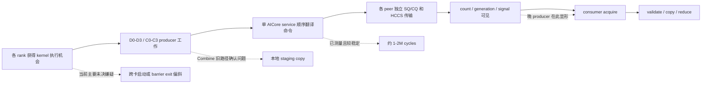

# EPv2 Ascend Normal Dispatch / Combine Rank 长尾问题分析

## 1. 文档目的

本文记录 Ascend 950 NPU8P 上 EPv2 Normal Dispatch 和 Normal Combine 的
rank 长尾问题，包括：

- 如何从 benchmark 和 stage profile 识别 rank 长尾；
- 已观察到的稳定现象；
- 对通信库管理面、SQ/CQ、channel、运行时调度和算子实现的怀疑；
- 已完成的验证、被否决的方案及其数据；
- 当前正在验证和设备恢复后仍需验证的项目。

本文区分三个概念：

1. **长尾出现的位置**：哪个 stage 在等待；
2. **长尾的来源**：哪个更早的 producer 或管理面动作晚到；
3. **性能修复**：是否真的让最慢 rank 更早完成，而不是把等待搬到另一个 stage。

“acquire wait 变短”或“rank 曲线更整齐”不等于整体性能提升。所有修复最终都必须以
8 rank 的最大完成时间、Normal Dispatch / Combine 均值与 P95、正确性和完整完成语义为准。

## 2. 代表性环境和口径

主要证据来自以下固定 workload：

| 项目 | 配置 |
| --- | --- |
| 平台 | Ascend 950 NPU8P，8 rank |
| CANN | 9.2.0 |
| tokens | 每 rank 8192 |
| hidden | 7168 |
| top-k | 8 |
| experts | 256 |
| data blocks | 72 |
| case | `ep-fp8-align128-bias0-hcopy1-prev0-async0-alloc0` |

性能汇总使用最慢 rank 的 device event 时间。`rank spread` 指同一轮或各 rank
均值中的 `max(rank_time) - min(rank_time)`。stage cycle 只在同一张卡内做差，不能直接
比较不同卡的 `GetSystemCycle()` 绝对值，因为各卡 cycle 时钟原点不同。

## 3. 如何从 Profiling 看出 rank 长尾

### 3.1 先看端到端 per-rank 时间

聚合均值会隐藏 collective 的等待结构。应先同时检查：

- operation 的最大 rank 时间；
- 每个 rank 的 device time；
- 每轮 `max-min` 和 30 次 rank 均值的 `max-min`；
- 慢 rank 是否固定，还是随发送顺序或运行轮次变化。

正式 30+30 terminal-flush 基线中：

| Operation | 时间 / 逻辑带宽 | rank 均值 spread |
| --- | ---: | ---: |
| Normal Dispatch | `18.743 ms / 415.41 GB/s` | `1.069 ms` |
| Normal Combine | `87.867 ms / 124.07 GB/s` | 约 `0.215 ms` |

这里 Dispatch 已经达到实测 400G 以上，但 collective 仍由最慢 rank 决定；约 1 ms 的
rank 均值差仍是需要解释的尾部。单次 profile 会因为插桩和运行抖动呈现更大的差异，
因此 profile 用于归因，正式非 profile 多次结果用于性能结论。

### 3.2 再看 stage，而不是只看 acquire

Normal Dispatch 的主要阶段为：

```text
D0 control -> D1 grouping -> D2 prefix/slot -> D3 record
           -> D4 payload/control/terminal drain
           -> D5 acquire -> D6/D7 validate/prefix -> D8 copy
```

完成语义修复后的一个 8-rank profile 中，D4 和 transport service 很稳定：

| 指标 | 8 rank 范围 |
| --- | ---: |
| D4 release payload | `0.910M - 1.015M cycles` |
| D4 release control | `0.291M - 0.310M cycles` |
| terminal drain | `0.034M - 0.037M cycles` |
| service 总周期 | `1.190M - 1.295M cycles` |
| service CQ wait | `0.772M - 0.878M cycles` |
| D5 epilogue acquire | `0.077M - 5.031M cycles` |

如果某些 rank 的 SQ/CQ progress 本身慢，应该在 service、CQ wait、queue depth 或
release span 中看到同量级差异。实际数百万 cycle 差异集中在 acquire，而本地 D4/service
只相差几十到约一百微秒。这说明 acquire 是长尾的**观测点**，不一定是根因发生点。

Normal Combine 的旧路径中还存在额外的真实工作：

| 指标 | 8 rank 范围 |
| --- | ---: |
| producer local copy | `44.2M - 51.2M cycles` |
| release payload | `1.60M - 1.67M cycles` |
| service 总周期 | `1.88M - 1.95M cycles` |
| epilogue acquire | `0.075M - 7.65M cycles` |

因此 Combine 需要同时区分“真实的本地数据搬运成本”和“等待其他 rank 到达”。main
分支已有 direct-local placement 等优化来删除旧路径的本地 staging copy；D4 归因分支
rebase 后必须基于新路径重新 profile，不能继续把旧路径的 44--51M cycles 当成当前现状。

### 3.3 看 signal 和 control 是否一起晚到

consumer 进入 acquire 时曾一次性快照每个 source 的 release signal 和 control
generation。64 个 source-destination 关系中只观察到：

- `SG`：signal 和 generation 都已到；
- `sg`：signal 和 generation 都未到。

没有出现 `sG`（generation 已到但独立 signal 未到）。这排除了“payload/control 已完成，
只有额外 signal WQE 单独拖尾”的主要嫌疑。晚到的是整条 peer payload/control/release
链，而不是最后一个 signal 标记。

典型快照呈三角形：较小 destination rank 进入 acquire 时已看到更多 source ready，较大
destination rank 看到更多 `sg`。反转发送顺序会反转“谁慢”，但不会缩短最晚 producer。
这说明固定 destination 顺序影响长尾的**分布**，但不是全局临界路径的根因。

```text
source 0: dst0 -> dst1 -> dst2 -> ... -> dst7
source 1: dst0 -> dst1 -> dst2 -> ... -> dst7
...

较早 destination: 进入 acquire 时更多 release 已到
较晚 destination: 进入 acquire 时更多 release 未到

改变顺序 => 慢 rank 翻转
全局最晚 producer 不变 => 总时间不降
```

### 3.4 用 queue completion 证据排除“假完成”干扰

旧实现会在 SQ/CQ 尚有 outstanding 时发布 `consumed_generation`，下一代 `reset()`
还可能复用未完成状态。这会把真正的 CQ/远端可见性等待泄漏到 consumer acquire，导致
profiling 归因不可靠。

修复后必须同时满足：

- `completion_generation == queue generation`；
- 所有 rank 的 SQ depth 和 CQ depth 均为 0；
- diagnostic clean；
- active、部分消费或未完成 generation 不能 reset/reuse。

完成语义修复后的 8 卡五操作 profile 已满足以上条件，但 Dispatch acquire 仍有
`0.077M - 5.031M cycles` 的差异。因此“假完成”是已确认并修复的管理面 bug，但不是
剩余 rank 长尾的唯一根因。

## 4. 当前对现象的整体解释

现有证据支持以下数据流：



release-entry barrier 诊断给出了最强的“等待搬移”证据：

- Dispatch acquire 从 `0.077--5.456M` 收敛为 `0.077--0.078M cycles`；
- 同一批长尾搬到 release payload：`1.085--5.237M cycles`；
- Combine acquire 从 `0.074--10.731M` 收敛为 `0.075M` 左右；
- 同一批长尾搬到 release payload：`1.946--10.111M cycles`；
- Dispatch 总时间从 `21.292 ms` 退化到 `21.975 ms`，Combine 也退化。

这证明等待在进入 release 之前已经形成。入口 barrier 只能让早到 rank 等最晚 rank，
不能让最晚 rank 更早完成，所以不能作为修复。

## 5. 怀疑点与验证状态

### 5.1 总表

| 怀疑点 | 状态 | 结论 |
| --- | --- | --- |
| `consumed_generation` 提前发布、未完成代被 reset 复用 | 已确认并修复 | 是真实管理面语义 bug；修复后 outstanding 清零，但剩余 rank tail 仍在 |
| 某些 rank 的 SQ/CQ drain 特别慢 | 已排除为主要根因 | 各 rank service/CQ wait 稳定，量级不足以解释 5--10M cycle 差异 |
| barrier 逐 peer 串行轮询累计等待 | 已修复/排除 | 已改为 pending bitmap 轮询全部 peer；尾部仍在 |
| 固定 `0 -> 7` peer 顺序导致固定慢 rank | 已验证 | 会决定谁慢；环形/逆序只搬移尾部且性能回退 |
| lane 0 串行 acquire 放大等待 | 已验证并否决 | 多 lane 并行 acquire 未消除最大 wait，Dispatch 降到约 `329.9 GB/s` |
| 独立 signal WQE/sync-memory 路径晚于 generation | 已排除 | 只见 `SG`/`sg`，未见 `sG` |
| 普通 host launch skew | 基本排除 | host 对齐到约 `0--20 us` 或约 `36 us` 后，数毫秒 device tail 仍在 |
| barrier 回 CPU 后重新提交造成 skew | 已排除 | barrier 与 operation 在同一 device stream 串联后没有改善 |
| 单 service worker 的 per-peer control 串行 | 已验证多版并行方案 | 能去掉三角形偏置，但多 AICore launch/竞争使端到端回退 |
| **每 peer 只有一个 channel/QP/SQ** | **实现完成，待实机验证** | `DEEP_EP_ASCEND_CHANNELS=2/3/4` 可创建多 channel；Normal Dispatch/Combine 已按完整记录切片，NPU2 编译通过，尚无 8-rank 功能/性能数据 |
| barrier exit 在不同卡上释放时间不一致 | 待验证 | device-chained barrier 无收益使其仍有嫌疑，但还缺 D0 入口 arrival 数据 |
| NPU runtime/device scheduler 让 kernel 真正启动时间不同 | 当前主要怀疑 | Dispatch D0→release 本地工作稳定，晚到差异更像发生在获得执行机会之前 |
| producer 上游计算负载不均 | Dispatch 基本排除，Combine 部分确认 | Dispatch D0→release 约 `0.69--0.73M cycles`；Combine 旧 local copy 有 44--51M 差异 |
| consumer 边等边处理、隐藏晚到 source | 待验证的性能方案 | 可减少临界路径，但属于 overlap 修复，不直接解释最晚 producer 为何晚到 |
| persistent/fused device launch | 待验证的结构方案 | 若 D0 已有 arrival skew，可避免每轮跨进程 host/device launch 重新失步 |

### 5.2 单 queue / 单 channel 必须如何表述

当前实现有两层“单”：

1. 一个 command queue 和一个 AICore service worker，按命令顺序构造 WQE；
2. 基线默认 `requested_channels == 1`；当前实验实现可通过
   `DEEP_EP_ASCEND_CHANNELS=2/3/4` 创建每 peer 多个 channel/QP/SQ。

但 team 内不同 peer 的 channel 0 会解析到不同 peer 的 SQ/CQ context。因此此前的
per-peer 多 AICore 实验已经并行操作过“不同 peer 的 channel 0”，却**没有**创建
“每个 peer 多个 channel/QP/SQ”。

已经验证的三版并行 service：

| 方案 | Normal Dispatch | Normal Combine | 结论 |
| --- | ---: | ---: | --- |
| 单独并行 control stage | `21.23 ms / 366.8 GB/s`，spread `1.67 ms` | `88.50 ms / 123.2 GB/s` | 三角形消失，但额外 stage/launch 成本更大 |
| payload + control 全部多 AICore 并行 | `26.25 ms / 296.6 GB/s` | `141.15 ms / 77.2 GB/s` | 底层发送资源严重争用 |
| 同 kernel：payload 单 walker，control 多 worker | 10 次 `21.60 ms / 360.4 GB/s`，spread `1.25 ms` | `89.04 ms / 122.4 GB/s` | 扩展到 8 blocks 的调度成本抵消收益 |

所以“多 AICore 并行当前 peer SQ”已经被否决。真实多 channel 的代码路径现已补齐 CANN
channel 创建、SIMT 命令 channel 编码、按完整 token/record 分片、flush/barrier 全 channel
汇合和 generation completion 语义；但 NPU8P 不可达，尚未完成实机功能和性能验证。

同时应设置合理预期：当前 service 总周期约 1--2M，而观测尾部可达 5--10M cycles。
即使多 channel 把本地 service 理想压到 0，也不能单独解释全部长尾。它可能是吞吐优化，
但在证据出现前不能把它写成根因。

### 5.3 已否决的管理面微调

以下方案均没有获得可重复的端到端收益，相关临时代码已撤销：

- 环形、逆序或分相的 peer/control/signal 发布顺序；
- 多 lane 并行 acquire；
- generation polling 替代独立 signal；
- immediate first generation poll；
- poll address linearization；
- control-before-flush；
- deferred payload flush；
- phase-batched control；
- doorbell batching、packed control 等只减少管理命令的方案；
- release-entry barrier 和 device-chained pre-op barrier。

共同规律是：它们会移动等待位置、改变慢 rank，或节省几十到几百微秒，但没有让最晚
producer 的实际到达时刻稳定提前。

## 6. 当前正在验证的怀疑点

NPU8P 当前无法连接，因此以下 D0 入口实验只完成了设计和 host contract 检查，临时代码
未提交到生产分支。

### 6.1 D0 kernel-entry arrival gate

在 Normal Dispatch profile 的 D0 producer 工作之前：

1. reset 当前 transport generation；
2. 所有 rank 执行一次 device barrier；
3. 记录 barrier issue、CQ drain 和 generation poll cycles；
4. barrier 完成后再次安全 reset，再执行原 D0-D8 路径。

判定规则：

| 结果 | 解释 | 下一步 |
| --- | --- | --- |
| D0 gate 已等待数百万 cycles，且与原 acquire wait 互补 | rank 在 producer 工作前已经失步 | 追 runtime/device scheduler、barrier exit；评估 persistent/fused launch |
| D0 gate 很短，但 release-entry gate 很长 | skew 在 D0→release 之间形成 | 对每个 kernel/stage 间隙做 arrival gate 或 ready timestamp |
| 两个 gate 都短，但 consumer 仍长 | 重新检查远端可见性、consumer cache/acquire 和 per-destination 路径 |

该 gate 只用于归因。即使它让后续 acquire 收敛，只要端到端时间不降，也不能保留为修复。

## 7. 设备恢复后待验证项目

### P0：完成 D0/C0 入口归因

- 先只跑 Normal Dispatch 的 1 次 profile，确认 barrier diagnostic 可解释；
- 再给 Normal Combine C0 加同构 gate；
- 与无 gate 的同二进制 profile 对照；
- 记录每 rank gate poll、D0→release、acquire、service/CQ wait 和端到端时间；
- 临时代码在结论记录后撤销。

### P0：测量 barrier exit 与下一 kernel 获得执行资源的间隙

需要在同一 rank 时钟域内记录：

```text
pre-op barrier entry
    -> barrier service completion
    -> barrier kernel exit
    -> operation D0 first block start
    -> D0 last block start
```

如果 `barrier exit -> D0 start` 的 rank 内间隙差异很大，说明问题位于 stream/runtime
调度；如果主要差异已经在 barrier 内，则应修改 barrier release 算法，而不是 EP release。

### P1：真实多 channel A/B

代码实现已完成，必须与已失败的“多 AICore 单 channel”分开理解：

1. host/runtime 接受每 peer 1--4 channel，默认 1，通过
   `DEEP_EP_ASCEND_CHANNELS` 显式开启；
2. 单个 SIMT producer 顺序编码命令，每个 channel/SQ 仍只有一个 owner；
3. Normal Dispatch 按完整 token、Normal Combine 按完整 record 连续均分到 channel；
4. count/generation/signal 固定走 channel 0，但必须等 collective flush drain 所有 channel
   的 SQ/CQ 后才发布；
5. terminal completion 同样 drain 所有 channel 后才发布 `consumed_generation`；
6. command queue capacity 已按 channel 数扩容；
7. host contract 为 `370 passed, 6 skipped, 67 subtests passed`；NPU2 上 production
   `dispatch.asc`、`combine.asc` 和 runtime object 已由 CANN 9.2/Bisheng 编译通过。

仍待 NPU8P 恢复后完成：多 channel 创建/注册的两 rank 冒烟、1/2/4 channel 正确性、分
channel submit/CQ wait/HWM/字节数观测，以及同二进制 ABBA 性能对照。

验收不是“service cycle 下降”，而是 Normal Dispatch/Combine 的最慢 rank、P95 和逻辑带宽
同时改善，且没有 queue ownership、次序、可见性或 reset 复用错误。

### P1：consumer ready-source overlap

现有 consumer 先等齐所有 source，再统一 validate/copy/reduce。可以评估：

- source ready 后立即验证并复制该 source 的 shard；
- 将 D8 copy 或 Combine reduction 与迟到 source 重叠；
- 最终只在确实依赖所有 source 的 prefix/output publication 前汇合。

这可能直接降低整体时间，但它是“隐藏 arrival skew”的性能方案。必须继续保留 D0/arrival
诊断，不能因此宣称最晚 producer 的根因已消失。

### P2：persistent/fused launch

若 D0 gate 证明 skew 在 kernel 获得执行资源之前形成，应评估持久化 device worker：host
只发布 generation/descriptor，已驻留的各 rank kernel 在 device 侧启动同一代工作。该方案
可以消除每轮 Python 进程、ACL launch 和 device scheduler 的重新排队，但改动范围较大，
必须先有 D0 数据支撑。

## 8. 已确认的代码修复

提交 `33a7adc` 修复 transport generation 完成语义：

- append 新命令前撤销旧 `consumed_generation`；
- service 只有在命令全部消费、末尾 SQ/CQ drain 成功且 diagnostic clean 时发布 generation；
- 失败路径保持 generation 未完成；
- `reset()` 拒绝 active、部分消费或未完成的非空 generation；
- barrier、Dispatch、Combine 调用方处理 reset 失败。

验证结果：

- host contract：`269 passed, 48 subtests passed`；
- Ascend 8 卡五操作正确性通过；
- 所有 rank `completion_generation == generation`；
- 所有 rank SQ/CQ depth 为 0。

这项修复应保留，因为它修复正确性和可诊断性；不能用它是否完全消除性能长尾来判断价值。

## 9. 证据与产物索引

主要本地 artifact：

- `/tmp/d4-terminal-flush-profile-8r.json`：terminal flush 的逐 rank stage/profile；
- `/tmp/d4-signal-control-profile-aligned.json`：host 对齐后的 signal/control 快照；
- `/tmp/d4-device-chained-barrier-10x.json`：barrier 与 operation device 串联对照；
- `/tmp/d4-release-entry-barrier-10x.json`：release-entry gate 非 profile 对照；
- `/tmp/d4-release-entry-barrier-profile2.json`：等待从 acquire 搬到 release 的 profile；
- `/tmp/d4-completion-semantics-10x.json`：完成语义修复后的五操作验证；
- `/tmp/d4-completion-semantics-profile.json`：generation 和 SQ/CQ 清零证据。

关键 TaskQueue 任务：

- `task_20260904_154001_1721798688`：terminal-flush profile；
- `task_20260904_154752_176897311521`：30+30 正式结果；
- `task_20260904_170135_2108011794`：多 lane acquire；
- `task_20260905_022051_377916923142`：signal/control ready 预扫描；
- 多 AICore per-peer release 的具体实现和结果保留在对应 Codex session 记录中。

## 10. 当前结论

1. 通信库确实存在过管理面完成语义错误，已经修复。
2. 当前剩余 rank tail 不是某个 rank 的 SQ/CQ drain 明显更慢，也不是单独 signal WQE 晚到。
3. 单 service 的固定 peer 顺序会塑造三角形 rank 分布，但改变顺序或多 AICore 并行没有
   缩短全局最晚 producer；后者在当前硬件/实现上还造成 launch 和发送资源竞争。
4. **真实多 channel 已实现并通过 host 与 NPU2 编译验证，但仍未完成 NPU8P 实机验证**。
   按现有 service 与 tail 的量级，它更可能是局部吞吐优化，不能预先认定为全部
   5--10M cycle 长尾的根因。
5. Dispatch 当前最强怀疑是 barrier exit、runtime/stream 或 device scheduler 导致不同 NPU
   真正开始 producer 的时间不齐；D0 entry gate 是恢复 NPU8P 后的第一优先级实验。
6. Combine 除同类 arrival skew 外，还必须在 rebase 后基于 main 的 direct-local placement
   新路径重新测量，避免用旧 staging-copy 数据指导当前优化。
